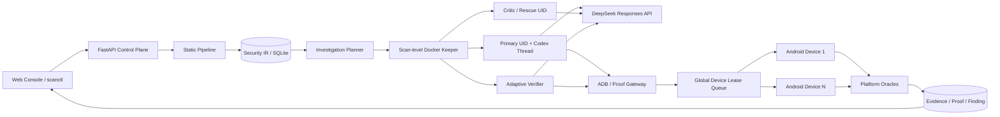
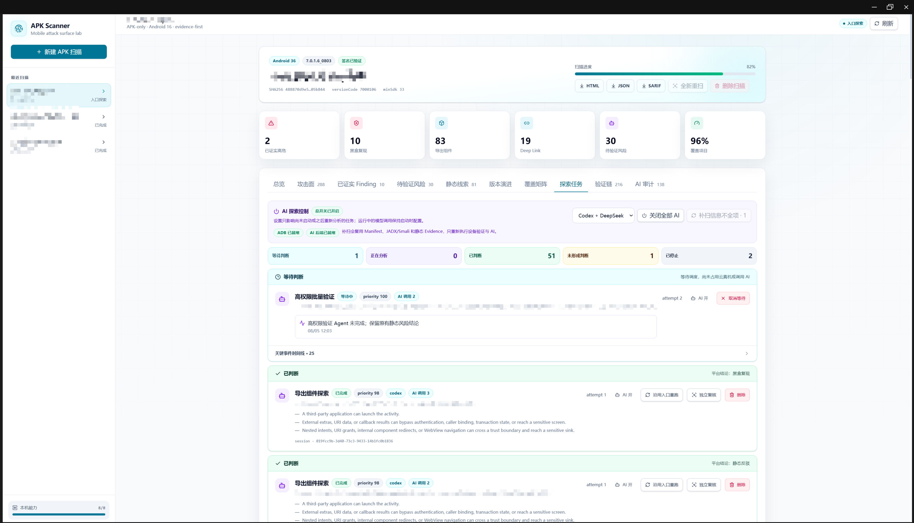

# APKScanner

> Evidence-first Android APK security auditing with deterministic attack-surface coverage,
> Codex-guided investigation, PoC generation, and real-device verification.


APKScanner 是一个面向授权 Android APK 的安全审计平台。它先用确定性分析枚举组件、
Deep Link 和代码攻击面，再让 Codex Agent 沿真实调用链探索、生成 PoC，并通过独占 ADB
设备和平台 Oracle 验证影响。只有能够引用有效 Evidence 的结论才会进入最终 Finding。

项目不是“把 APK 丢给大模型生成报告”，而是把传统静态分析、Agent 调查、真机实验、
证据审计和版本回归组合成一条可复核的工程流水线。

> 当前定位：个人研究型工程与安全测试控制面，不是面向不可信租户的 SaaS。仅用于已授权的
> APK、测试账号、测试设备和测试后端。

[快速开始](#快速开始) · [系统架构](#系统架构) · [证据模型](#证据模型) ·
[公开测试 APK](#公开测试-apk) · [完整文档](docs/README.md)

## 为什么做这个项目

Android APK 审计中，传统规则和纯 AI 分析各自存在明显缺口：

- 规则命中只能说明存在危险形状，不能证明普通第三方应用能够造成实际危害；
- 一次性让模型阅读整个 APK，容易漏入口、混淆调用身份或编造未执行的验证结果；
- ADB、PoC 和最终报告如果缺少统一 ID，很难证明“哪个调用产生了哪个影响”；
- 应用升级后，完整重扫成本高，但直接复用旧 Finding 又会产生错误结论。

APKScanner 的核心设计是：**平台保证覆盖和事实，Agent 负责探索策略，真机负责产生可观察结果。**

## 核心能力

| 能力 | 实现方式 |
| --- | --- |
| 确定性攻击面 | 解析生效 Manifest，枚举 Activity、Service、Receiver、Provider、Alias、权限与 Deep Link；结合 Apktool/Smali、JADX 和归档规则生成 Security IR |
| 产品资产图谱 | 递归拆解内嵌 APK 与 H5/JS 资源；连接宿主加载证据、内嵌 APK 与插件入口；枚举 SO 并生成 ELF、动态符号、JNI 摘要，连接 Java native 声明、`loadLibrary`、JNI 导出与具体 ABI 库 |
| 目标感知规划 | 通用枚举之后应用显式目标 Profile；按同一实现和攻击链归并入口变体，保留全部入口 ID、合并原因与成本回执，并把插件、Web 和 Native 子链限制为少量高价值任务 |
| 深度 Agent 调查 | `openai-codex==0.144.4` + DeepSeek Responses API；持久 Thread、多轮证据回灌、Critic/Rescue/Final 有界扇出、终局 Adaptive Verifier |
| Docker 隔离 | 一次扫描一个无密钥 keeper 容器；每个 `task + attempt + role` 使用独立 Unix UID、HOME、`CODEX_HOME`、临时目录和可写工作区 |
| 真机验证 | ADB 设备池支持 USB 与 IP:Port 动态接入；一个任务在完整生命周期内独占一个 serial，并可运行 Probe 或 Agent 生成的普通 App UID PoC |
| 证据闭环 | 持久化 Hypothesis、Argument、ProofAttempt、Evidence、Oracle 和 Verdict；模型文字不能自证漏洞成立 |
| 版本演进 | 内容寻址复用 JADX/Apktool/代码索引，生成 Manifest、DEX、Native、资源语义 Diff，并在新版本重新构建和回放历史 PoC |
| 审计控制台 | FastAPI + React/TypeScript；支持实时任务、人工复核、版本比较、运行时观察以及 JSON/HTML/SARIF 报告 |

重点覆盖的 Android 攻击链包括：

- 导出组件、Deep Link、Intent 重定向和嵌套 Intent；
- PendingIntent、URI Grant、FileProvider、ACTION_SEND、SAF、压缩包与文件导入；
- Binder/AIDL、动态 Receiver、localhost TCP 与 Unix Socket；
- WebView source-to-sink、JavaScript Bridge、外部网页回调与 Token 泄露；
- Provider 越权、敏感文件状态变化、进程崩溃与其他可扩展语义实验。

详细分析方法见 [Android 攻击链分析](docs/android-attack-chain-analysis.zh-CN.md)。

## 系统架构



设计上的几个关键取舍：

1. **入口覆盖不交给模型。** 平台先枚举全部入口，再按入口和静态语义创建调查任务。
2. **容器按扫描复用，工作区按角色隔离。** 避免每个小任务重复创建大镜像，同时阻止并发角色修改彼此文件。
3. **设备是动态容量，不是固定 worker 数。** 在线几台设备就允许几条动态验证链并行；没有设备时仍保留静态分析能力。
4. **复用静态计算，不复用安全结论。** 新 APK 可以复用反编译结果或 PoC 配方，但必须生成自己的 Evidence 和 Verdict。

完整设计背景见 [关键设计决策](docs/design-decisions.zh-CN.md) 和
[架构与判定模型](docs/architecture.zh-CN.md)。

## 证据模型

平台将“线索”“静态支持”和“动态复现”分开，避免用高危规则命中冒充已证实漏洞。

| Verdict | 最低条件 |
| --- | --- |
| `supported_static` | 引用当前 Scan 的静态 Evidence，能够说明 source、control、sink 和可达路径 |
| `refuted_static` | 静态证据表明入口受保护、路径不可达或没有实际安全影响 |
| `reproduced_blackbox` | 普通 App UID Probe/PoC 与平台观察使用同一 request/test-case ID，且 Oracle 独立观察到具体危害 |
| `not_reproduced` | 已执行的普通 App UID 用例被平台负向 Oracle 明确反驳；只反驳该用例，不宣称应用整体安全 |

当前 Oracle 覆盖 Binder reply、Provider rows、目标 UID 日志、UI 文本、进程崩溃、文件状态变化
以及 Web/网络/Socket/SSH 等标准化语义观察。无法形成客观动态证据时，结论保持
`supported_static` 或待验证状态，不会被模型自行提升。

## 演示



## 快速开始

### 1. 无 API Key 的静态体验

适合第一次查看项目，不需要 Docker、Codex 或 Android 设备。

```bash
git clone https://github.com/Nijika0529/ApkScanner.git
cd ApkScanner

python3.12 -m venv .venv
. .venv/bin/activate
python -m pip install -e '.[dev]'

npm ci --prefix frontend
npm run build --prefix frontend

export APKSCANNER_CODEX_ENABLED=false
export APKSCANNER_FRONTEND_DIST="$PWD/frontend/dist"
scanctl serve
```

访问 `http://127.0.0.1:8000`，可以上传自己的授权 APK，也可以直接运行仓库内的合成测试 APK：

```bash
scanctl scan "$PWD/testapk/vulntest.apk" --investigator none
```

静态分析质量取决于宿主工具。最小推荐工具为 `aapt2`、`apksigner`、`apktool` 和
Binutils `readelf`，安装 JADX 后可以获得源码检索以及 Java↔JNI↔SO 链接。缺失工具会作为
Coverage Gap 展示，而不是伪装成完整覆盖。

### 2. Codex + Docker 完整调查

完整模式需要 Docker、DeepSeek API Key，以及固定 Worker 镜像。首次构建前按
[Worker 镜像准备](docs/worker-image.zh-CN.md)放置校验过的 JADX/Apktool 离线资产，然后执行：

```bash
docker build \
  -f Dockerfile.worker \
  -t apk-scanner-codex-worker:0.2.0 \
  .

cp .env.example .env
chmod 600 .env
# 编辑 .env，写入新生成的 DEEPSEEK_API_KEY

./start.sh
```

`start.sh` 只解析 `KEY=value`，不会执行 `.env` 中的 shell 内容；显式导出的变量优先于文件值。
`.env`、扫描数据、私有 APK 和本地 SSH 配置均被 Git 忽略。执行
`scanctl capabilities --deep` 可以在正式扫描前完成一次小额真实 Provider 冒烟测试。

### 3. 接入 Android 设备

宿主必须指向真实 platform-tools `adb`，不能指向容器内部的任务 Gateway。USB serial 和
IP:Port 都可以使用：

```bash
export APKSCANNER_HOST_ADB=/absolute/path/to/platform-tools/adb
"$APKSCANNER_HOST_ADB" connect 192.0.2.10:5555
export APKSCANNER_ADB_SERIALS=192.0.2.10:5555
./start.sh
```

设备也可以在服务运行期间通过控制台或 `/api/v1/devices` 接入、排空、重连和移除，不需要重启。

更完整的安装、停止、故障排查和模式切换说明见
[快速开始指南](docs/getting-started.zh-CN.md)。

## 双验证环境

| Profile | 设备要求 | 结论范围 | 适用场景 |
| --- | --- | --- | --- |
| `development` | 默认 API 26+ | `development_legacy` 或 `development_android16`，不进入正式发布门禁 | 本地旧设备、开发调试、Finding 落库链路验证 |
| `android16_release` | API 36+ | `android16_release`，可作为版本回归与发布结论 | 正式 Android 16 真机环境 |

PoC 的 compileSdk/targetSdk 始终保持 API 36+；开发 Profile 只降低 minSdk 以兼容本地设备。
目标应用数据默认不清除，`APKSCANNER_DEVICE_RESET_POLICY=never` 会保留登录态、首次协议和本地状态。

## 公开测试 APK

`testapk/` 中的 APK 都是故意构造的合成测试程序，只能安装到专用测试设备。

| Fixture | 主要用途 |
| --- | --- |
| `vulntest.apk` | 导出组件、Deep Link、Intent 转发、WebView JSBridge、Provider、Binder、Receiver 基线 |
| `rescuetest.apk` | PendingIntent 间接委托链与 Blind Rescue 负向关闭测试 |
| `adaptivecases.apk` | Zip Slip、动态 Receiver、localhost、JSBridge Token、Binder 多值返回和安全对照组 |
| `specialcases.apk` | 大型特权应用常见语义边界的静态压力测试 |

每个测试项都保留可复现源码和 ground truth。Benchmark 只统计平台确认的最终 Finding，默认要求动态
证明，并将没有命中真值的已确认 Finding 计入 false positive；模型候选不会混入指标。

```bash
scanctl benchmark testapk/adaptivecases.apk \
  --truth testapk/adaptivecases-ground-truth.json \
  --investigator codex
```

## 验证与质量门禁

```bash
pytest -q
ruff check backend
npm run lint --prefix frontend
npm run build --prefix frontend

# 可选：需要 Docker 和固定 Worker 镜像
APKSCANNER_RUN_DOCKER_TESTS=1 pytest -q backend/tests/test_codex_executor.py

# 可选：会产生真实 API 调用
APKSCANNER_RUN_REAL_PROVIDER_TESTS=1 \
  pytest -q backend/tests/test_real_provider_integration.py
```

仓库不会在 README 中填写未经固定数据集复验的召回率或“100% 检出率”。可公开复现的测试样本、
ground truth、Evidence 准入规则和评测命令构成当前的结果口径。

## 当前状态与路线图

| 模块 | 状态 |
| --- | --- |
| APK Intake、Manifest/归档分析、规则引擎、Security IR | 已实现 |
| Codex SDK + DeepSeek、持久 Thread、结构化输出恢复 | 已实现 |
| 扫描级 Docker、多 UID 工作区、ADB/Proof Gateway | 已实现 |
| 动态设备池、运行时接入、任务级独占租约 | 已实现 |
| Adaptive Verifier、语义实验、MCP/Python Capability 入口 | 已实现第一阶段 |
| 静态缓存、版本快照、语义 Diff、历史 PoC 重放 | 已实现第一阶段 |
| 内嵌 APK/JS/SO ArtifactGraph、宿主→插件入口、Java↔JNI↔SO 静态链接 | 已实现第一阶段 |
| Copilot 7.x 目标 Profile、Zeus/Native 子链和任务归并回执 | 已实现第一阶段 |
| Android 16 自托管正式回归 | 工作流已提供，需要实际设备与仓库 Secret |
| 企业多用户、RBAC、Provider egress 治理 | 不属于当前个人版本，保留架构接口 |
| Native 函数级数据流、动态脱壳、IDA MCP、应用内部业务流程测试 | 后续扩展方向 |

## 文档导航

完整索引见 [docs/README.md](docs/README.md)。推荐阅读顺序：

1. [快速开始指南](docs/getting-started.zh-CN.md)
2. [关键设计决策](docs/design-decisions.zh-CN.md)
3. [架构与判定模型](docs/architecture.zh-CN.md)
4. [Codex Docker 执行架构](docs/codex-docker-architecture.zh-CN.md)
5. [Android 攻击链分析](docs/android-attack-chain-analysis.zh-CN.md)
6. [版本安全演进](docs/version-security-evolution.md)

## 项目结构

```text
backend/apkscanner/     FastAPI、静态分析、编排、设备、Codex、证据与报告
backend/tests/          单元、契约、Docker、ADB 和真实 Provider 可选测试
frontend/               React + TypeScript + Vite 审计控制台
probe/                  普通 App UID 通用验证 Probe
testapk/                故意脆弱的公开 APK、源码和 ground truth
config/                 模型目录、SDK 基线和 benchmark 示例
docker/                 Worker 包装器与本地 vendored 工具目录
docs/                   架构、运行时、攻击链、评测与版本演进文档
```

## 安全与使用范围

- 仅扫描你拥有或明确获准测试的 APK、设备、账号和服务；
- Web 服务默认只监听 `127.0.0.1`，不应直接暴露到公网；
- Docker Worker 内部使用 full-access sandbox，但容器边界不等于多租户安全隔离；
- Provider 会接收任务上下文和反编译证据，生产使用前应确认数据处理与网络出口策略；
- Probe 和测试 APK 均为故意危险工具，测试结束后应从设备卸载；
- 仓库当前未声明开源许可证；公开可见不等于获得复制、修改或分发授权。
