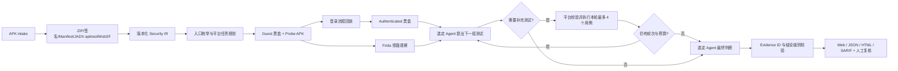

# APK Scanner 架构与判定模型

## 目标与边界

系统面向公司待上线、仅提供 APK 的安全复核。控制面运行在个人电脑本地，动态面只访问已授权的 Android 16 / API 36 云真机和专用测试后端。它提供覆盖面、证据和人工复核辅助，不自动阻断发布。

v1 的固定边界是：单 APK、单用户、单测试账号、`pm clear` 复位、无源码、无服务端权限模型。无法验证的控制项必须显示为 gap，不允许用“扫描成功”替代“已覆盖”。

## 执行流水线

平台而不是 Codex/OpenCode 负责 fan-out。默认有 3 个全局入口探索 worker，可通过
`APKSCANNER_AGENT_CONCURRENCY` 调整为 1–8；多个扫描也共享这一上限。一个导出组件对应
一个任务；同一 handler 的 Deep Links 合并成一个任务。Agent 不能创建子 Agent，也不能
直接把自己的文字当作复现证据。默认最多进行 3 个自适应测试轮次、每轮接受 8 个受限
测试：只能使用当前任务的入口 ID；Deep Link 和 Provider URI 必须保持 Manifest 声明的
scheme、host/authority 和 port；额外参数有数量、键名、类型和长度上限。每轮证据都会回灌
下一次判断，最终再执行禁止申请新动作的证据总结。轮次和单轮测试数可在 1–5 / 1–1000 的
范围内配置。每次扫描在创建时记录初始 `codex`、`opencode` 或 `none`；服务默认值的后续
变更不会静默改变它，只有用户在扫描控制台显式调整才会影响后续任务。

扫描创建后的 Agent 控制分两层：`Scan.stats.agent_control` 是总开关和后端选择；
`InvestigationTask.preconditions.agent_enabled` 是单任务覆盖。总开关关闭时所有任务只运行
规则和确定性动态验证；总开关开启后，任务级开关仍可关闭某个入口的 AI。运行中的任务保留
启动瞬间解析出的配置，避免一次审计调用途中切换模型；新配置只影响未启动或重新分析的任务。

一个任务以 `task_id + attempt` 作为平台逻辑探索运行。为保持一次性 worker 的隔离边界，目前每次物理模型调用使用新的 Codex thread 或 OpenCode session；下一轮会重新装载完整的静态上下文、累计 Evidence 和已执行测试，因此不会依赖供应商侧隐藏状态。Web 将这些物理调用统一聚合到同一个任务时间线。

静态阶段结束即发布 preliminary report，并继续动态任务。外部工具、MobSF 请求和每个任务都有超时；超过 4 小时 preliminary 目标或 24 小时整单预算会写入事件及 coverage gap。

JADX 的非零退出码不直接等同于反编译不可用。平台把结果归一化为完整成功、部分成功、部分超时或工具失败，并生成 `code_index.json`：逐个组件记录目标类是否位于失败列表、可用 Java/Smali 路径、文件 SHA-256 和有界源码片段。Codex 和 OpenCode 都接收相同的目标级代码上下文；OpenCode 不需要文件系统权限。历史扫描在任务重试时可从已有 workspace 与 `static.jadx` Evidence 懒生成索引，不会为了补上下文再次运行 JADX。

## 单云真机调度

v1 只有一个 `APKSCANNER_ADB_SERIAL`，因此所有并行 worker、所有扫描共享一个显式
`SingleDeviceScheduler`。任务按风险优先级降序排队，相同优先级按入队序号 FIFO；已运行
的 worker 在申请设备时进入 `awaiting_device`，获取租约后恢复为 `running`。任务结果按
每次租约记录 `position_at_enqueue`、`requested_at`、`acquired_at`、`wait_seconds`、
`released_at` 和 `held_seconds`，旧租约进入 `history`；Web 同步展示排队状态和设备关键
事件。

设备租约只覆盖真实设备操作：健康/安装/`pm clear`、访客与认证探测、可选 Frida 观察、
Agent 已申请且经平台校验的补充测试，以及清理。初始动态证据收集完毕后先清理并释放设备，
再调用模型；模型思考、Critic/Review 和最终总结均不占用 ADB。若模型申请下一轮测试，任务
重新排队，获取租约后重新执行 `prepare`，避免其他并发任务改变设备上的 APK 或登录态。
因此最多可有 3 个入口同时进行 AI/证据分析，但任意时刻只有 1 个入口能执行 ADB。设备排队
时间不计入单任务 20 分钟预算，整单 24 小时截止时间仍然生效。

排队任务取消时，控制面同时设置任务 cancellation event 并唤醒调度 Condition，无需等待
前一任务释放后才能确认。运行中的 ADB 子进程使用独立进程组；停止任务会终止当前命令，
后续设备命令直接返回 canceled，但 `pm clear` 和 App Link reset 清理仍会忽略取消信号执行。
Web 健康检查使用真正的非阻塞锁；设备繁忙时读取最近一次能力结果，不会插入或等待当前
设备会话。控制面重启时，`awaiting_device` 任务安全恢复为 `queued`；
`cancel_requested` 直接确认为 `canceled`；在模型或平台计算阶段中断的 `running` 任务可
安全重新排队，只有数据库显示“已获取但尚未释放设备租约”的任务才标为 `inconclusive`
并要求人工重试，避免重复外部副作用。

## 信任边界

| 区域 | 可访问内容 | 约束 |
| --- | --- | --- |
| 本地控制面 | SQLite、APK、workspace、evidence | FastAPI 仅监听 loopback；变更 API 需要自定义请求头；内容寻址文件拒绝 symlink/摘要冲突 |
| Codex Docker worker | 当前任务 attempt workspace、显式 Codex auth、模型网络 | 每次调用新容器、只读 bind mount/SDK sandbox/rootfs、无 ADB 参数、丢弃 capabilities、PID/CPU/内存限制；默认模式 |
| Codex host worker | 当前任务 attempt workspace 与模型网络 | 仅作为显式 `host` 降级模式；developer instructions 禁止 ADB/目标网络请求，设备动作仍走平台 |
| OpenCode + DeepSeek Docker worker | 当前任务 attempt workspace、`/tmp`、平台 task JSON、DeepSeek API | workspace 可写、rootfs 只读、临时 HOME、丢弃 capabilities；Analyzer/Explorer 允许 read/glob/grep/bash，独立 Finalizer 只允许 StructuredOutput；ADB 由 permission + PATH shim + 无设备挂载阻断 |
| OpenCode + DeepSeek host worker | 平台生成的 task JSON、DeepSeek API | 每次调用使用临时 HOME/XDG 与带随机 Basic Auth 的 loopback server；仍仅适合个人受控环境 |
| 云真机 | 目标 APK、Probe APK、测试账号 | 固定 Android 16/API 36；串行 lease；任务前后 `pm clear`；不声称完整快照复位 |
| Probe APK | 以普通 App UID 调用目标入口 | 只接受最初发送者为 shell/root 的调度；仍只允许安装在专用测试设备 |
| MobSF | 上传 APK并返回广度扫描报告 | 可选、显式 URL/API Key；失败不阻断内置基线，但标为 tool gap |

APK、反编译代码、资源、日志、网页和工具输出都属于不可信数据。两个 Agent 后端的
developer instructions 都明确禁止服从这些内容中的指令。每个 `task_id + attempt` 获得独立
workspace，平台只物化该入口的代码上下文和不可变 Evidence；并发 Agent 不共享可写扫描目录。
目标组件命中的 Java/Smali 原文件会复制到 `target_source/`（每次调用最多 2 MiB），使
Agent 能继续使用 grep/bash，而无需暴露整份共享反编译目录。Codex 只读；OpenCode 可在
当前任务 workspace 和 `/tmp` 执行命令并写入临时分析产物，容器
rootfs 和宿主机其他目录不在可写范围。云真机操作始终由 Python 平台校验后执行，Agent
不持有 ADB 参数、Socket 或可用命令。模型网络出口应分别限制到企业 Codex 或获批的
DeepSeek/代理端点。

## Security IR

核心对象全部带 `schema_version`：

- `Scan`：制品摘要、包/版本/SDK、签名、工具版本、状态和时限。
- `EntryPoint`：Activity、Alias、Service、Receiver、Provider、Deep Link；保存有效 exported 原因、权限保护级别、Intent Filter 和 URI 模板。
- `InvestigationTask`：入口集合、假设、前置条件、允许副作用、设备基线、线程/turn 和重试次数。
- `Evidence`：内容摘要、不可变文件、命令 argv、退出码、调用身份、登录态、request/test-case ID。
- `Finding`：规则、MASVS/CWE、严重性、置信度、结论级别、入口和 Evidence 引用、人工结论。
- `CoverageItem`：每个 MASVS 域和每个入口在 static、deterministic、blackbox、authenticated、agent、instrumented 阶段的状态及 gap。

## 结论和证据规则

| 结论 | 平台最低条件 |
| --- | --- |
| `supported_static` | 引用了本 scan 的 `static.*` Evidence ID |
| `reproduced_blackbox` | 同一随机 request ID 的 Probe APK 调用、Probe 结果日志，且 Probe 返回 success；`adb shell` 成功不等价 |
| `observed_instrumented` | Frida 成功加载且至少产生一个非 hook-error 观察事件 |
| `not_reproduced` | 同一 test-case/request ID 的普通 App UID 尝试与结果日志存在，且平台 Prover 明确产生 `oracle_refuted=true`；它只反驳该已执行用例，不证明全局安全 |
| `inconclusive` | 证据不足、工具缺失、预算耗尽或前置条件失败 |

Agent 声称但不属于本 scan/task 的 Evidence ID 会被删除。需要证据的结论不满足条件时自动降级为 `inconclusive`。重试产生不同结果时，旧 Agent Finding 不删除，但会标记为已被新 turn 取代且降级为 inconclusive。

风险等级与结论等级分开校验。模型输出的 `severity_proposal` 是原始建议；只有
`supported_static`、`reproduced_blackbox` 或 `observed_instrumented` 等平台接受的风险结论
才产生 `platform_severity`。最终结果为 `inconclusive` 时平台风险等级是未定，而不是 LOW；
验证 Evidence 同时记录 `claimed_severity`、`final_severity=null` 和
`severity_disposition=undetermined_due_to_incomplete_evidence`。

## 能力恢复后的增量补扫

连接 ADB、补齐 Probe APK/登录流程或恢复模型后端后，不需要重新上传 APK。单任务“重新分析”
和扫描级“补扫信息不全项”都会把目标任务重新置为 `queued`，将扫描恢复为
`investigating`，随后复用已有 workspace、代码索引和静态 Evidence，重新执行设备租约、
动态验证和按当前开关决定的 Agent 调用。批量补扫仅选择设备阻塞、证据不足、超时、失败及
平台最终结果为 `inconclusive` 的任务，不自动重跑已经确认或当前未复现的结论。

人工重新分析不受自动尝试预算限制，但每次仍增加 `attempts`，产生新的 thread/turn 和完整
AI 审计；旧 Evidence 不删除。批量补扫仅允许在当前扫描已经 `final`/`failed` 时启动，避免
与仍在运行的设备任务竞态。

单任务默认预算为 20 分钟。任务进入 `timed_out` 后，Web 提供“继续深度探索”而不是普通
重跑：控制面重新排队同一 `task_id`，分配一份新的 20 分钟预算，并将该任务历次静态、
ADB、Probe、Frida、Agent 请求/响应和平台校验 Evidence 一并装载给新一轮 Agent。续跑轮次
记录在 `manual_continuation.continuation_number`，旧 thread/turn 仅作为关联信息保留，新轮
仍产生独立可审计调用。显式续跑不受原扫描 24 小时截止时间或自动尝试次数限制，但每轮仍
重新获取设备租约、执行准备与最终清理，且只能由已经 `timed_out` 的任务触发。

## 假设、反证与危害证明

入口任务启动时，平台将 Planner 的安全问题固化为 `SecurityHypothesis`。稳定 fingerprint
避免同一扫描重复创建同一主张；攻击者身份、前置条件、预期影响和 proof obligations 不再
只存在于 Prompt。模型输出按角色写入 `HypothesisArgument`：

- Hunter/Advocate 只能提供支持论证和 Evidence 引用；
- Critic 独立寻找权限检查、调用者校验、不可达路径、认证/配置前置和无实际危害的反例；
- Arbiter 是平台 Evidence 校验后的决定，不直接采用任一模型的自评。

通过边界校验的 `requested_tests` 必须关联当前任务的 Hypothesis，并形成
`ProofAttempt`。第一版 `android_entry_probe` Prover 复用现有 ADB/Probe/Frida 能力；
Oracle 将“入口执行成功”和“实际危害”分开：普通应用 UID Probe 回执或 Frida 观察只能设置
`execution_demonstrated=true`；只有领域 Prover 同时给出平台可校验的
`security_impact_observed=true`（例如敏感数据实际返回、未授权状态确实变化或认证边界被
绕过），才设置 `harm_demonstrated=true`。模型文字、导出声明、危险 API 名称、单独
`adb shell` 成功以及单纯打开组件都不能让危害 Proof 通过。Web“验证链”展示候选、正反
论证、Proof Attempt、Evidence 和最终状态。

## 私有 APK 真值评测

`scanctl benchmark APK --truth SPEC --investigator BACKEND` 对 APK 完整扫描并保存
`BenchmarkEvaluation`；`scanctl evaluate --scan-id ID --truth SPEC` 可以对已有结果重复
评分。SPEC 支持按 rule ID、CWE、入口名称和 Finding 文本关键词匹配已知漏洞，并为每项真值
指定 `static`、`dynamic` 或 `instrumented` 最低证明等级。

评分只统计平台确认的 `supported_static`、`reproduced_blackbox` 和
`observed_instrumented`。默认真值要求 `dynamic`，因此只有静态猜测的高危描述既不能命中，
如果已被平台确认为 Finding 但不匹配任何真值，还会计为 false positive。主指标使用 F0.5，
精确率权重是召回率的两倍；`candidate`、`inconclusive`、人工 review 的 accepted 状态和
没有平台证明的模型输出均不算发现，只作为 `unproven_ai_noise` 单独报告。这样可以直接比较
不同模型在同一私有 APK 上“发现了多少真实漏洞”以及“制造了多少看似有用的噪声”。

## AI 内容审计

每次实际模型调用都会形成独立 `audit_id`，并按调用阶段写入内容寻址的不可变 Evidence：

1. `agent.request`：后端、provider、模型、SDK、隔离方式、developer instructions、精确
   prompt、输出 JSON Schema 和工具边界；
2. `agent.events`：SDK 会话、turn/step、输出校验、工具生命周期、错误等规范化关键事件；
3. `agent.response`：thread/turn、平台收到的结构化原始输出和 token/费用 usage；
4. `agent.test_validation`：Agent 申请的测试、平台接受/拒绝的测试、拒绝原因、实际执行
   用例及其 Evidence ID；
5. `agent.validation`：模型声称的结论和 Evidence ID、平台接受/拒绝的 Evidence ID、是否
   降级以及最终落库结果；
6. `agent.error`：已发起但失败的模型调用错误；
7. `agent.cancellation`：用户停止请求、运行时确认、后端和任务阶段；此前已产生的事件继续
   保留，被停止的调用不生成新的最终结论。

OpenCode 审计还记录显式执行 profile、各阶段思考模式、reasoning effort、实际 wire
`tool_choice`、HTTP 状态和工具事件。静态阶段使用关闭思考的 Analyzer；规划、Critic 和
自由探索阶段使用 Thinking Explorer。二者都在完整工具循环结束后只输出证据备忘录，再
由全新 session 中关闭思考且不开放 workspace 工具的 Finalizer 通过
`StructuredOutput` 定稿。Worker 随后执行 Ajv 和业务语义校验，失败时最多使用两个全新
session 纠正。兼容代理只对 thinking 请求删除 OpenCode 注入的 `tool_choice: auto`，
并保留完整 `reasoning_content` 回放；每轮 prompt、备忘录、结构化响应、校验错误、wire
审计和 usage 都进入不可变审计记录。Flash/Pro 使用同一阶段协议，失败时不会静默换模型。

Codex 的 app-server notification 与 OpenCode 的 `event.subscribe()` SSE 会先归一化为
`exploration.*` 平台事件。Web 只展示假设、阶段、动作、证据和结论等关键事件，不展示或
持久化隐藏思维链；模型必须通过结构化字段提供可审计的简短理由。

这些记录不包含模型 API Key。每份内容在写入时计算 SHA-256，Web 的“AI 审计”页和 JSON
报告展示同一份内容及摘要；Web 会优先展示平台校验后的结论、风险级别、置信度、有效
Evidence 数和降级原因，再提供完整原始 JSON；读取时再次校验文件路径与 SHA-256，损坏或
篡改会显示为完整性异常。没有实际调用 AI 的任务不会伪造审计记录。

## 任务停止

Web 把任务明确区分为等待判断、正在分析、已判断、未形成判断和已停止。排队或等待设备的
任务取消后立即进入 `canceled`；运行中的任务先进入 `cancel_requested`，控制面再调用
Codex `turn/interrupt`，或终止 OpenCode 的一次性进程/容器。设备清理仍在 `finally` 中
执行。运行时确认后任务进入 `canceled`，Coverage 标为 partial，并把取消原因写入事件和
`agent.cancellation` Evidence。停止不会删除已经产生的证据，也不会把半成品模型文本落为
Finding；用户可显式重试或删除已经终止的任务。处于 `cancel_requested` 的任务也允许
立即软删除：后台仍完成中止与设备清理，随后只更新取消确认审计，不会把任务恢复到列表。

## 扫描删除

Web 只允许删除已经 `final` 或 `failed` 的扫描；任务进入重试队列时会先把扫描恢复为
`investigating`，避免删除与后台执行发生竞态。删除操作需要二次确认，会级联删除数据库
中的入口、任务、Finding、Coverage、事件和 Evidence，并删除该扫描独占的 APK、Evidence
文件及 workspace。内容寻址文件如果仍被其他扫描引用则保留，避免删除重复上传 APK 所
共享的数据。

## 扩展方式

- 广度引擎：在 `MobSFAdapter` 或新的静态 adapter 中归一化为 `FindingDraft`，同时增加 engine coverage。
- 漏洞类型：在 `InvestigationPlanner` 增加 task 类型/假设，在平台请求校验器增加对应的最小安全动作集。
- 设备供应商：保持 `prepare → reset/authenticate/probe → cleanup` 和 Evidence 输出契约，替换 ADB lease 实现。
- 新判定级别：先定义所需的不可伪造 Evidence 条件，再扩展 Agent schema 和报告层，不能只改 prompt。

## 上线前仍需完成

- 用公司真实签名 APK 建立回归语料和误报基线。
- 在目标云真机供应商上编译/安装 Probe APK并跑 API 36 集成测试。
- 构建并验证两个 Docker worker 镜像、企业 Codex/DeepSeek 凭据方式和各自网络出口策略。
- 为每个 App 维护稳定的登录流程和 `assert_text` 成功标志。
- 根据发布风险决定人工 gate；当前产品刻意不自动 gate。
