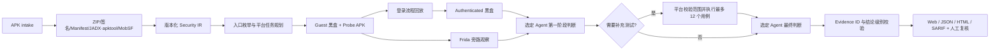

# APK Scanner 架构与判定模型

## 目标与边界

系统面向公司待上线、仅提供 APK 的安全复核。控制面运行在个人电脑本地，动态面只访问已授权的 Android 16 / API 36 云真机和专用测试后端。它提供覆盖面、证据和人工复核辅助，不自动阻断发布。

v1 的固定边界是：单 APK、单用户、单测试账号、`pm clear` 复位、无源码、无服务端权限模型。无法验证的控制项必须显示为 gap，不允许用“扫描成功”替代“已覆盖”。

## 执行流水线

平台而不是 Codex/OpenCode 负责 fan-out。一个导出组件对应一个任务；同一 handler 的 Deep Links 合并成一个任务。Agent 不能创建子 Agent，也不能直接把自己的文字当作复现证据。第一阶段最多提出 12 个受限测试：只能使用当前任务的入口 ID；Deep Link 和 Provider URI 必须保持 Manifest 声明的 scheme、host/authority 和 port；额外参数有数量、键名、类型和长度上限。平台执行后再进行一次最终判断。每次扫描在创建时固化 `codex`、`opencode` 或 `none`，服务默认值的后续变更不会让同一扫描混用模型后端。

静态阶段结束即发布 preliminary report，并继续动态任务。外部工具、MobSF 请求和每个任务都有超时；超过 4 小时 preliminary 目标或 24 小时整单预算会写入事件及 coverage gap。

## 信任边界

| 区域 | 可访问内容 | 约束 |
| --- | --- | --- |
| 本地控制面 | SQLite、APK、workspace、evidence | FastAPI 仅监听 loopback；变更 API 需要自定义请求头；内容寻址文件拒绝 symlink/摘要冲突 |
| Codex Docker worker | 当前 scan workspace、显式 Codex auth、网络 | 每任务新容器、只读 bind mount、只读 rootfs、丢弃 capabilities、PID/CPU/内存限制；默认模式 |
| Codex host worker | 本机与网络 | 仅作为显式 `host` 降级模式；个人受控环境使用 |
| OpenCode + DeepSeek Docker worker | 平台生成的 task JSON、DeepSeek API | 不挂载 scan workspace；只读 rootfs、临时 HOME、丢弃 capabilities；禁用文件/Shell/Web/MCP/子 Agent，仅允许内部 StructuredOutput 工具 |
| OpenCode + DeepSeek host worker | 平台生成的 task JSON、DeepSeek API | 每次调用使用临时 HOME/XDG 与带随机 Basic Auth 的 loopback server；仍仅适合个人受控环境 |
| 云真机 | 目标 APK、Probe APK、测试账号 | 固定 Android 16/API 36；串行 lease；任务前后 `pm clear`；不声称完整快照复位 |
| Probe APK | 以普通 App UID 调用目标入口 | 只接受最初发送者为 shell/root 的调度；仍只允许安装在专用测试设备 |
| MobSF | 上传 APK并返回广度扫描报告 | 可选、显式 URL/API Key；失败不阻断内置基线，但标为 tool gap |

APK、反编译代码、资源、日志、网页和工具输出都属于不可信数据。两个 Agent 后端的 developer instructions 都明确禁止服从这些内容中的指令。Codex Docker worker 只有只读 workspace；OpenCode worker 连 workspace 都不挂载，只接收控制面整理后的 JSON。云真机操作始终由 Python 平台校验后执行，Agent 不持有 ADB 能力。模型网络出口应分别限制到企业 Codex 或获批的 DeepSeek/代理端点。

## Security IR

核心对象全部带 `schema_version`：

- `Scan`：制品摘要、包/版本/SDK、签名、工具版本、状态和时限。
- `EntryPoint`：Activity、Alias、Service、Receiver、Provider、Deep Link；保存有效 exported 原因、权限保护级别、Intent Filter 和 URI 模板。
- `InvestigationTask`：入口集合、假设、前置条件、允许副作用、设备基线、线程/turn 和重试次数。
- `Evidence`：内容摘要、不可变文件、命令 argv、退出码、调用身份、登录态、request/test-case ID。
- `Finding`：规则、MASVS/CWE、严重性、置信度、结论级别、入口和 Evidence 引用、人工结论。
- `CoverageItem`：每个 MASVS 域和每个入口在 static、deterministic、blackbox、authenticated、agent、instrumented 阶段的状态及 gap。

## 结论和证据规则

| 结论 | 平台最低条件 |
| --- | --- |
| `supported_static` | 引用了本 scan 的 `static.*` Evidence ID |
| `reproduced_blackbox` | 同一随机 request ID 的 Probe APK 调用、Probe 结果日志，且 Probe 返回 success；`adb shell` 成功不等价 |
| `observed_instrumented` | Frida 成功加载且至少产生一个非 hook-error 观察事件 |
| `not_reproduced` | 同一 request ID 的普通 App UID 尝试与结果日志存在；它只描述已执行用例，不证明全局安全 |
| `inconclusive` | 证据不足、工具缺失、预算耗尽或前置条件失败 |

Agent 声称但不属于本 scan/task 的 Evidence ID 会被删除。需要证据的结论不满足条件时自动降级为 `inconclusive`。重试产生不同结果时，旧 Agent Finding 不删除，但会标记为已被新 turn 取代且降级为 inconclusive。

## 扩展方式

- 广度引擎：在 `MobSFAdapter` 或新的静态 adapter 中归一化为 `FindingDraft`，同时增加 engine coverage。
- 漏洞类型：在 `InvestigationPlanner` 增加 task 类型/假设，在平台请求校验器增加对应的最小安全动作集。
- 设备供应商：保持 `prepare → reset/authenticate/probe → cleanup` 和 Evidence 输出契约，替换 ADB lease 实现。
- 新判定级别：先定义所需的不可伪造 Evidence 条件，再扩展 Agent schema 和报告层，不能只改 prompt。

## 上线前仍需完成

- 用公司真实签名 APK 建立回归语料和误报基线。
- 在目标云真机供应商上编译/安装 Probe APK并跑 API 36 集成测试。
- 构建并验证两个 Docker worker 镜像、企业 Codex/DeepSeek 凭据方式和各自网络出口策略。
- 为每个 App 维护稳定的登录流程和 `assert_text` 成功标志。
- 根据发布风险决定人工 gate；当前产品刻意不自动 gate。
