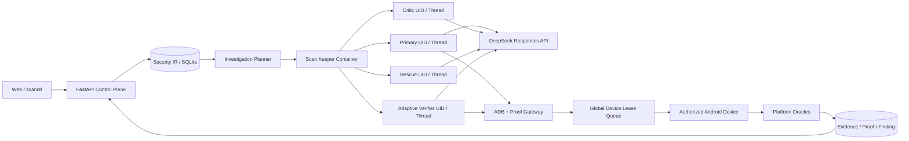

# Codex + DeepSeek Docker 执行架构

状态：当前实现规范。

本文说明 APKScanner 如何在本地单用户控制面中运行 Codex Agent，以及 Container、Thread、
ADB、Proof、Evidence 和监督 Campaign 之间的边界。文档只描述当前可执行路径，不记录迁移过程、
历史方案或未排期的能力清单。

## 1. 核心约束

1. Codex 是唯一的 AI 调查后端；关闭 Agent 后，确定性静态分析仍可独立运行。
2. AI 调查默认运行在 Docker 中，不自动降级到宿主进程。
3. Codex 在容器边界内使用 full-access sandbox；安全边界由 Docker、Unix UID、只读挂载和网关共同提供。
4. 一个 Scan 复用一个无密钥 keeper 容器，不为每个入口重复创建容器。
5. 每个 `task + attempt + role` 使用独立 UID、HOME、`CODEX_HOME`、TMPDIR、cache 和可写 workspace。
6. APK、JADX、Apktool 和 archive 输入只读挂载；Agent 不能修改扫描原件。
7. Provider Key 不写入镜像、keeper、配置文件、命令参数、事件或报告。
8. Agent 可以提出假设和实验，但不能用自己的文字生成动态 Evidence 或提升 Verdict。
9. ADB 设备由控制面独占租约管理；容器不能直接访问宿主 USB、ADB server 或 Docker socket。
10. 调查深度不使用工具调用次数限制；任务生命周期、取消、无事件超时和资源边界负责运行控制。

## 2. 总体架构



控制面始终拥有任务状态、设备租约、Proof 执行、Evidence 落库和 Finding 准入权。Agent 只拥有
当前角色工作区和经过网关授权的任务级操作能力。

## 3. 执行对象

| 对象 | 生命周期 | 作用 |
| --- | --- | --- |
| Scan | 一次 APK 审计 | 固定 APK、分析 Profile、Agent 开关和版本关系 |
| ScanContainer | Scan 动态调查阶段 | 承载固定工具链、只读输入和多个隔离 UID |
| InvestigationTask | 一个入口或静态语义边界 | 固定 scope、假设、优先级和设备需求 |
| Attempt | Task 的一次执行 | 记录重试、续跑、取消和独立复核关系 |
| AgentSession | `task + attempt + role` | 绑定 UID、workspace、Provider 和配置指纹 |
| AgentThread | Session 内持久对话 | 复用累计 Evidence，支持同配置恢复 |
| AgentTurn | 一次模型调用 | 记录输入、事件、usage、结构化结果和错误 |
| ProofAttempt | 一次可验证实验 | 绑定 PoC、调用身份、设备、Oracle 和 Evidence |

这些对象独立于前端事件列表持久化。事件可以分页或摘要化，但 Container、Session、Turn 和 Proof
台账不会因为 UI 性能优化而丢失。

## 4. 容器和工作区

### 4.1 镜像内容

固定 Worker 镜像包含：

- Python 3.13 与 `openai-codex==0.144.4`；
- Codex CLI、Node.js 22.13、OpenJDK 17；
- Android Platform 36 与 Build Tools 36.1；
- JADX 1.5.6、Apktool 3.0.3、Smali、ripgrep、git、curl、jq、sqlite3；
- `apkscanner-adb-gateway`、Proof 客户端和 Worker Protocol v3 实现。

第三方大文件通过 `docker/vendor/` 提供并校验摘要，准备方法见
[Worker 镜像准备](worker-image.zh-CN.md)。

### 4.2 挂载

| 容器路径 | 权限 | 内容 |
| --- | --- | --- |
| `/scan-input/apk` | 只读 | 当前 APK |
| `/scan-input/jadx` | 只读 | 当前 Scan 的 JADX 结果 |
| `/scan-input/apktool` | 只读 | Apktool/Smali 结果 |
| `/scan-input/archive` | 只读 | 安全解包后的归档视图 |
| `/scan-input/native` | 只读 | SO 原件、标准化 ELF/JNI 摘要与 Java↔JNI↔SO 索引 |
| `/scan-input/artifacts` | 只读 | 内嵌 APK 及其递归 JADX、资源和 Native 分析结果 |
| `/scan-input/artifact_graph.json` | 只读 | 主包、插件、Java Native 桥、JNI 符号和 SO 的统一关系图 |
| `/agent-workspaces/<key>/workspace` | 当前 UID 可写 | 脚本、笔记、PoC 工程和输出 |
| `/agent-workspaces/<key>/home` | 当前 UID 可写 | 私有 HOME 与 Codex 状态 |

workspace key 只使用小写字母、数字和连字符。角色名在生成路径前规范化，避免
`rescue_explorer` 等下划线名称破坏路径契约。

### 4.3 运行参数

keeper 使用只读 root filesystem、丢弃 Linux capabilities、禁止提权，并配置 PID、CPU、内存和
临时文件限制。容器不挂载 Docker socket、宿主根目录、完整 `.data`、USB 设备或长期凭据目录。

扫描结束、删除或取消后，控制面终止对应 UID 的进程组并回收 keeper。孤立容器通过数据库记录和
Docker label 对账，不依据模糊容器名称删除其他实例。

## 5. SDK 与 Provider

主调用链固定使用 Python SDK：

```text
openai-codex==0.144.4
provider=deepseek
model=deepseek-v4-flash
web_search=live
```

Provider 配置只保存 base URL、模型、能力和凭据环境变量名。`DEEPSEEK_API_KEY` 从宿主控制面环境
进入当前 UID worker 的 `docker exec` 环境，keeper 和其他 UID 不获得 Key。Codex 的 shell
environment policy 会从 Agent 自己执行的 Bash 子进程中排除 Provider Key。

当前路径直接连接 DeepSeek，不依赖本地 Provider Gateway。覆盖 base URL 时只接受明确配置的
HTTPS 目标；开发代理不得静默改变模型、结构化输出或认证语义。

`config/codex-sdk-baseline.json` 记录已审查的源码提交、Python SDK/CLI 版本和生成协议哈希。
`/work/codex` 可以更新到上游最新提交用于差异检查；兼容性门禁比较已安装版本和生成协议哈希，
不会因为检查仓库 HEAD 前进、但运行时与协议未升级而误报失败。真正升级 SDK 或协议时，仍需重新
审查并更新 baseline。

启动前可以执行：

```bash
scanctl capabilities --deep
```

该命令校验镜像 label、SDK/Protocol、模型目录、结构化输出和真实 Provider 连通性。

## 6. Worker Protocol v3

控制面通过 NDJSON 与 Worker 通信。请求至少包含：

- protocol version、request ID、scan/task/attempt/role；
- workspace 和只读输入路径；
- Provider/model/config fingerprint；
- Thread 创建或恢复信息；
- developer instructions、platform context 和 output schema；
- 当前 Evidence、已执行测试和允许的 Gateway 能力。

Worker 输出事件、heartbeat、Thread/Turn ID、usage、结构化结果或标准化错误。所有消息必须带
request ID；未知类型、越界路径、错误 schema version 和不匹配的 Thread fingerprint 会被拒绝。

### 6.1 Thread 复用

Primary 的连续轮次复用同一非 ephemeral Thread，并重新装载平台累计 Evidence。Critic、Rescue、
Final 和 Adaptive Verifier 使用独立 Session/Thread，避免互相污染观点和工作区。

Worker 异常退出后，控制面先终止旧 UID 进程，再以同一配置指纹启动 replacement generation。
Thread 状态完整时调用 `thread_resume`；无法恢复时创建新 Thread，并保留旧 Session/Turn 的错误记录。

### 6.2 结构化结果

Worker 优先使用 `output_schema`。模型偶发在 JSON 前后添加说明或返回可兼容的字段类型时，解析器会：

1. 提取所有完整 JSON object；
2. 按目标 schema 选择字段最完整的候选；
3. 规范化明确允许的 list/string 兼容字段；
4. 运行 Pydantic 校验；
5. 由 Finding Policy 再校验 Evidence 归属和 Verdict 条件。

解析兼容只提高传输稳定性，不允许缺少动态 Evidence 的结果升级为 `reproduced_blackbox`。

## 7. Agent 编排

### 7.1 Primary

Primary 从平台分配的入口和 SecurityHypothesis 出发，读取完整反编译输入、使用 Bash/Web Search、
生成 PoC，并将实验交给 Proof Gateway。每轮真实结果会回灌同一 Thread，直到假设闭环、没有新的
实质动作、任务取消或生命周期结束。

### 7.2 Critic 与 Rescue

- Critic 独立检查 caller 校验、权限、可达性、账号态、配置前置和危害解释，防止把静态形状直接当漏洞；
- Blind Rescue 在任务过早给出安全或信息不足结论时，从独立工作区寻找替代攻击链；
- Final 只总结已有 Evidence，不能申请新测试或推翻平台已经签发的 Proof。

Critic、Rescue 和 Final 在单个 Task 中各最多启动一次。这个限制控制角色扇出，不限制已启动 Turn
的代码阅读、工具调用、PoC 修正或 Proof Replay 深度。

### 7.3 Adaptive Verifier

普通入口任务结束后，扫描级 Adaptive Verifier 处理静态证据较强但尚未动态闭环的候选：

- 候选按提示词字符预算拆批，不按数量静默截断；
- 每批 assessment 和 checkpoint 持久化，失败后只恢复未完成批次；
- 可以组合普通 App PoC、Web 回调、Socket、文件状态、固定 Python/MCP Capability 和可选 SSH；
- 可以通过 `duplicate_of_finding_id` 归并同一根因的跨任务 Finding；
- 无设备、实验不足或结构化结果失败时保留原静态风险和明确 gap。

Adaptive Verifier 可以判断 Token、会话或业务状态的语义，但仍必须引用真实 RuntimeObservation、
Proof 或其他平台 Evidence，不能只用自然语言声明实验成功。

## 8. ADB、设备租约与 Proof

宿主控制面通过 `APKSCANNER_HOST_ADB` 固定真实 Android platform-tools 绝对路径。Python 包不注册
名为 `adb` 的宿主命令；只有 Worker 镜像把 `apkscanner-adb-gateway` 链接为容器内 `adb`。

Gateway Token 绑定 scan、task、attempt、serial、允许动作和过期时间。容器请求由控制面转换成
真实 ADB 命令，并将 argv、调用身份、退出码、输出摘要和 artifact 记录为 Evidence。

设备池支持 USB serial 与 IP:Port：

- 一个任务从 prepare、安装、探索、PoC、Oracle 到 cleanup 始终独占同一 serial；
- 在线设备数量决定动态验证容量；运行中接入设备可以扩大并发；
- drain 停止新 lease，不打断当前任务；活跃设备不能重连或删除；
- 没有设备时静态分析仍可进行，动态任务保留明确状态；
- 默认 reset policy 为 `never`，不会自动清除目标应用登录态和本地数据。

Proof Gateway 接受平台 Probe、源码型 PoC 和经过校验的预构建 PoC。控制面检查包名、签名、大小、
minSdk/targetSdk、入口和 SHA-256，再进入同一设备队列执行。

## 9. Oracle 与 Verdict

平台支持的客观观察包括：

- Binder typed reply；
- Provider rows；
- 目标 UID 日志；
- UI 文本和页面状态；
- 目标进程崩溃；
- 目标文件存在性与 SHA-256 变化；
- Web/网络回调、localhost/Unix Socket 和标准化 RuntimeObservation。

PoC 自身日志只能证明 PoC 执行，不能单独证明目标应用危害。`adb shell` 结果保留 shell 身份，不能
代替普通第三方应用可利用性。

动态结论同时保存验证范围：

| Profile | 设备 | Verdict scope | 发布资格 |
| --- | --- | --- | --- |
| `development` | API 26+ | `development_legacy` / `development_android16` | 否 |
| `android16_release` | API 36+ | `android16_release` | 是 |

## 10. 事件与审计

AgentEvent 记录：

- Container、Session、Thread 和 Turn 生命周期；
- 模型请求、响应阶段、usage 和 reconnect；
- tool、Web Search、ADB、Proof 和 Evidence 事件；
- schema 校验、重试、取消、超时和恢复；
- Adaptive batch/checkpoint 与 Finding 归并。

事件使用 scan 内单调序号和稳定 dedupe key。前端默认读取摘要和最近窗口，完整事件保留在数据库中。
隐藏 Chain of Thought、reasoning 原文、API Key、SSH 私钥和敏感环境变量不进入事件或报告。

## 11. Capability 与 Campaign Supervisor

非标准测试能力通过版本化 Capability Manifest 注册，当前接口支持 built-in、固定 SHA-256 的 Python
Adapter 和显式绑定的 MCP Adapter。每项能力声明：

- 输入/输出 JSON Schema；
- 权限、超时、网络和设备需求；
- Evidence mapper 与清理动作；
- 适用 Android API 和版本。

Capability 返回值默认只是工具结果；只有经过 Evidence mapper 和 Finding Policy 后才具有证明效力。

Campaign Supervisor 持久化 goal、DAG entry、依赖、总预算和最大并行 Scan 数。服务内 reconcile
循环只启动依赖已经完成的节点，重启后从数据库继续观察已有 Scan，并支持追加 entry、继续和取消。
Campaign 并发控制扫描级任务，不绕过单个 Scan 内的设备租约、Capability allowlist 或 Evidence 规则。

## 12. 资源与失败恢复

默认资源边界由以下配置控制：

| 配置 | 默认值 | 含义 |
| --- | --- | --- |
| `APKSCANNER_CODEX_MAX_CONTAINERS` | `2` | 全局扫描容器上限 |
| `APKSCANNER_CODEX_MAX_SESSIONS` | `6` | 全局活动 UID Session 上限 |
| `APKSCANNER_CODEX_MAX_SESSIONS_PER_SCAN` | `6` | 单 Scan 活动 Session 上限 |
| `APKSCANNER_AGENT_ANALYSIS_SLOTS` | `4` | 无设备 Agent 分析并发 |
| `APKSCANNER_POC_BUILD_SLOTS` | `2` | PoC 编译并发 |
| `APKSCANNER_AGENT_INITIAL_PHASE_SECONDS` | `900` | 首轮分析阶段时限 |
| `APKSCANNER_AGENT_CRITIC_PHASE_SECONDS` | `300` | Critic 阶段时限 |
| `APKSCANNER_AGENT_RESCUE_PHASE_SECONDS` | `480` | Rescue 阶段时限 |
| `APKSCANNER_AGENT_FINAL_PHASE_SECONDS` | `180` | 终局裁决阶段时限 |
| `APKSCANNER_AGENT_NO_PROGRESS_LIMIT` | `3` | 连续无证据进展轮次上限 |
| `APKSCANNER_RESCUE_AUDIT_SAMPLE_RATE` | `0.15` | 低风险负面结论的 Rescue 抽样率 |
| `APKSCANNER_CODEX_CPU_LIMIT` | `6` | 单容器 CPU 上限 |
| `APKSCANNER_CODEX_MEMORY_LIMIT` | `12g` | 单容器内存上限 |
| `APKSCANNER_CODEX_TURN_TIMEOUT` | `3600` | 单 Turn 生命周期 |
| `APKSCANNER_CODEX_NO_EVENT_TIMEOUT` | `900` | 无事件超时 |
| `APKSCANNER_ADAPTIVE_VERIFIER_TIMEOUT` | `3600` | 扫描终局验证总时间 |

Provider/transport 错误、schema 错误、设备阻塞、取消、无事件超时和资源终止使用不同错误码，前端不再
统一显示为“证据、工具或预算不足”。重试只在副作用边界明确时执行；已形成的平台 Proof 是不可变事实，
模型重试不能覆盖。

## 13. 验证命令

```bash
pytest -q
ruff check backend
npm run lint --prefix frontend
npm run build --prefix frontend

APKSCANNER_RUN_DOCKER_TESTS=1 \
  pytest -q backend/tests/test_codex_executor.py backend/tests/test_codex_worker_contract.py

APKSCANNER_RUN_REAL_PROVIDER_TESTS=1 \
  pytest -q backend/tests/test_real_provider_integration.py
```

真实 Provider 测试必须显式 opt-in。Android 16 正式回归使用带
`self-hosted, linux, apkscanner-android16` 标签的专用 Runner，普通 CI 模拟器不能签发 release verdict。

## 14. 安全边界

当前架构适用于单用户、localhost、授权 APK 和专用测试设备。它不承诺：

- 敌对多租户之间的强隔离；
- 在没有服务端权限模型时证明后端授权安全；
- 将静态高危、模型候选或历史 Finding 自动视为当前版本漏洞；
- 将开发旧机结果外推为 Android 16 正式结论；
- 自动管理生产账号、生产 SSH 凭据或未授权网络目标。

Native/IDA、Frida、外部业务流程和其他测试系统只能通过显式 Capability 接入；未注册能力不会因为
Agent 在 Prompt 中提出而自动获得权限。
