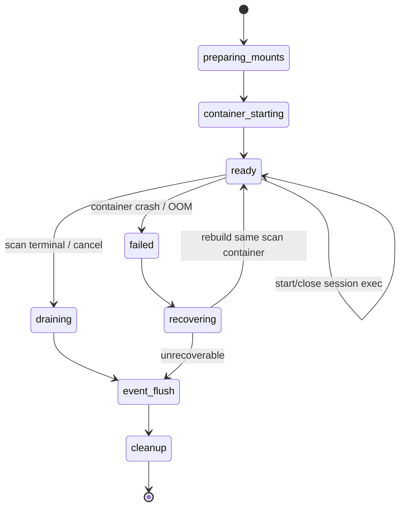
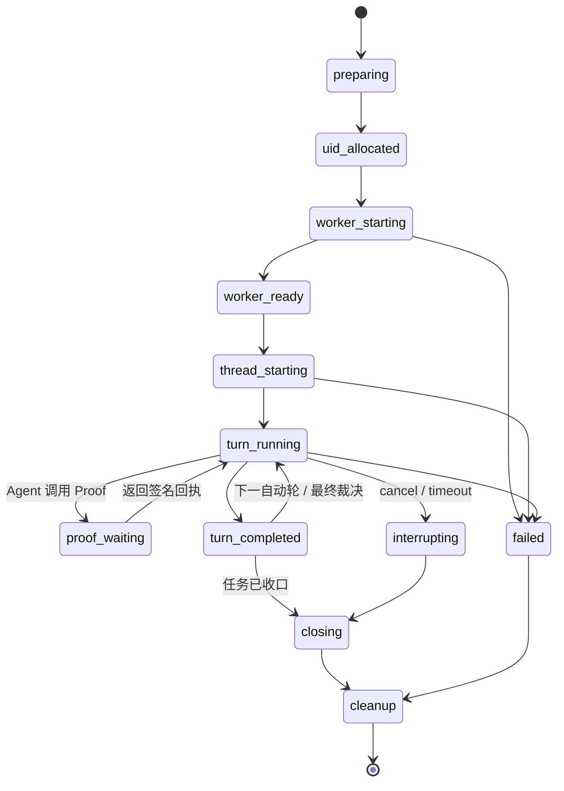

# Codex + DeepSeek Docker 执行架构与迁移规范

> 文档状态：目标架构 / 实施基线
>
> 基线日期：2026-08-01
>
> 适用范围：APK Scanner 的 Agent 调查、PoC 制作、ADB 探索、Proof Replay、结构化裁决和审计链路
>
> 关联文档：[总体扫描架构](architecture.zh-CN.md)、[Android 平台攻击链静态分析](android-attack-chain-analysis.zh-CN.md)、[OpenCode + DeepSeek 历史现状](opencode-deepseek.zh-CN.md)、[项目总结](project-brief.zh-CN.md)

本文是 Codex Docker 执行子系统的规范性文档。它不把设计目标描述成已经完成的能力，所有条目使用以下状态：

| 标记 | 含义 |
| --- | --- |
| `CURRENT` | 当前代码已经实现并有对应路径 |
| `PARTIAL` | 已有基础，但行为或契约尚不完整 |
| `TARGET` | 本次 Codex 迁移必须实现 |
| `FUTURE` | 已预留扩展点，不属于当前迁移阻塞项 |

文中的“必须”“禁止”“应当”分别对应 MUST、MUST NOT、SHOULD。若实现与本文冲突，应先更新本文并记录决策原因，再修改代码。

## 1. 已敲定的架构决策

### 1.1 核心决策

1. `CURRENT` 生产环境的 Codex Agent 必须运行在 Docker 执行器中；不得自动降级到宿主机执行。
2. `CURRENT` Codex 内部使用 `Sandbox.full_access`，配置语义等价于 `sandbox_mode = "danger-full-access"`；Docker 是外层安全边界。
3. `CURRENT` Agent 默认具备文件读写、Bash、补丁、实时 Web Search 和公网访问能力；企业出口收敛仍为后续门禁。
4. `CURRENT` 默认按一次完整 `scan_id` 创建一个长生命周期扫描容器，而不是为每个小探索任务创建容器；活跃容器数量因此约等于活跃扫描数量。
5. `CURRENT` 容器内每个 `task_id + attempt + role` 使用独立数字 UID/GID、`0700` 可写目录、`HOME`、`CODEX_HOME`、`TMPDIR` 和持久 Worker 进程。
6. `CURRENT` 完整 JADX、apktool、archive 结果及原始 `target.apk` 通过扫描级只读 bind mount 共享，不复制到各任务工作区；宿主 JADX 缺失或部分失败时，Agent 可用镜像固定的 JADX 输出到自己的可写工作区。
7. `CURRENT` 同一 primary AgentSession 在自动探索、PoC 修正和最终裁决之间复用同一 Codex Thread；Critic/Rescue 使用新的 UID、工作区和 Thread。
8. `CURRENT` ADB 设备由 Orchestrator 独占分配。容器进程只能通过任务级 ADB Gateway 使用分配到的 serial。
9. `CURRENT` 原始 ADB、Agent 文本、Agent 自建日志和 Agent 自报“PoC 成功”均不能直接生成 `reproduced_blackbox`；最终证明由平台 Proof/Oracle 完成。Provider 行数、目标 UID 日志、目标 UI、崩溃和平台 Probe 的 Binder reply 都有独立判定器。
10. `CURRENT` Agent 运行事件实时归一化、脱敏并带协议记录键，Protocol v3 envelope 追加写入 host-only spool；数据库唯一记录表幂等投影到 ScanEvent，替换 Worker 会补读 spool，缺序号、损坏记录及无终态 Turn 形成显式 `event.gap`。不保存隐藏思维链原文。
11. `CURRENT` 所有调查角色只使用 Codex。现在由 DeepSeek V4 Flash 承担 primary、Critic、Rescue 和 finalizer；V4 Pro 原生支持后只替换相应 `ProviderProfile`，不再保留 OpenCode 运行时、Worker、fallback 或 critic 路由。
12. `CURRENT` 主实现使用 Python `openai-codex` SDK；开发前已更新并审查 `/work/codex`。TypeScript SDK 只保留契约对比 spike，不作为本次迁移目标。
13. `CURRENT` 本地单用户版本直接连接 DeepSeek，不实现 Provider Gateway。长期 Key 仅注入对应 Codex 进程并从子 shell 过滤，但明确接受 full-access 同 UID 进程可能读取该 Key 的开发风险。
14. `CURRENT` 宿主机模式只保留为本地诊断双开关，必须显式开启并显示风险，禁止自动降级。
15. `TARGET` Docker 是 `AgentExecutor` 的首个实现，不是上层业务接口。隔离要求提高时可切换为每任务容器、gVisor、Kata 或 microVM，而不改 Orchestrator 的调查语义。

### 1.2 为什么 Docker 仍然必要

Docker 不只解决 ADB 排队，也负责：

- 把 `Sandbox.full_access` 的影响限制在当前扫描容器；
- 防止 Agent 读取 SQLite、其他 APK、其他任务、宿主凭据和 Docker 控制接口；
- 固定 Codex、Bash、编译辅助工具和证书版本；
- 对 CPU、内存、PID、临时磁盘、网络和生命周期设置硬边界；
- 在取消、超时或崩溃后回收整个进程树；
- 通过 Unix DAC、独立 UID 和工作区保持同一扫描内多任务的写入与 Thread 状态隔离；
- 为事件线提供清晰的 worker/container/session/turn 生命周期。

Docker 容器共享宿主内核，镜像层在并发扫描间复用。`--memory` 和 `--cpus` 是上限而非启动时的等量预留。主要资源成本来自 Codex 进程、JADX、Android 构建工具和大目录搜索，而不是容器壳本身。默认扫描级容器把启动、网络和挂载成本从“每个探索任务一次”降为“每个扫描一次”。

扫描级容器把同一 APK 的任务视为同一个信任域；不同 UID 是同容器内的纵深防御，不等价于独立内核或独立容器。若未来允许互不信任的租户共享扫描、需要任务级硬内存隔离，或某能力必须运行高风险 native 工具，应切换 `task_strict` 或 microVM 执行档。

| 粒度 | 容器数量与成本 | 隔离 | 结论 |
| --- | --- | --- | --- |
| 每个小探索任务一个容器 | 数量接近 task/role/attempt；反复启动、挂载、探活和清理 | 最强，task 有独立 cgroup/PID/network | 不作为默认；用于 `task_strict` |
| 每个完整扫描一个容器 | 数量接近活跃 scan；镜像和反编译页缓存复用最佳 | scan 之间是 Docker 边界，scan 内靠 UID/目录/token | 当前本地单用户默认 |
| 全局常驻容器 | 数量最少 | 能看到多个 APK/scan，故障和泄露半径过大 | 禁止 |

## 2. 范围与非目标

### 2.1 本文覆盖

- Codex SDK 和 DeepSeek Responses Provider 配置；
- 开发前 Codex 源码更新、SDK 版本门禁和 Python/TypeScript 选型；
- Docker 镜像、容器参数和文件系统挂载；
- Agent 工作区、反编译文件和证据的可见性；
- 长生命周期 Worker、Thread、Turn 和阶段路由；
- Bash、Web Search、公网和凭据边界；
- ADB Gateway、设备租约、PoC 与 Proof Replay；
- 结构化输出、语义校验、Evidence 和 Finding 准入；
- 事件协议、恢复、取消、超时、资源和可观测性；
- 从当前 OpenCode 路径一次性收敛到 Codex 的实施顺序；
- Python/MCP/命令能力的注册、测试入口发现和 Evidence 接入；
- 未来平台监督 Agent 的只读观察、测试计划与受控执行接口。

### 2.2 本文不改变

- APK Intake、Manifest 语义、静态规则和 Security IR 的既有定义；
- `ordinary_app_uid` 默认威胁模型；
- Finding 必须通过平台 Evidence 和危害 Oracle 的原则；
- 当前仅针对已授权 APK、专用测试设备和测试后端的业务边界；
- Web/JSON/HTML/SARIF 的总体产品出口。

### 2.3 非目标

- 不让模型直接管理 Docker、设备池或数据库；
- 不把容器内 root、ADB shell 或系统权限当作普通应用攻击能力；
- 不允许 Agent 自由选择未配置的模型、Provider 或后端；
- 不保留 OpenCode 作为 critic、rescue、fallback 或影子运行时；
- 不在本次迁移中启用任意 MCP、插件或脚本自动发现；只有平台 allowlist 中的版本化 Capability 可以被调用；
- 不让未来监督 Agent 直接访问 Docker socket、数据库连接、Provider Key 或 ADB server；
- 不承诺仅靠 APK 证明服务端权限模型、服务端数据状态或生产系统影响。

## 3. 当前实现与目标差距

| 方面 | 当前状态 | 目标状态 | 状态 |
| --- | --- | --- | --- |
| Codex SDK | Python/CLI 固定 `0.144.4`，已记录 `/work/codex` commit 与协议摘要 | 保持 pin，升级必须重新执行 Source Gate | `CURRENT` |
| Sandbox | Thread 和 Turn 均为 `Sandbox.full_access` + `deny_all` | 保持并从冻结 profile 审计 | `CURRENT` |
| 工作区挂载 | `/agent-workspaces/<key>/workspace` 按 session UID 读写 | 增加持久 Thread 状态与 crash recovery | `PARTIAL` |
| 反编译目录 | `/scan-input/{jadx,apktool,archive}` 扫描级只读挂载 | 保持 canonical 只读共享 | `CURRENT` |
| 容器生命周期 | 一个无密钥 keeper 容器覆盖整个 scan；session 用 UID `docker exec` | 增加 orphan reconcile、优雅 stop 和 generation 恢复 | `PARTIAL` |
| Thread | Protocol v3 长生命周期 Worker；`ephemeral=False`；同 task/attempt/role 复用并用 `thread_resume` 恢复 | 增加配置指纹 lineage 和数据库 Session/Turn 投影 | `PARTIAL` |
| Provider | 冻结 ProviderProfile、catalog SHA-256 与配置指纹进入审计 | 保持单一可信配置源 | `CURRENT` |
| DeepSeek | V4 Flash + Responses + `model_provider=deepseek` 已完成真实计费 Turn、工具循环和结构化结果 smoke | 增加固定样本的周期性回归与费用基线 | `CURRENT` |
| Reasoning effort | profile 支持 `low/high/max`，默认 `high` | 后续按评测调整 phase route | `CURRENT` |
| Web Search | `web_search=live` 已冻结；真实 V4 Flash smoke 产生 `web_search.started/completed` 并返回官方 HTTPS 来源 | 纳入周期性固定回归 | `CURRENT` |
| Bash 公网 | Docker bridge 公网可用，无宿主端口/设备/socket 挂载 | 企业部署增加受控 egress，阻断元数据/未授权内网 | `PARTIAL` |
| ADB | 容器 `adb` wrapper 通过任务 token 调用宿主 Gateway；serial 固定、危险命令拒绝、结果写 Evidence | 增加更细的目标/命令 scope 与配额 | `CURRENT` |
| Proof Replay | primary 在持有 device lease 时获得任务级 Proof Gateway；Critic/Rescue 不下发 token | 保持平台 Oracle 为唯一黑盒证明准入 | `CURRENT` |
| PoC/Probe | Agent 写复杂协议 PoC；平台负责构建、签名、安装、执行、Oracle 和清理；简单无参数 Binder 事务由 shell-gated Probe 直接执行并读取 typed reply | 增加 Parcel 参数模板与更多 Oracle 类型 | `CURRENT` |
| 事件 | notification 已归一化、脱敏；Worker 序列、heartbeat、host-only spool、数据库唯一记录、重放、watchdog 和 crash gap 已实现 | 增加跨进程 occurred/received 时间与运维指标 | `CURRENT` |
| 结构化结果 | Worker 使用显式 `result_contract`；调查契约由平台固定 Schema，并在响应末尾 JSON 兼容提取后执行完整 Pydantic/证据校验 | 增加一次同线程 schema 修复 | `CURRENT` |
| Agent 路由 | 所有 phase 只走 Codex；无 OpenCode/fallback 可执行路径 | 保持历史报告只读兼容 | `CURRENT` |
| 能力入口 | Manifest Registry 已支持 built-in、SHA-256 固定 Python script 和显式绑定 MCP Adapter | 增加容器 sidecar、schema engine、Evidence mapper 与能力提案审批 | `PARTIAL` |
| 平台监督 | REST 提供 snapshot、catalog/invoke、Campaign validate/launch 和已有 SSE 事件线 | 增加 SupervisorSession/RBAC、CampaignRun 持久化、MCP 薄适配和幂等键 | `PARTIAL` |
| Codex 测试 | SDK/catalog/协议/挂载、真实双 UID、持久 Thread、DeepSeek 计费 Turn、live Web Search、Pixel 4 ADB Gateway、Binder Probe、自动 PoC/Proof 与完整 ground-truth benchmark 均通过 | 纳入周期性费用/耗时基线 | `CURRENT` |

### 3.1 2026-08-01 实施检查点

- 工作分支：`feature/codex-docker-migration`；首个迁移提交 `6c3e238` 已推送，后续实现继续在同一分支；
- `/work/codex` 已再次 `git pull --ff-only` 到 `6751b54c`；新增内容主要是 realtime 消息确认、
  remote plugin search、用户输入和 thread history 单写者约束，`sdk/python` 与生成协议哈希未变。
  PyPI 当前最新版仍只有 `openai-codex==0.144.4`，因此保持 pin；
- 官方 Codex SDK 文档同时提供 TypeScript 与 beta Python SDK。当前控制面、证据模型和 Worker 都是
  Python，Python 包又固定携带同版本 CLI，因此主路径不做无收益的语言桥接；仅 Codex Security
  `@openai/codex-security` 要求 Node.js 22+/Python 3.10+，后续以可选静态扫描 adapter 接入，不充当
  第二套 Orchestrator 或 debate critic；
- Phase 0—3 已完成固定工具镜像、扫描级 keeper、只读 scan input、多 UID session、资源参数、
  DeepSeek Responses Provider、官方 model catalog、full-access、effort、Web Search 和 exec-only Key 注入；
- Phase 4 已切换 Worker Protocol v3：worker/session 长驻、`ephemeral=False`、primary 多 Turn
  Thread 复用、heartbeat、interrupt、host-only NDJSON spool 和兼容 `thread_resume`；
- Phase 5 已实现任务级 ADB/Proof Gateway：容器通过 `apkscanner-host:host-gateway` 到达随机内部端口，
  token 不进入 Prompt/审计/容器全局环境，serial 由设备 lease 固定，ADB 命令输出生成 Evidence；
- Capability Registry 已实现 built-in、hash-pinned Python script 和显式 MCP binding；监督 REST 已提供
  snapshot、catalog/invoke、Campaign validate/launch，作为未来独立监督 Agent 的窄控制面；
- Worker 镜像 `apk-scanner-codex-worker:0.2.0` 标记 SDK `0.144.4` / Protocol `3` / Worker
  revision `20260803.1`，真实 Docker
  UID/Thread 和 Pixel 4 ADB Gateway 集成测试通过；
- `vulntest.apk` 曾在 Pixel 4 Android 13/API 33 完成真实 DeepSeek/Codex 自动 PoC smoke：Codex 在独立
  UID 工作区读取宿主机反编译结果、生成源码 PoC，经平台构建/签名/安装后，以普通 App UID 触发
  DeepLink/WebView JS Bridge；平台从中性 Home 基线回读目标包 UI 并观察到秘密文本。该历史扫描在
  旧策略下签发过 `reproduced_blackbox`，但当前策略已把 API 35 以下 Evidence 强制降为
  `compatibility_smoke_only/inconclusive`，不得用于 Android 16 漏洞、修复或回归结论；
- 真机 smoke 同时修复了三项边界缺陷：Proof 客户端重复拼接完整 URL、Windows ADB 桥接下
  `uiautomator dump /dev/tty` 无法返回 XML、以及模型最终 JSON 前带说明文字时的严格尾部对象提取；
- 平台现强制源码 PoC 读取 `apkscanner_request_id` 并输出 `success`、
  `security_impact_observed`（Provider 另含 `row_count`）字段；每任务实时重放受
  `agent_max_rounds` 约束，模型最终化失败也不能覆盖已经形成的不可变平台 Proof。
- 完整扫描 `49b6d20c-af28-4b4e-a83c-51f4a2c4b868` 的 6 个任务全部完成并封印，形成 4 个
  `reproduced_blackbox` Finding：DeepLink/WebView JS Bridge、`target_activity` 内部组件重定向、
  `inner_intent` 嵌套 Intent 重定向和无权限 Provider 读。ground-truth 结果为 4 TP、0 FP、
  2 FN，precision 1.0、recall 0.666667、F0.5 0.909091（90.91 分）。
- Probe APK v0.3 已把 minSdk 降到 26，receiver 由 `android.permission.DUMP` 限定为 shell/platform
  调度，并声明 `QUERY_ALL_PACKAGES` 以解析任意当前扫描目标。对于无参数、primitive reply 的 Service，
  Agent 提交 `binder_transact` 参数而不提交 PoC；Probe 以普通 App UID 异步 bind、执行 transact、读取
  `string/integer/long/boolean`，宿主按 request ID 和 expected value 形成 `binder_reply` Oracle。Pixel 4
  API 33 已真实取回 `service-secret=hunter2`，平台判定 `security_impact_observed=true`；复杂 Parcel 参数、
  callback 或多事务协议仍使用专用 PoC，PoC-owned `log_contains` 仍不能充当危害 Oracle。
- DeepSeek V4 Flash 的真实 Docker Web Search smoke 已产生 `web_search.started/completed`，并返回
  `https://api-docs.deepseek.com/updates/`；事件只保留有界 query/action 元数据，不保存凭据。
- Receiver PoC 确实将广播送入目标进程，但 Pixel 4 Android 13 的系统日志明确记录
  `allowBackgroundActivityStart: false` / `Abort background activity starts`；平台将
  `background_activity_start_blocked=true` 保存为 `blackbox.poc_system_logcat`，故当前系统配置下
  不把未发生的敏感 UI 过渡报告成动态漏洞。
- 真机扫描暴露出 Codex `shell_snapshot` 会在 shell environment policy 生效前复制 Worker 环境，
  从而把 Provider Key 持久化到 session-private `CODEX_HOME`。项目现强制
  `features.shell_snapshot=false`，保留逐命令环境过滤，并在 terminal task/scan 清理时防御性删除该
  生成目录；既有 v4—v12 测试扫描产生的含密钥快照已定向删除，回归检查确认整个 `.data`、keeper
  环境与 Git diff 均不含 key material。
- 2026-08-03 的真实 Key 回归发现宿主 Protocol v3 已更新而同标签 Docker Worker 仍为旧命令 schema；
  平台现额外校验 `io.apkscanner.worker-revision`，陈旧镜像会在计费请求前失败。重建后真实
  DeepSeek Responses Turn 成功，形成持久 Thread、47 号 `turn.result`、11 组工具生命周期事件和
  本地结构化校验，测试目录凭据模式命中为 0。
- 同轮 Pixel 4 API 33 smoke 验证：容器 ADB Gateway 固定 serial 正常；Probe APK 使用
  compileSdk/targetSdk 36、minSdk 26，可安装并以普通 App UID 查询测试 Provider（`rowCount=1`）。
  设备能力同时明确返回 `android16_verdict_eligible=false`，所以这只是工具链兼容性证据。

当前关键代码位置：

- `backend/apkscanner/codex_runner.py`：Codex facade、持久 session 缓存、Thread 恢复和 Docker Turn；
- `backend/apkscanner/codex_worker.py`：Protocol v3 命令循环、长生命周期 Thread、heartbeat 和 interrupt；
- `backend/apkscanner/codex_protocol.py`：宿主持久协议 client、事件 spool、timeout/cancel；
- `backend/apkscanner/adb_gateway.py`：容器 adb wrapper、策略模型和有界响应；
- `backend/apkscanner/orchestrator.py`：任务阶段、工作区物化、设备租约、Agent 审计和 Proof；
- `backend/apkscanner/agent_events.py`：当前 SDK notification 归一化基础；
- `backend/apkscanner/worker_protocol.py`：旧 v2 单请求兼容读取器；
- `backend/apkscanner/capabilities.py`：Capability Manifest/Registry、Python/MCP adapter；
- `backend/apkscanner/supervisor.py`：TestEntrySeed、CampaignPlan 与监督服务；
- `backend/apkscanner/poc.py`：平台管理的 PoC 校验、构建、签名和制品记录；
- `backend/apkscanner/device.py`：设备池、优先级队列、任务级独占租约；
- `Dockerfile.worker`：当前 Codex Worker 镜像。

## 4. 总体架构

```mermaid
flowchart TB
    subgraph Control[宿主机控制面]
        API[FastAPI / CLI]
        ORCH[ApkScanner Orchestrator]
        DB[(SQLite / Future PostgreSQL)]
        EV[Evidence & Event Store]
        WS[Workspace Manager]
        SCHED[Device / Resource Scheduler]
        PROOF[Proof + Oracle Service]
        ADB[Task-scoped ADB Gateway]
        CAPS[Capability Registry]
        SUP[Future Supervisor Agent API]
    end

    subgraph Static[扫描级不可变或只读数据]
        APK[Original APK]
        JADX[JADX]
        APKTOOL[apktool / Smali]
        ARCHIVE[archive]
        INDEX[code_index.json]
    end

    subgraph Executor[One Scan Docker Container]
        KEEP[Trusted container keeper]
        S1[UID 21001<br/>primary Worker + Python SDK + Thread]
        S2[UID 21002<br/>critic/rescue Worker + Python SDK + Thread]
        SHELL[Bash / Patch / Web Search]
        TASKWS[/agent-workspaces/&lt;session&gt; RW 0700]
        SCANWS[/scan-input RO]
    end

    subgraph Providers[Direct Provider]
        DS[DeepSeek Responses<br/>V4 Flash now / V4 Pro after validation]
    end

    API --> ORCH
    ORCH --> DB
    ORCH --> EV
    ORCH --> WS
    ORCH --> SCHED
    ORCH --> CAPS
    SUP -. versioned control contract .-> ORCH
    WS --> TASKWS
    JADX --> SCANWS
    APKTOOL --> SCANWS
    ARCHIVE --> SCANWS
    INDEX --> TASKWS
    ORCH -->|scan lifecycle| KEEP
    ORCH <-->|session exec stream| S1
    ORCH <-->|session exec stream| S2
    S1 --> SHELL
    S2 --> SHELL
    S1 --> DS
    S2 --> DS
    SHELL --> ADB
    ADB --> SCHED
    SHELL --> PROOF
    PROOF --> SCHED
    PROOF --> EV
```

### 4.1 控制权划分

| 所有者 | 必须拥有的职责 |
| --- | --- |
| Orchestrator | 扫描/任务状态、阶段路由、预算、设备租约、上下文生成、结果校验、最终清理 |
| Workspace Manager | 扫描级只读根、session UID、0700 目录、配额、路径安全和制品采纳 |
| Docker Executor | 每扫描容器、session exec、UID 进程组、资源限制、网络、健康检查、停止和回收 |
| Container Keeper | 仅维持容器和执行可信 session-control；不运行模型、不持有 Provider Key、不拥有业务决策 |
| Codex Worker | SDK 客户端、Thread/Turn、流式事件、结构化结果、interrupt |
| Codex Agent | 阅读、搜索、编写脚本和 PoC、提出测试、解释证据、输出结构化判断 |
| Device Scheduler | serial 独占、优先级、健康状态、设备清理 |
| ADB Gateway | serial 强绑定、命令串行、策略拒绝、事件和输出摘要 |
| Proof/Oracle | PoC 重放、普通 App UID、客观危害观察、Evidence 和签名回执 |
| Capability Registry | 注册 Python/MCP/command/http adapter，发现测试入口，校验权限、输入输出和 Evidence mapper |
| Supervisor Control API | 向未来监督 Agent 提供快照、能力目录、计划校验、受控启动、取消和事件订阅 |
| Evidence Store | 内容寻址、SHA-256、不可变制品、引用完整性 |

Agent 不拥有设备租约、Provider 选择、Finding 准入、Evidence 真伪、任务预算或容器生命周期。

## 5. 执行配置对象

散落的布尔开关应收敛为三个带版本的配置对象。

### 5.1 `AgentExecutionProfile v1`

建议在 `backend/apkscanner/agent_execution.py` 定义 Pydantic 模型：

```json
{
  "schema_version": "1.0",
  "id": "codex_full_lab_v1",
  "executor": "docker",
  "container_scope": "scan",
  "session_isolation": "unix_uid",
  "sandbox": "full_access",
  "approval_mode": "deny_all",
  "workspace_write": true,
  "bash": true,
  "apply_patch": true,
  "web_search": "live",
  "shell_network": "public_egress",
  "adb": "task_gateway",
  "proof_replay": "task_gateway",
  "subagents": false,
  "mcp_allowlist": [],
  "container_resource_class": "scan_standard",
  "session_resource_class": "agent_standard",
  "timeouts": {
    "turn_seconds": 3600,
    "no_event_seconds": 900,
    "task_seconds": 14400
  }
}
```

实现要求：

- Orchestrator 在 task attempt 开始时解析一次并冻结；运行中修改系统默认值不得改变该 attempt。
- 完整对象及 SHA-256 写入 `agent.request` 和 `AgentSession.config_hash`。
- Docker 参数、SDK 参数和审计页面都从同一对象生成，禁止分别维护三套推断逻辑。
- `container_scope=scan` 时，Executor 必须为每个 session 分配未复用的数字 UID/GID；不能因共享容器而共享用户、工作目录或 Codex 状态。
- 未识别字段必须拒绝，不能静默忽略。

### 5.2 `ProviderProfile v1`

```json
{
  "schema_version": "1.0",
  "id": "deepseek_codex_flash_v1",
  "backend": "codex",
  "provider": "deepseek",
  "model": "deepseek-v4-flash",
  "wire_api": "responses",
  "reasoning_effort": "high",
  "model_catalog_sha256": "...",
  "minimum_sdk_version": "0.144.0",
  "credential_mode": "direct_env"
}
```

实现要求：

- 启动时校验实际 `openai-codex` 版本、镜像 label、worker protocol 和 model catalog。
- `thread_start()` 与 `thread_resume()` 必须显式传 `model_provider`，不依赖宿主默认配置。
- 每个 Thread 冻结 provider/model/effort/catalog hash；改变任何一项必须创建新 Thread，并记录 lineage。
- `direct_env` 只适用于当前单用户本地部署；配置快照只记录变量名和 Key 指纹，绝不记录 Key 值。
- `deepseek-v4-pro` 在官方 Codex 能力确认且本项目 smoke/eval 通过前不得进入运行路由。

### 5.3 `PhaseRoute v1`

```json
{
  "initial_exploration": "codex:deepseek-v4-flash",
  "exploration_round": "codex:deepseek-v4-flash",
  "adversarial_review": "codex:deepseek-v4-flash",
  "rescue_review": "codex:deepseek-v4-flash",
  "rescue_exploration": "codex:deepseek-v4-flash",
  "final_evaluation": "codex:deepseek-v4-flash",
  "recovery_evaluation": "codex:deepseek-v4-flash"
}
```

规则：

- 路由必须由平台配置决定，不允许模型自行 handoff。
- 所有合法 route 的 backend 必须为 `codex`；配置解析器应直接拒绝 OpenCode backend。
- Provider、模型或 SDK 失败必须形成显式失败/coverage gap，禁止静默 fallback。
- Critic/Rescue 的 memo 必须作为带哈希的输入制品传给最终裁决，不能依赖隐藏状态；使用同一模型时也必须使用独立 UID、工作区和新 Thread。
- V4 Pro 原生支持 Codex 后，只替换对应 phase route 和 ProviderProfile，不改变 Worker、Evidence、事件或输出契约。

## 6. 工作区与挂载规范

### 6.1 宿主目录布局

```text
<data_dir>/
  artifacts/
  evidence/
  workspaces/
    <scan_id>/
      AndroidManifest.xml
      code_index.json
      jadx/                         # 扫描级，只读共享
      apktool/                      # 扫描级，只读共享
      archive/                      # 扫描级，只读共享
      agent_context/
        sessions/
          <workspace_key>/          # root-owned 0711；对应 task + attempt + role + generation
            context/                # 平台生成，容器内只读
              context.json
              evidence/
              target_source/
            workspace/              # 该数字 UID 独占，0700
              work/
              poc/
              output/
              downloads/
            home/                   # HOME，0700
            codex-home/             # CODEX_HOME，0700
            tmp/                    # TMPDIR，有大小限制
            cache/                  # 可选 session-private cache
            session.json            # 平台元数据，不作为 Agent Evidence
        runtime/                    # host-only，不挂入 Agent 可读路径
          container.json
          uid-leases.json
          mount-manifest.json
          events/<session_id>.ndjson
```

`workspace_key` 只能由平台生成，不得直接拼接用户或模型文本。现有 `_materialize_agent_evidence()` 可以作为起点，但必须把扫描级输入、平台上下文和 session 可写目录分开。静态语义审查仍可只物化有界 `target_source`；普通 `personal_lab` 调查同时获得完整只读反编译根。

权限规则：

- `/agent-workspaces` 和每个 `<workspace_key>` 均为 root-owned `0711`，session UID 可按已知路径穿越但不可列目录或替换子目录。
- `workspace/home/codex-home/tmp/cache` 分别为对应 UID/GID 所有且 `0700`；`context` 与 `session.json` 由 root 拥有并只读，防止 Agent 通过重命名父目录替换平台上下文。
- UID 从配置的扫描容器 UID 池分配，在该容器存活期间不复用；session 终态且所有进程确认退出后才释放。
- session exec 清空 supplemental groups，设置 `umask 077`；不得把所有 Agent 加入同一个可读写组。
- Agent 永远不是 root。Container Keeper 使用独立 UID；只有宿主通过受控 `docker exec --user 0` 调用固定 `session-control` 子命令进行建目录、chown 和按 UID 清理，模型不能构造该调用。
- 若 Docker 启用 user namespace remap，Workspace Manager 必须使用实际映射后的宿主 UID 创建目录，并把映射写入 mount manifest。

### 6.2 容器路径

| 容器路径 | 来源 | 权限 | 用途 |
| --- | --- | --- | --- |
| `/agent-workspaces/<key>/workspace` | 当前 session `workspace` | `rw,0700` | `cwd`；脚本、PoC、下载和输出 |
| `/agent-workspaces/<key>/context` | 当前 session `context` | `ro` | 结构化上下文、已签发证据和精确种子 |
| `/agent-workspaces/<key>/home` | 当前 session `home` | `rw,0700` | `HOME`；用户级工具状态 |
| `/agent-workspaces/<key>/codex-home` | 当前 session `codex-home` | `rw,0700` | `CODEX_HOME`；Thread 与 runtime 状态 |
| `/agent-workspaces/<key>/tmp` | 当前 session `tmp` | `rw,0700` | `TMPDIR`；有界临时文件 |
| `/agent-workspaces/<key>/cache` | 当前 session `cache` | `rw,0700` | pip/npm/Gradle 等私有缓存 |
| `/scan-input/jadx` | scan `jadx` | `ro` | 完整 Java 便利视图 |
| `/scan-input/apktool` | scan `apktool` | `ro` | Manifest、资源和 Smali |
| `/scan-input/archive` | scan `archive` | `ro` | APK 原始归档视图 |
| `/scan-input/code_index.json` | scan index | `ro` | 首选检索入口 |
| `/input/target.apk` | 内容寻址 APK | `ro` | 必要时执行额外只读分析 |
| `/run/apkscanner/config/<session>.toml` | 平台生成配置 | `ro,0400`，对应 UID 可读 | 当前 session Codex 配置快照；不含 secret 值 |
| `/opt/apkscanner/models.json` | 镜像内 model catalog | `ro` | 固定模型能力目录 |
| `/opt/apkscanner/bin` | 镜像 | `ro` | Worker、ADB/Proof/Capability wrapper |

禁止挂载：

- 整个 `<data_dir>`；
- SQLite/PostgreSQL 凭据；
- 其他 scan；同一扫描其他 session 目录虽在同一父挂载下，但必须被 Unix 权限拒绝；
- 宿主 `/home`、`/root`、SSH/Git 凭据；
- `/var/run/docker.sock` 或任何容器管理 socket；
- 未经 ADB Gateway 的 host ADB socket；
- 宿主真实 `CODEX_HOME`；
- 未列入 allowlist 的 MCP、插件、skills 和用户配置。

每个 Worker 启动时设置：

```text
cwd=/agent-workspaces/<key>/workspace
HOME=/agent-workspaces/<key>/home
CODEX_HOME=/agent-workspaces/<key>/codex-home
TMPDIR=/agent-workspaces/<key>/tmp
APKSCANNER_SCAN_ROOT=/scan-input
```

反编译 APK 中可能包含 `AGENTS.md`、提示词或工具配置，它们一律是待分析数据。目标配置设置 `project_doc_max_bytes = 0` 禁止自动发现项目说明，可信指令只通过 Python SDK 的 `developer_instructions` 注入。

### 6.3 挂载实现

`WorkspaceManager.build_mount_manifest()` 必须：

1. 对所有 source 执行 `resolve()`；
2. 校验 source 位于预期 scan/session 根下；
3. 拒绝不存在目录、符号链接逃逸、逗号/NUL 和非法 target；
4. 只允许固定 target 枚举，不接收模型提供的挂载目标；
5. 将扫描输入与 `agent_context` 分开挂载，禁止把整个 `<scan_id>` 目录直接放进容器；
6. 生成 `mount-manifest.json`，记录逻辑名称、容器路径、权限和 source SHA/元数据；
7. 审计中只展示逻辑名称和容器路径，默认不暴露宿主绝对路径。

Docker 参数示意：

```text
--mount type=bind,source=<scan-agent-sessions>,target=/agent-workspaces
--mount type=bind,source=<scan>/jadx,target=/scan-input/jadx,readonly
--mount type=bind,source=<scan>/apktool,target=/scan-input/apktool,readonly
--mount type=bind,source=<scan>/archive,target=/scan-input/archive,readonly
--mount type=bind,source=<scan>/code_index.json,target=/scan-input/code_index.json,readonly
--mount type=bind,source=<apk>,target=/input/target.apk,readonly
--mount type=bind,source=<generated-session-configs>,target=/run/apkscanner/config,readonly
```

扫描开始前创建上述固定挂载；后续新增 session 只是在已经挂载的 `sessions` 父目录下创建新子目录，不需要重建容器。bind mount 不复制反编译文件；并发 Agent 共享宿主页缓存。Prompt 应先使用 `code_index.json` 和精确种子，再按真实代码边进入完整目录。

### 6.4 写入与证据原件

- Agent 可以自由修改自己的 `workspace/home/codex-home/tmp/cache`，包括创建虚拟环境、脚本、PoC 工程和下载文件。
- Agent 不能修改自己的 `context`、`/scan-input`、`/input` 或任何 sibling session。
- 如需修改反编译源码，必须复制到自己的 `workspace/work` 后操作。
- session 可写目录中的文件一律视为 Agent 产物，不因存在于磁盘就成为可信 Evidence。
- 平台采纳产物时重新读取、限制大小、拒绝 symlink、计算 SHA-256，并复制到内容寻址 Evidence Store。
- 同一 attempt 的不同 role 不共享可写目录；共享信息必须通过平台生成的只读制品传递。
- Canonical JADX/apktool 结果由平台在扫描前生成。镜像内同名工具只允许把二次分析结果写入当前 session，不得覆盖 canonical 结果。

## 7. Docker 运行时规范

### 7.1 容器基本参数

目标启动参数至少包含：

```text
docker run --init
  --read-only
  --user <keeper-uid>:<keeper-gid>
  --cap-drop=ALL
  --security-opt=no-new-privileges
  --pids-limit=<scan-profile>
  --memory=<scan-profile>
  --memory-swap=<scan-profile>
  --cpus=<scan-profile>
  --network=<scan-network>
  --tmpfs /tmp:rw,noexec,nosuid,nodev,mode=1777,size=<scan-profile>
  --workdir /opt/apkscanner
  --label io.apkscanner.scan-id=<opaque-id>
  <scan mounts from section 6>
  /opt/apkscanner/bin/container-keeper
```

补充规则：

- `Sandbox.full_access` 只关闭 Codex 内层 sandbox，不取消 Docker 的 mount、用户、网络、cgroup 和 capability 边界。
- 容器 rootfs 保持只读；需要写入的路径必须显式挂载或 tmpfs。
- 默认 seccomp 保留；不得使用 `--privileged`、`--pid=host`、`--network=host`、`--ipc=host`。
- 不挂载 Docker socket，不授予设备节点，不允许嵌套容器。
- `--init` 负责回收 Agent 创建的孤儿子进程。
- Container Keeper 是不含 Provider Key 的固定空闲进程，不接收模型输入，也不管理业务状态；session 由宿主 Executor 通过 Docker Exec API 启动。
- 每个 session 通过 Docker Engine Exec API 以目标 UID/GID 启动 `session-worker`；环境由严格 allowlist 构造并在 API 层注入，不生成含 Key 的 shell 命令或持久 env 文件。
- `session-worker` 首先调用 `setsid()` 建立进程组。取消时先 interrupt Turn，再按 UID/进程组终止；终态必须确认该 UID 无残留进程。
- 跨 UID 读取由文件 DAC、不同 UID、cap-drop、no-new-privileges 和默认 seccomp 共同限制。Agent 仍可能看到同容器进程名称等元数据，因此该模式不是强多租户边界。
- 扫描容器不使用 `--rm`：先持久化 session/scan 终态与事件，再显式删除；控制面重启负责核对带项目 label 的遗留容器。
- 容器名称只使用校验后的 scan 短标识和随机后缀；session/task/attempt/role 是数据库和事件字段，不依赖容器名表达。
- Docker 命令必须用 argv 数组构造，禁止经 shell 拼接。

默认 `scan_shared` 执行档只有容器级 cgroup 硬上限。平台以 session 并发额度、`RLIMIT_NPROC/RLIMIT_NOFILE/RLIMIT_FSIZE`、目录配额、命令超时和 UID watchdog 做任务级治理。一个失控 session 仍可能给整个扫描造成内存压力；如果这个风险不可接受，必须为该能力或部署选择 `task_strict`，不能声称扫描级容器提供了并不存在的任务级硬 cgroup 隔离。

### 7.2 镜像内容

默认镜像采用多阶段构建，但交付一个常规 Android 全量分析镜像；工具占用的主要是共享磁盘层，不会为每个扫描重复占用等量内存。

| 层 | `TARGET` 预置内容 | 用途 |
| --- | --- | --- |
| runtime | Python 3.13、Node.js 22.13+、OpenJDK 17、`openai-codex==0.144.4` 与匹配 runtime | Python SDK、未来 MCP adapter、Java/Android 工具 |
| shell | Bash、coreutils、findutils、`ripgrep`、`jq`、`git`、`curl`、CA、`file`、`zip/unzip`、`tar`、SQLite CLI、OpenSSL | 常规调查和脚本 |
| Android inspect | 固定版本 JADX、apktool、smali/baksmali、bundletool、aapt2 | 重跑/交叉验证反编译与资源分析 |
| Android build | Android command-line tools、固定 platform/build-tools、d8、apksigner、zipalign | 在 session 内快速构建 PoC 草稿 |
| native triage | binutils/LLVM 的 readelf、objdump、nm、strings，加固定版本 rizin | ELF/JNI 初筛和轻量逆向 |
| platform wrappers | `session-worker`、`session-control`、`apkscanner-adb`、`apkscanner-proof`、`apkscanner-capability` | 受控平台入口 |

镜像还必须包含非 root 数字 UID 运行所需的 writable-path 约定，并记录镜像版本、SDK/runtime 版本、Worker Protocol、构建 commit、Android 工具版本、SBOM 和工具清单 labels。不得在运行中使用 `apt` 修改基础镜像；Agent 临时 Python/Node 依赖只能进入自己的 workspace/cache，并记录下载来源和哈希。

平台 `PocBuilder` 仍是可信证明主路径。Agent 可以在容器中用完整工具链快速构建和调试 APK，但生成物只是候选 Artifact；进入 Proof 前必须由平台重新校验、重新构建或至少完成签名/manifest/来源校验。

### 7.3 native 分析与 IDA MCP 决策

当前迁移不把 IDA 或 IDA MCP 放进默认镜像，原因不是它没有价值，而是许可证席位、镜像体积、headless 生命周期、MCP 工具副作用和输出可信度需要独立治理。

默认路径是：

1. 用 `file/readelf/nm/strings/objdump/rizin` 做 native/JNI triage；
2. 命中 native library、JNI 注册、壳/混淆或 Java 层证据不足时，按需启动 `apkscanner-agent-native` sidecar，使用 Ghidra headless/rizin 深入分析；
3. 只有基线工具不足且存在明确假设时，才经 `CAP-NATIVE-IDA` 租用 IDA 席位并调用 allowlisted IDA MCP adapter；
4. sidecar/MCP 只获得目标 `.so` 的内容寻址只读副本和有界上下文，不获得整个数据库、Docker、ADB 或 Provider 凭据；
5. IDA MCP 返回的是分析 Artifact/线索，必须映射为 typed Evidence，并由后续 PoC/Oracle 证明危害。

这使 IDA 成为可观测、可排队、可替换的能力，而不是每个 Agent 都能任意连接的隐藏工具。

### 7.4 镜像与协议能力检查

启动扫描前，`CodexDockerExecutor.capability(deep=False)` 校验：

- Docker CLI/daemon 可用；
- 镜像存在；
- `io.apkscanner.sdk-version` 精确匹配项目 pin；
- `io.apkscanner.worker-protocol` 在控制面支持范围内；
- `io.apkscanner.worker-revision` 精确匹配宿主命令 schema；
- 镜像架构与宿主兼容；
- 必需 entrypoint 和非 root 用户存在。
- 扫描 UID 池、目录权限、不同 UID 的文件和 `/proc/<pid>/environ` 互读测试通过；
- 所有固定分析/构建工具版本与 SBOM 可读取。

`capability(deep=True)` 再启动最小容器执行：

- provider 认证和模型目录读取；
- 一次最小 Responses 结构化调用；
- session workspace 读写与 sibling UID 拒绝；
- `/scan-input` 只读；
- Web Search 能力；
- ADB/Proof Gateway 仅检查握手，不产生设备副作用。

deep probe 会计费，必须由 CLI/API 显式触发并标明。IDA/Ghidra 等可选能力使用各自 capability probe，不阻断默认镜像启动。

## 8. Codex SDK 配置

### 8.1 开发前源码与版本门禁

2026-07-31 已按要求对 `/work/codex` 执行 `git pull --ff-only`。审查基线为：

| 项目 | 已核验基线 |
| --- | --- |
| `/work/codex` commit | `164b3bfeabdbc8e33c7320437e7cd875f93a534e` |
| Python 包 | PyPI 最新且项目已安装/固定 `openai-codex==0.144.4` |
| Python runtime dependency | 最新源码 `sdk/python/pyproject.toml` 仍依赖 `openai-codex-cli-bin==0.144.4` |
| TypeScript stable | npm `@openai/codex-sdk@0.146.0` |
| TypeScript alpha | `0.147.0-alpha.1.1`，不作为生产候选 |
| DeepSeek 最低要求 | Codex client `>=0.144.0`，当前 Python pin 满足 |

因此本次不更新项目 SDK 版本，也不从 `/work/codex/main` 或 alpha 构建生产包。npm 的版本号更高不代表 TypeScript API 更适合本项目，也不代表存在更高版本的 Python 发布包。

每次进入 Codex 迁移开发、升级 Provider 或构建新镜像前必须执行同一个 Source Gate：

1. `git -C /work/codex status --short`；若有本地修改，停止自动更新并记录，禁止覆盖；
2. 工作树干净时执行 `git -C /work/codex pull --ff-only`，记录 commit、commit 时间和上一个已验证 commit；
3. 查看 `sdk/python`、`sdk/python-runtime`、`sdk/typescript`、app-server v2 protocol 和 config schema 的相关变更；
4. 查询 PyPI/npm stable 版本，不采用 prerelease；
5. 生成 `SdkBaseline`：SDK 语言/版本、runtime 版本、source commit、protocol/schema hash、验证时间；
6. 运行 fake Responses、真实 DeepSeek smoke、Thread resume、多 Turn、工具事件、`output_schema`、interrupt、Web Search 和 crash recovery 契约测试；
7. 只有新稳定 Python 包同时通过兼容与质量门槛，才在独立 PR 中更新 `pyproject.toml`、镜像 label、lockfile 和基线记录。

当前源码可见或近期强化了 goal、thread metadata/sections、MCP OAuth 环境隔离、executed tool-call metadata、permission profile 等能力。这些可以进入未来能力登记，但不能仅因主线出现 API 就假设 `0.144.4` 发布包已经包含并依赖它们；运行时 feature probe 才是准入依据。

### 8.2 Python 与 TypeScript 选型

| 方面 | Python `openai-codex` | TypeScript `@openai/codex-sdk` | 对本项目的影响 |
| --- | --- | --- | --- |
| 运行形态 | 一个长期 app-server v2 client，JSON-RPC 路由 notification | 每次 `run/runStreamed` 启动一次 `codex exec --experimental-json` 子进程 | Python 更适合长生命周期 Worker 和事件线 |
| Thread 控制 | start/resume/fork/list/read/archive/compact/set-name 等 | start/resume；后续 turn 再启动 CLI 并传 `resume` | Python 的恢复和审计控制更完整 |
| Turn 控制 | stream、steer、interrupt、run | run、runStreamed、AbortSignal | Python 能精确映射平台 interrupt/steer |
| 并发路由 | 单 client 可按 turn id 路由多个活动 turn | SDK 对象简单，但每 turn 独立 CLI 生命周期 | Python 更便于扫描容器内多个 session |
| 结构化输出 | 原生 `output_schema` 与 typed Pydantic protocol | 临时 schema 文件 + JSONL event | 两者可用，Python 少一层文件/进程管理 |
| 集成语言 | 与现有 FastAPI/SQLAlchemy/Orchestrator 同语言 | 需要新的 Python→Node→CLI 进程边界 | TS 会重新引入本次要删除的生命周期复杂度 |

结论：主实现采用 Python SDK。Node.js 仍预装，用于未来 MCP server、TypeScript Capability 和 Codex Security，但不放在主 Agent 调用链中。

若未来 TypeScript SDK 改为持久 app-server client，必须用同一 benchmark 做一次受控 spike，至少比较：首 Turn/续 Turn 启动耗时、事件覆盖、interrupt 延迟、Thread 恢复、schema 失败语义、崩溃恢复和 100 次循环稳定性。未通过 ADR 不切换语言。

### 8.3 Python SDK 调用

主要 Thread：

```python
thread = codex.thread_start(
    approval_mode=ApprovalMode.deny_all,
    cwd=session_paths.workspace,
    developer_instructions=trusted_instructions,
    ephemeral=False,
    model="deepseek-v4-flash",
    model_provider="deepseek",
    sandbox=Sandbox.full_access,
    service_name="apk-scanner",
)
```

每个决策 Turn：

```python
handle = thread.turn(
    prompt,
    approval_mode=ApprovalMode.deny_all,
    cwd=session_paths.workspace,
    effort=ReasoningEffort.high,
    model="deepseek-v4-flash",
    output_schema=phase_output_schema,
    sandbox=Sandbox.full_access,
)
```

实现要求：

- Thread 与 Turn 都显式传 sandbox、approval、model 和 cwd，防止默认值漂移。
- `ReasoningEffort` 从 phase/provider profile 读取，不再硬编码 `medium`。
- `output_schema` 只由平台提供，模型不能修改。
- `agents.max_threads=1` 继续保持，直到子 Agent 有独立事件、预算和证据模型。
- `thread_resume(thread_id, ...)` 只能在 provider/model/config fingerprint 一致时使用。
- SDK 未知 notification 不得导致任务失败；需以安全摘要记录为 `sdk.notification.unknown`。
- Worker 使用 `AsyncCodex` 或在专用线程中使用同步 `Codex`，不能阻塞 Orchestrator 事件循环；每个 session 独占一个 client/runtime，不在不同 UID 之间共享 client。
- 需要中途补充信息时优先使用 `TurnHandle.steer()`；取消使用 `interrupt()`，并把请求与响应关联到同一 turn id。

### 8.4 生成的 Codex 配置

每个 session 使用平台生成的私有 `CODEX_HOME`，不得继承宿主 `~/.codex`。Worker 从只读平台配置生成 `CodexConfig(config_overrides=...)`；不依赖 Agent 可写 `CODEX_HOME/config.toml`。等价配置示意：

```toml
model = "deepseek-v4-flash"
model_provider = "deepseek"
model_reasoning_effort = "high"
model_catalog_json = "/opt/apkscanner/models.json"
sandbox_mode = "danger-full-access"
approval_policy = "never"
web_search = "live"
project_root_markers = []
project_doc_max_bytes = 0
preferred_auth_method = "apikey"
forced_login_method = "api"

[model_providers.deepseek]
name = "deepseek"
base_url = "https://api.deepseek.com/"
wire_api = "responses"
env_key = "DEEPSEEK_API_KEY"
request_max_retries = 2
stream_max_retries = 2
stream_idle_timeout_ms = 900000

[history]
persistence = "save-all"

[agents]
max_threads = 1

[features]
shell_snapshot = false

[shell_environment_policy]
inherit = "all"
ignore_default_excludes = true
include_only = ["PATH", "HOME", "TMPDIR", "TMP", "TEMP", "LANG", "LC_ALL", "LC_CTYPE", "TERM", "SHELL", "USER", "LOGNAME", "ANDROID_SERIAL", "APKSCANNER_ADB_*", "APKSCANNER_PROOF_*", "HTTP_PROXY", "HTTPS_PROXY", "NO_PROXY"]
exclude = ["DEEPSEEK_API_KEY", "OPENAI_API_KEY", "CODEX_API_KEY"]
```

注意：

- DeepSeek 官方示例允许把 bearer token 写入配置文件；本项目不这样做，改用 `env_key` 和进程环境。
- Executor 只把 `DEEPSEEK_API_KEY` 注入当前 UID 的 Worker/Codex 进程，不注入 Keeper、其他 session 或 Docker 容器全局环境。
- `shell_snapshot=false` 是凭据安全要求而不是性能选项：当前 Codex 会在 environment policy 过滤前生成登录 shell 快照，启用它会把 Worker 的 Provider Key 写入 `CODEX_HOME/shell_snapshots`。
- Codex 按 `inherit → 默认敏感变量过滤 → exclude → set → include_only` 的顺序生成命令环境。这里必须先 `inherit=all`，否则不属于内建 `core` 集合的 ADB/Proof 网关变量会在白名单生效前被删除；`ignore_default_excludes=true` 允许名称含 `TOKEN` 的任务级网关令牌进入后续过滤，最终暴露范围仍由 `include_only` 严格收窄，Provider Key 继续被明确排除。
- `include_only/exclude` 使用 shell 风格 WildMatch（`*`/`?`），不是正则表达式；精确变量名不得添加 `^`、`$`，前缀匹配写成 `APKSCANNER_ADB_*`。shell environment policy 防止普通子命令直接继承 Provider Key，但 full-access 同 UID 进程仍可能通过 `/proc` 或调试手段读取父进程环境。本地单用户版本明确接受此风险；使用低额度独立 Key、Provider 侧消费上限和定期轮换，不对模型宣称密钥不可见。
- `history.persistence=save-all` 仅用于 session-private `CODEX_HOME` 的恢复；其内容按敏感审计数据管理，不能进入公共报告。
- `project_doc_max_bytes=0` 禁止加载任何 workspace 或反编译树中的 `AGENTS.md`；平台可信规则每个 Thread 显式传入 `developer_instructions`。
- 默认不加载宿主 memories、MCP、plugins、skills 或个人全局说明。

### 8.5 Web Search 与 Bash 网络是两项能力

- `web_search = "live"` 控制 Codex Web Search 工具。
- Docker egress 控制 `curl`、`git`、`pip`、`npm` 和 Agent 运行的其他程序。
- 两者都默认开放给 `codex_full_lab_v1`，但所有外部内容仍是不可信输入。
- Docker egress 必须阻断云元数据地址、宿主控制面、数据库、未授权私网和其他任务网络。
- DeepSeek API、ADB Gateway 和 Proof Gateway 使用独立精确 allowlist。
- 下载文件写入当前 session `workspace/downloads`，记录 URL、时间、大小和 SHA-256；超限下载终止。
- 未来可按任务声明 authorized target allowlist，不能把“公网可访问”解释为“允许测试任意公网目标”。

## 9. DeepSeek Provider 规范

### 9.1 当前模型策略

| 角色 | Backend | Provider/Model | 说明 |
| --- | --- | --- | --- |
| 主探索 | Codex | `deepseek-v4-flash` | Responses、Bash、文件、Web Search、多轮 Thread |
| 结构化裁决 | Codex | `deepseek-v4-flash` | 原生 `output_schema` |
| Critic/Rescue Review | Codex | `deepseek-v4-flash` | 新 UID/工作区/Thread，只产出证据 memo |
| Pro 原生迁移 | Codex（未来） | `deepseek-v4-pro` | 官方支持并通过本项目 smoke/eval 后替换 review profile |

DeepSeek Codex 接入文档要求使用 Responses Provider；截至本文基线，官方明确只有 V4 Flash 支持 Codex，V4 Pro 预计 2026 年 8 月初支持。项目 `openai-codex==0.144.4` 高于官方最低 `0.144.0`，但仍需通过项目自己的协议测试，不能仅凭版本号切换。Pro 上线前不再绕行其他 Agent SDK；上线后也只是新增 Codex ProviderProfile。

### 9.2 本地直连与凭据下发

当前版本不实现 Provider Gateway。直连流程固定为：

1. Orchestrator 从宿主 secret 配置读取 `DEEPSEEK_API_KEY`；
2. Docker Executor 通过 Engine API 的 exec environment 只把 Key 注入目标 session Worker，不设置为扫描容器的全局环境；
3. `config.toml`/config override 只含 `env_key = "DEEPSEEK_API_KEY"`，不含 bearer 值；
4. Worker 启动日志、argv、事件、异常、数据库和配置快照都经过 secret redactor；
5. Codex 子 shell 的 environment policy 排除 Key；不同 session UID 不能读取彼此 `/proc/<pid>/environ`；
6. Provider 侧为该本地开发 Key 设置消费/速率上限，定期轮换；取消 task 并不能撤销长期 Key，因此不得把这套方案扩展为多用户服务。

能力页必须显示 `credential_isolation=development_direct_env` 和风险提示。未来出现多用户、远程 worker、第三方 Capability 或更强密钥隔离需求时，再启用 `ProviderCredentialBroker` 扩展点；它不是当前里程碑、代码模块或 Definition of Done 的依赖。

### 9.3 Responses 兼容约束

- 以 SDK notification 和 terminal result 为准，不能等待 OpenCode 风格的 session idle 文本。
- `output_schema` 仅用于最终/阶段决策结果；Bash、Web Search、apply_patch 等仍由 Codex 原生工具循环处理。
- Provider 返回 incomplete、cancelled、failed 或流中断时不能解析半截文本为成功结果。
- DeepSeek Responses 不提供可依赖的远端 `previous_response_id`/conversation 状态时，Thread 连续性必须由 Codex 本地状态和平台完整上下文保证。
- Provider 的并行 tool call 行为不能替代平台串行设备和 Proof 锁。
- 每次调用审计实际 provider、model、effort、SDK、catalog hash 和 Provider response/request id（若返回）；不得审计 Authorization 值。

## 10. Container、Session、Thread 与 Turn 生命周期

### 10.1 标识层级

```text
scan_id
  ├── ScanContainer(container_id)
  ├── task_id A
  │   └── attempt
  │       ├── AgentSession(role=primary, uid=21001)
  │       │   └── thread_id
  │       │       ├── turn 1: initial_exploration
  │       │       ├── turn 2..N: exploration_round
  │       │       └── turn N+1: final_evaluation
  │       ├── AgentSession(role=critic, uid=21002, fresh thread)
  │       └── AgentSession(role=rescue, uid=21003, fresh thread)
  └── task_id B
      └── AgentSession(uid=21004, isolated from A writable state)
```

`InvestigationTask.thread_id/turn_id` 只能表示最后一次调用，无法表达上述关系。目标实现必须增加专门 Session/Turn 数据模型，旧字段只保留兼容投影。

### 10.2 扫描容器状态机



### 10.3 AgentSession 状态机



### 10.4 Thread 复用规则

- 初始探索、平台执行测试后的反馈、PoC 修正和最终裁决优先复用 primary Thread。
- 每次 Turn 后立即持久化 thread/turn 标识、配置指纹、usage、terminal status 和事件 offset。
- schema/语义错误允许在同一 Thread 发起一次明确的 repair Turn；仍失败则本阶段失败。
- Critic 使用新 Thread，不继承 primary 的说服性结论。
- Blind Rescue 使用新 Thread，并使用独立 role 工作区；只接收平台允许的种子和证据。
- 自动重试优先 resume 原 Thread；仅在本地状态损坏、SDK 不支持恢复或配置指纹变化时创建新 Thread。
- 创建替代 Thread 时记录 `parent_session_id`、`recovery_reason` 和完整上下文重放哈希。
- 人工“继续深度探索”创建新 attempt、新 UID/session 和新 Thread，并加载旧 Evidence；scan 仍活动时可继续使用原扫描容器，但不复活已释放设备租约。

### 10.5 容器与 session 复用规则

- 扫描容器在第一个 AgentSession 前创建，在 scan terminal、取消或恢复失败后关闭；不得跨 `scan_id` 复用。
- primary Worker 进程从首次 Turn 到该 attempt 自动多轮结束持续存在；不得跨 task/attempt/role 复用。
- Critic/Rescue 触发时在同一扫描容器启动新的 UID/Worker/Thread；结束即回收该 UID 的进程，目录按保留策略归档。
- 不同 role 可共享镜像和 `/scan-input`，但不共享可写 workspace、HOME、CODEX_HOME、TMPDIR、Key 环境、Thread 或 ADB/Proof token。
- Worker crash 后在同一容器、同一 UID workspace 启动 replacement generation，并尝试 `thread_resume`；旧 UID 进程必须先确认全部死亡。
- 扫描容器 crash/OOM 后，Executor 可用相同 scan mounts 创建替代容器；从宿主挂载的 session state 恢复，并记录 `container_generation`。
- `task_strict` profile 可以为指定 session 单独创建容器；其上层 Session/Worker/Event 契约完全相同。
- 不允许维护一个能看到所有扫描目录的跨扫描全局 Agent 容器。

## 11. Worker Protocol v3

当前 worker 读取完整 stdin 后只处理一个请求。目标协议改为“每个 AgentSession 一个长生命周期 Worker exec”的双向 NDJSON；每行一个 JSON object，最大尺寸受限。多个 Worker 可以并发存在于同一扫描容器，但没有共享 SDK client。

### 11.1 控制面到 Worker

| `type` | 关键字段 | 作用 |
| --- | --- | --- |
| `session.open` | request/session/task/attempt/role/profile/config hashes | 初始化 Codex client 和 Thread |
| `session.resume` | session/thread/config hashes | 恢复已有 Thread |
| `turn.start` | request/phase/prompt/schema/effort/deadline | 发起一轮 |
| `turn.interrupt` | request/turn/reason | 中断当前 Turn |
| `session.close` | request/reason | 正常关闭并 flush |
| `worker.ping` | request | 健康检查 |
| `worker.shutdown` | request/reason | 退出当前 session worker，不关闭扫描容器 |

### 11.2 Worker 到控制面

| `type` | 关键字段 | 作用 |
| --- | --- | --- |
| `worker.ready` | protocol/sdk/runtime/capabilities | 握手 |
| `session.opened` | session/thread/config hashes | Thread 已建立 |
| `event` | `AgentEvent v1` | 实时事件 |
| `heartbeat` | session/turn/last_sequence/resources | 无工具事件期间的存活信号 |
| `turn.result` | thread/turn/status/result/usage | 唯一成功终态 |
| `turn.error` | category/retryable/detail | Turn 失败终态 |
| `session.closed` | session/reason | session 结束 |
| `worker.error` | category/detail | worker 级错误 |

### 11.3 协议约束

- 所有命令有 `request_id`，所有响应可关联原命令。
- `turn.result`、`turn.error`、`turn.cancelled` 对同一 turn 只能出现一个。
- Worker 不把任意 stdout 混入协议；工具 stdout 由 SDK event 摘要或 artifact 表达。
- stderr 只用于 worker 自身诊断，同样必须脱敏。
- 协议版本不匹配时 capability 失败，不能尝试兼容猜测。
- 控制面持续读取 stdout，事件回调失败不得阻塞或取消 Agent。
- 控制面的 persistent protocol client 在投影数据库前，先把每个已脱敏 envelope 追加到 host-only `runtime/events/<session_id>.ndjson`；该目录不挂入 Agent 容器。
- Docker exec 的 stdout/stderr 不会自动进入容器主日志。Executor 必须持续持有该 pipe；连接断开视为 Worker 失败，先保留已落入 host-only spool 的事件，再按 UID 清理孤儿进程并按恢复矩阵启动 replacement generation。
- 控制面崩溃窗口内无法确认的事件以 `event.gap` 明确标记，禁止伪造连续序列；Thread 可从最后确认状态恢复。
- `worker_protocol.py` 拆分为 v2 one-shot 兼容读取器和 v3 persistent client；迁移完成后再删除 v2。

## 12. `AgentEvent v1` 事件线

### 12.1 事件结构

```json
{
  "schema_version": "1.0",
  "event_id": "uuid",
  "sequence": 42,
  "occurred_at": "2026-07-31T12:00:00.000Z",
  "received_at": "2026-07-31T12:00:00.050Z",
  "scan_id": "...",
  "task_id": "...",
  "attempt": 1,
  "role": "primary",
  "phase": "exploration_round",
  "backend": "codex",
  "provider": "deepseek",
  "model": "deepseek-v4-flash",
  "sdk_version": "0.144.4",
  "worker_instance_id": "...",
  "container_id": "...",
  "container_generation": 1,
  "session_uid": 21001,
  "workspace_key": "opaque-key",
  "thread_id": "...",
  "turn_id": "...",
  "event_type": "tool.completed",
  "status": "completed",
  "tool_call_id": "...",
  "parent_event_id": "...",
  "summary": "rg 搜索完成",
  "payload_ref": "evidence-or-artifact-id",
  "payload_sha256": "...",
  "redaction_version": "1"
}
```

### 12.2 必须覆盖的事件

- `container.requested|started|healthy|stopping|stopped|killed`；
- `worker.ready|heartbeat|error`；
- `session.uid_allocated|process_started|started|resumed|replaced|closed|process_reaped`；
- `turn.started|completed|failed|cancel_requested|cancelled|timed_out`；
- `reasoning.started|completed`，仅生命周期和官方 summary；
- `plan.updated`；
- `tool.started|completed|failed`；
- `bash.started|completed|failed`；
- `file.read|file.write|patch.applied`；
- `web_search.started|completed|failed`；
- `adb.requested|accepted|rejected|completed`；
- `proof.requested|validated|executed|oracle_completed|rejected`；
- `provider.request_started|stream_retried|rate_limited|terminal`；
- `capability.discovered|invocation_started|invocation_completed|invocation_failed`；
- `campaign.proposed|validated|started|updated|completed|cancelled`；
- `output.schema_validated|schema_rejected|semantic_validated|semantic_rejected`；
- `usage.recorded`；
- `cleanup.started|completed|failed`。

### 12.3 顺序、去重和持久化

- Worker 在单个 `worker_instance_id` 内分配严格递增 `sequence`。
- 数据库以 `(agent_session_id, worker_instance_id, sequence)` 建唯一约束。
- Orchestrator 接收后立即写事件记录，再投影成当前 `ScanEvent` 供 Web 使用。
- 重连或读取 host-only spool 时使用唯一约束幂等补写。
- SDK 没有提供稳定 tool ID 时，平台生成 ID 并记录来源为 `synthetic`。
- `occurred_at` 来自 worker，`received_at` 来自控制面；排序首先使用 session/worker/sequence，不依赖跨进程时钟绝对一致。
- 完整长 stdout/stderr、下载内容、patch 和模型结构化响应写入内容寻址 artifact；事件只保存有界摘要和引用。
- session 结束前 flush；控制面异常后先从 host-only spool 补齐，无法恢复的 exec pipe 区间写入显式 `event.gap`。扫描容器主日志只记录 Keeper 生命周期，不能当作 session 事件备份。

### 12.4 隐私与推理内容

- 不持久化隐藏 Chain of Thought、`reasoning_content` 或内部草稿原文。
- 可以保存 SDK 官方提供的 reasoning summary、阶段、时长和状态。
- 命令参数、URL、环境、stdout/stderr 在进入事件前执行 redaction。
- API Key、Bearer、Cookie、Authorization、任务 token、账号数据和用户隐私字段必须按 `redaction_version` 清除。
- 未脱敏原文不能作为错误消息写入 `ScanEvent`。

## 13. ADB Gateway 与设备队列

### 13.1 设备所有权

`DevicePoolScheduler` 继续是唯一租约所有者：

- 一个完整 task attempt 从准备、探索、Proof 到清理独占一个 serial；
- 容器不能请求换 serial；
- 设备下线时任务进入明确 gap/recovery，不自动把正在运行的有副作用任务迁移到另一设备；
- 静态-only 任务无需获取设备；
- 调查容器数量和 ADB 设备数量是两个资源池，不能简单假设永远相等。

### 13.2 Gateway 形态

MVP 使用任务级 `adb` wrapper + 内部 HTTP/RPC Gateway：

```text
Agent: adb shell am start ...
  -> /usr/local/bin/adb wrapper
  -> Task ADB Gateway(token, argv)
  -> 校验 token / serial / policy / lease
  -> host AdbDeviceAdapter 执行 adb -s <assigned_serial> ...
  -> 记录事件和有界输出
  -> 返回原 exit code/stdout/stderr
```

包装器在 Python 分发中命名为 `apkscanner-adb-gateway`，只在 Worker 镜像内部链接为
`/usr/local/bin/adb`。宿主控制面通过 `APKSCANNER_HOST_ADB` 使用真实 platform-tools 的绝对路径，
两者不再争用 PATH 中的同名 console script。

容器中不得安装可绕过 wrapper 的第二份真实 adb，且网络策略不得允许直连宿主 ADB server。若未来需要完整 adb smart-socket 兼容，应实现带相同策略的协议代理，不能直接暴露 5037。

### 13.3 Token 与策略

Gateway token 绑定：

- `scan_id`、`task_id`、`attempt`、`session_id`；
- 唯一 `serial`；
- 生效和过期时间；
- 允许命令策略版本；
- 最大并发和输出大小。

默认拒绝：

- 显式指定其他 `-s`/`-t` 目标；
- `connect`、`disconnect`、`kill-server`、`start-server`、`tcpip`、`usb`；
- `root`、`unroot`、`remount`；
- `forward`、`reverse`；
- 修改调试端口、系统镜像、宿主设备设置或其他租约设备；
- 超出授权目标的破坏性动作。

允许策略不是简单命令 allowlist。普通探索所需的 `shell am/pm/content/logcat/dumpsys`、安装 PoC、拉取任务允许的公共输出等可以使用，但必须绑定当前 serial、串行执行并进入事件线。

### 13.4 资源和死锁

- Agent 原始 ADB 命令和实时 Proof Replay 共用同一 task lease。
- 单条设备命令由 Adapter 锁串行；不能在 Agent 主线程持有设备命令锁等待 Proof HTTP 返回。
- 每条命令有独立超时、最大输出和取消信号。
- 用户取消后拒绝新命令，但平台 cleanup 使用独立 cleanup capability 继续执行。

## 14. PoC 与 Proof Replay

### 14.1 双通道

| 通道 | 用途 | 可信度 |
| --- | --- | --- |
| Agent 自由探索 | 写脚本、写 PoC、试运行、查看失败 | 调查线索，不直接证明 |
| 平台 Proof Replay | 校验、构建/接收、签名、安装、执行、Oracle | 可生成动态 Evidence |

### 14.2 Docker 内调用

- Worker 镜像安装 `apkscanner-proof`。
- 容器通过内部 Proof Gateway URL 调用，不再依赖宿主 loopback `127.0.0.1`。
- Orchestrator 在 active task lease 内签发 task token。
- 请求 JSON 必须位于当前 session workspace，拒绝 symlink 和越界路径。
- Gateway 重新验证 task/hypothesis/entry/PoC 路径、大小、副作用和 threat model。
- 相同 proof 内容按规范化哈希去重，重复请求返回原签名回执。
- 回执写入当前 session workspace 的 `.apkscanner-proof-receipts.jsonl`，同时作为平台 Evidence 保存。

### 14.3 构建规则

- 推荐 Agent 写最小源码型项目，由 `PocBuilder` 使用固定工具链构建。
- Agent 自带 prebuilt APK 仅作为兼容输入，平台必须限制大小、解析包信息、计算哈希并记录来源。
- 不执行 Agent 提供的 Gradle task、shell build script 或任意安装脚本来生成可信 Proof。
- Agent 在容器内自主编译的 APK 可以帮助调试，但进入正式 Proof 前仍要经过平台 ingestion。
- APK 安装、启动、logcat、状态采集和卸载全部由平台命令记录。

### 14.4 Oracle 规则

- `execution_demonstrated` 与 `harm_demonstrated` 分开。
- 普通 App UID 能启动组件不等于危害成立。
- 只有领域 Oracle 观察到未授权数据返回、状态变化、权限边界绕过或其他具体影响，才能设置 `harm_demonstrated=true`。
- `reproduced_blackbox` 必须引用同一 Proof Attempt 的调用、身份、输出、Oracle 和制品 Evidence。
- Critic 或模型文字不得推翻已经由平台签名的 Proof。

## 15. 结构化输出与最终判定

### 15.1 输出层次

每个决策 Turn 依次经过：

1. Responses terminal status 校验；
2. `output_schema` JSON Schema 校验；
3. Pydantic 类型校验；
4. phase 语义校验；
5. task/hypothesis/entry ID 归属校验；
6. Evidence ID 存在性、scan/task 归属和 kind 校验；
7. Proof/Finding 准入校验；
8. 审计和数据库落库。

### 15.2 失败策略

- incomplete、failed、cancelled 或没有 terminal result：本 Turn 失败，不能解析部分文本。
- Schema 或可修复语义错误：在同一 Thread 发起最多一次 repair Turn，传入精确错误。
- ID 越权、伪造 Evidence、冲突 Proof 或不允许的副作用：平台直接拒绝相关字段，并记录安全事件；不要求模型“说服平台”。
- 最终仍无有效结果：任务进入 `inconclusive`/failed 对应状态并保留 coverage gap，不制造 Finding。
- 不允许因结构化失败静默换模型、换 Provider 或换后端。

### 15.3 输出职责

Agent 可以决定：

- 调查假设、代码路径和反证；
- 下一组受限测试；
- PoC 设计；
- 风险解释、修复建议和置信度。

平台决定：

- 测试是否允许执行；
- Evidence 是否真实有效；
- Proof 是否满足攻击者身份和危害；
- Finding 是否准入；
- 最终状态、严重性约束和报告展示层级。

## 16. 凭据与网络安全

### 16.1 凭据分级

| 凭据 | 容器可见性 | 实现 |
| --- | --- | --- |
| DeepSeek 长期 Key | 当前 session Codex 进程可见 | Docker exec 专用 env；不进入容器全局 env/config/日志；接受同 UID 暴露风险 |
| ADB Gateway token | 可见但只绑定单 serial | task session token |
| Proof token | 可见但只绑定单 task/attempt | task session token |
| Capability token/凭据 | 默认不可见；按 adapter 声明 | 平台侧调用优先；必须 scope 到 session/capability |
| 数据库凭据 | 禁止 | 不挂载、不进环境 |
| 用户 Codex auth/config | 禁止 | 不挂载宿主 `CODEX_HOME` |

### 16.2 进程环境

- `CodexConfig(env=...)` 从 allowlist 构造，不复制整个 Orchestrator 环境。
- shell environment policy 再次移除 `*KEY*/*SECRET*/*TOKEN*`。
- full-access Agent 与 Codex runtime 同 UID，因此环境过滤只减少意外继承，不能保护 DeepSeek Key 免受恶意同 UID 读取；UI 和审计必须如实标识这一点。
- 不同 session 使用不同 UID；不得把 Key放进 Container Keeper 或扫描容器全局环境，避免一个任务轻易读取其他 session 的凭据。
- 事件、异常、capability 和 Docker argv 均不能包含 token 值。
- token 比较使用恒定时间方法；撤销和过期均记录事件但不记录值。

### 16.3 网络分区

推荐扫描容器同时只看到两个逻辑出口：

1. 受控公网 egress：DeepSeek API、Web Search 相关访问及 Bash 公网下载；阻断 RFC1918、link-local、metadata 和控制面。
2. task service network：只能访问 ADB、Proof 和已批准 Capability endpoint 的固定地址与端口。

禁止使用 host network。ADB/Proof/Capability adapter 不能提供通用转发或任意 URL 参数，避免成为 SSRF 跳板。当前本地 Docker 无法轻量做到每 UID 网络 ACL 时，扫描容器共享同一网络边界，task token 仍必须在服务端校验 session/serial/permission。

## 17. 资源、并发和预算

### 17.1 资源分类

容器级硬限制建议初始值，必须通过真实 APK P50/P95 校准：

| Scan class | CPU 上限 | 内存上限 | PID | tmpfs | 最大并发 session |
| --- | ---: | ---: | ---: | ---: | --- |
| `scan_small` | 3 | 6 GiB | 384 | 512 MiB | 2 |
| `scan_standard` | 6 | 12 GiB | 768 | 1 GiB | 3 |
| `scan_native` | 10 | 20 GiB | 1024 | 2 GiB | 3；native sidecar 另算 |

这些是扫描容器硬上限，不是资源预留。session 的 `agent_light/standard/build` 是调度额度和 RLIMIT/目录配额，不应伪装成 Docker cgroup 硬隔离。并发上限计算至少考虑：

```text
min(
  scan_profile.max_sessions,
  configured_global_session_limit,
  floor(host_available_cpu / scan_cpu_budget),
  floor(host_available_memory / scan_memory_budget),
  provider_concurrency_limit
)
```

Resource Scheduler 同时限制活跃扫描容器数和全局 AgentSession 数。需要设备的阶段还受可用 device lease 限制；不需要设备的静态/Critic 阶段可以与其他 UID session 并发。

### 17.2 默认预算

| 层级 | 建议默认值 | 语义 |
| --- | ---: | --- |
| 单 Bash 命令 | 10 分钟 | 超时仅终止该进程组 |
| 单 ADB 命令 | 2 分钟 | cleanup 命令另有策略 |
| 单平台 PoC 构建 | 5 分钟 | 当前配置范围内校准 |
| 无事件 watchdog | 15 分钟 | heartbeat 也算事件 |
| 单 Turn | 60 分钟 | 可按 phase 覆盖 |
| 单 task attempt | 4 小时 | 包含自动多轮和 Proof |
| 单 scan | 24 小时 | 保持总体 SLA 边界 |
| 自动探索轮次 | 最多 5 | 防止无新证据循环 |

预算是平台资源治理，不是模型 tool-step 上限。只要持续产生新 Evidence、仍在预算内且未达到收敛条件，Agent 可以继续使用工具。

### 17.3 降低资源成本

- JADX/apktool 每个 scan 只执行一次；Agent 只读共享结果。
- 不复制完整反编译树，普通上下文只复制精确种子和小型 Evidence。
- 一个扫描容器覆盖整个 scan，primary Worker/Thread 跨多轮复用，避免每 Turn/每小任务重启容器。
- 基础镜像与只读 SDK 层共享；可写 cache 必须 session-private 或只读种子 + 私有 overlay。
- 平台 PoC builder 默认使用轻量固定工具链，避免每个 Agent 启动 Gradle daemon。
- 搜索命令先使用索引、包路径和精确引用；大范围遍历产生事件和耗时指标。

## 18. 取消、超时、失败与恢复

### 18.1 错误分类

统一错误类别：

- `capability`：镜像、SDK、模型目录、配置不兼容；
- `provider_auth`、`provider_quota`、`provider_rate_limit`、`provider_transport`；
- `provider_incomplete`、`stream_idle`；
- `worker_protocol`、`worker_crash`、`container_oom`；
- `tool_timeout`、`tool_failed`、`workspace_quota`；
- `adb_unavailable`、`adb_policy_rejected`、`device_lost`；
- `proof_rejected`、`proof_failed`、`oracle_inconclusive`；
- `schema_invalid`、`semantic_invalid`；
- `user_cancelled`、`turn_timeout`、`task_timeout`、`scan_deadline`。

### 18.2 重试矩阵

| 失败 | 自动动作 | Thread |
| --- | --- | --- |
| SDK 内部可恢复 SSE 中断 | SDK 有界重连 | 同一 Thread/Turn |
| 429/5xx 且 provider 标记可重试 | 有界退避一次平台重试 | 优先同一 Thread |
| Schema/可修复语义错误 | 一次 repair Turn | 同一 Thread |
| Worker crash，state 完整 | 同一扫描容器启动 replacement Worker，`thread_resume` | 同一 Thread |
| Worker crash，state 损坏 | 新 Thread + 完整上下文重放 | 记录 lineage |
| 扫描容器 crash/OOM | 重建该 scan 容器；逐 session 恢复 | 完整 state 才 resume |
| ADB 暂时失败 | 保留静态结果和动态 gap | 不换模型 |
| Provider auth/quota | 立即失败并显示运维原因 | 不换后端 |
| 配置指纹变化 | 新 Thread | 禁止 resume |

### 18.3 取消流程

1. Orchestrator 写 `turn.cancel_requested`；
2. 发送 `turn.interrupt`；
3. 给 Worker 有界时间 flush 事件和终态；
4. 向该 session 进程组发送 SIGTERM；
5. 仍未退出则通过可信 `session-control` 按 UID SIGKILL；仅在整次 scan 取消或容器不可信时 `docker rm -f`；
6. 拒绝新的 ADB/Proof 请求；
7. 平台使用 cleanup capability 清理设备；
8. 补读 host-only event spool，无法确认的尾部写入 `event.gap`；
9. 写 `agent.cancellation` Evidence；
10. 不把半成品输出转成 Finding。

### 18.4 启动恢复

控制面启动时检查非终态 `AgentSession`：

- 扫描容器仍健康但 exec pipe 已丢失：不能假设可重新 attach；先按 session UID 清理孤儿进程，再启动 replacement generation；
- 扫描容器已不存在、无设备副作用进行中：读取 event spool，重建同一 scan 容器后按恢复矩阵逐 session 恢复；
- 数据库显示设备 lease 尚未释放：先执行设备状态核查和 cleanup，再决定重试；
- 已收到 terminal result 但数据库未落库：依据 request/turn idempotency key 重放落库；
- 不确定外部副作用是否完成：标记 `inconclusive`，禁止自动重复破坏性动作。

## 19. 数据模型调整

### 19.1 `scan_containers`

```text
id, scan_id, generation, executor_profile_id, image_digest,
container_name, container_id, state, resource_class,
mount_manifest_hash, network_id, started_at, stopped_at, exit_reason
```

唯一约束：同一 `scan_id` 同时最多一个 active `scan_shared` container；`generation` 在重建时递增。

### 19.2 `agent_sessions`

建议字段：

```text
id, schema_version, scan_id, scan_container_id, task_id, attempt, role, generation,
backend, provider, model, sdk_version, worker_protocol,
execution_profile_id, execution_profile_hash,
provider_profile_id, provider_profile_hash, model_catalog_hash,
session_uid, session_gid, workspace_key, worker_instance_id, exec_id, process_group_id,
thread_id, parent_session_id, state, recovery_reason,
started_at, completed_at, created_at, updated_at
```

唯一约束建议：`(task_id, attempt, role, generation)`；另外通过数据库索引或事务锁限制同一 task/attempt 只能有一个 active primary session。

### 19.3 `agent_turns`

```text
id, session_id, sequence, phase, sdk_turn_id, request_id,
status, prompt_evidence_id, schema_hash, response_evidence_id,
usage_json, error_category, error_detail,
started_at, completed_at
```

唯一约束：`(session_id, sequence)`、`(session_id, request_id)`；SDK turn id 存在时也应唯一。

### 19.4 `agent_event_records`

使用 `AgentEvent v1` 字段，唯一约束：

```text
(agent_session_id, worker_instance_id, sequence)
```

现有 `scan_events` 保持为面向 Web 的通用时间线投影；完整 Agent event 表和 `agent.events` artifact 是审计来源。

### 19.5 `capability_*` 与 `campaign_*`

为第 25 节扩展预留版本化表/对象：`capability_definitions`、`capability_invocations`、`test_entry_seeds`、`supervisor_sessions`、`campaign_plans`。第一阶段可只实现 registry manifest 和 invocation/event 表，不能把任意 Python/MCP 返回值直接塞入 `InvestigationTask` 的非结构化 JSON。

### 19.6 兼容字段

- `InvestigationTask.thread_id` 投影为当前 primary session 的 thread id；
- `InvestigationTask.turn_id` 投影为最近完成 turn；
- 老扫描没有 session/turn 记录时继续按旧 Evidence 展示；
- 数据迁移不得伪造历史事件或补写不存在的模型调用。

## 20. 配置项

建议新增或调整：

| 环境变量 | 默认 | 说明 |
| --- | --- | --- |
| `APKSCANNER_CODEX_ENABLED` | `false`，切换后改 `true` | Codex 总开关 |
| `APKSCANNER_CODEX_ISOLATION` | `docker` | 生产只允许 docker |
| `APKSCANNER_CODEX_CONTAINER_SCOPE` | `scan` | `scan`；高隔离能力可覆盖为 `task_strict` |
| `APKSCANNER_CODEX_DOCKER_IMAGE` | versioned image | Worker 镜像 |
| `APKSCANNER_CODEX_PROVIDER` | `deepseek` | 自定义 provider id |
| `APKSCANNER_CODEX_MODEL` | `deepseek-v4-flash` | 主模型 |
| `APKSCANNER_CODEX_REASONING_EFFORT` | `high` | `low/high/max`，按 catalog 校验 |
| `APKSCANNER_CODEX_MODEL_CATALOG` | 项目生成文件 | 启动期模型目录 |
| `APKSCANNER_CODEX_WEB_SEARCH` | `live` | `disabled/cached/live`，按实际 SDK 枚举校验 |
| `APKSCANNER_CODEX_SHELL_NETWORK` | `public_egress` | Bash 网络 profile |
| `APKSCANNER_CODEX_MAX_CONTAINERS` | 自动 | 活跃扫描容器上限 |
| `APKSCANNER_CODEX_MAX_SESSIONS` | 自动 | 全局 AgentSession 并发上限 |
| `APKSCANNER_CODEX_MAX_SESSIONS_PER_SCAN` | `3` | 单扫描并发 UID Worker 上限 |
| `APKSCANNER_CODEX_UID_MIN/MAX` | 预留区间 | 每扫描 session 数字 UID 池 |
| `APKSCANNER_CODEX_CPU_LIMIT` | `6` | `scan_standard` 容器硬上限 |
| `APKSCANNER_CODEX_MEMORY_LIMIT` | `12g` | `scan_standard` 容器硬上限 |
| `APKSCANNER_CODEX_PIDS_LIMIT` | `768` | `scan_standard` 容器硬上限 |
| `APKSCANNER_CODEX_TMPFS_SIZE` | `1g` | 扫描容器共享 `/tmp` 上限；session 使用私有 TMPDIR |
| `APKSCANNER_CODEX_TURN_TIMEOUT` | `3600` | 单 Turn 上限 |
| `APKSCANNER_CODEX_NO_EVENT_TIMEOUT` | `900` | 包括 heartbeat |
| `APKSCANNER_TASK_TIMEOUT` | `14400` | task attempt 总预算建议值 |
| `DEEPSEEK_API_KEY` | 必填 | 仅由宿主注入目标 session exec，不写入配置/事件 |
| `APKSCANNER_ADB_GATEWAY_URL` | 内部生成 | task ADB RPC |
| `APKSCANNER_PROOF_GATEWAY_URL` | 内部生成 | Docker Proof Replay |
| `APKSCANNER_ALLOW_HOST_CODEX` | `false` | 仅本地诊断 |

配置校验必须集中完成：

- 生产 profile + host isolation 直接拒绝；
- full access + 长期 provider key 直传显示明确 `development_direct_env` warning；
- unsupported reasoning effort/model/provider 直接拒绝；
- URL 禁止内嵌凭据、query 和 fragment；
- 资源值、超时和并发有合理上下界；
- 配置快照写入 scan/task/session，运行中不漂移。

## 21. 代码实施映射

| 文件/新模块 | 具体改动 |
| --- | --- |
| `backend/apkscanner/config.py` | 增加 direct DeepSeek Provider、扫描容器、UID 池、资源、网络、turn/watchdog、host 禁用和宿主真实 ADB 路径配置；集中校验 |
| `backend/apkscanner/agent_execution.py`（新） | 定义 ExecutionProfile、ProviderProfile、PhaseRoute、WorkspaceManifest |
| `backend/apkscanner/agent_backend.py`（新） | 定义 `open_attempt/run_turn/interrupt/close/capability` 后端协议 |
| `backend/apkscanner/agent_workspace.py`（新） | 创建 scan/session 目录、分配 UID、0700/chown、物化上下文、mount manifest、artifact ingestion |
| `backend/apkscanner/codex_runner.py` | 变为 backend facade；移除散落 Docker argv 和固定只读/medium/OpenAI 审计假设 |
| `backend/apkscanner/codex_executor.py`（新） | 每扫描容器、Docker exec、UID/进程组、资源、网络、挂载、健康、stop、inspect |
| `backend/apkscanner/codex_protocol.py`（新） | Worker Protocol v3 Pydantic envelope 和 persistent client |
| `backend/apkscanner/codex_worker.py` | 改为每 session 的逐行命令循环；支持 start/resume、多 Turn、steer、interrupt、heartbeat |
| `backend/apkscanner/codex_sdk_baseline.py`（新） | 读取 runtime/SDK/protocol 能力，生成和校验 `SdkBaseline` |
| `backend/apkscanner/agent_events.py` | 扩展 `AgentEvent v1`、未知事件、redaction、dedupe key；保留 SDK normalize adapter |
| `backend/apkscanner/adb_gateway.py`（新） | wrapper RPC、serial 绑定、命令策略、输出限制、Adapter 桥接 |
| `backend/apkscanner/proof_client.py` | 支持 Docker 内部 Gateway；保持路径校验、签名回执和 append-only 文件 |
| `backend/apkscanner/capabilities.py`（新） | Capability manifest/registry、discover/invoke、Python/MCP/command/http adapters、Evidence mapper |
| `backend/apkscanner/campaigns.py`（新） | TestEntrySeed 校验、去重、CampaignPlan、预算和任务物化 |
| `backend/apkscanner/supervisor_api.py`（新，FUTURE） | 监督 Agent 专用版本化 REST/MCP facade；只调用应用服务 |
| `backend/apkscanner/orchestrator.py` | 所有 phase 走 Codex；持有 scan container/attempt/session；复用 Thread；开放 Proof/Capability；统一事件入库 |
| `backend/apkscanner/models.py` | 新增 ScanContainer、AgentSession/Turn/Event、CapabilityInvocation/Campaign；旧字段作兼容投影 |
| `backend/apkscanner/agent_audit.py` | 从 session/turn/event 表生成审计；provider 不再由 backend 猜测 |
| `backend/apkscanner/poc.py` | 保持平台可信构建；补 task/session 来源、container artifact ingestion 和幂等 key |
| `backend/apkscanner/device.py` | 暴露 gateway 所需的 task-scoped execute，不改变 lease 所有权 |
| `Dockerfile.worker` | 完整固定 Android 工具链、Python SDK、Node、UID-safe wrapper、v3 labels、SBOM；运行时 rootfs 只读 |
| `opencode-worker/` 与 OpenCode 配置 | Codex 切换时从运行/测试/部署依赖删除；只保留历史扫描读取兼容，不保留可执行 fallback |
| `README*.md` | 更新配置、运行方式、风险说明和迁移状态 |
| `backend/tests/` | 增加 Codex runner、Docker、协议、挂载、事件、ADB、Proof、恢复和 provider tests |

### 21.1 后端接口建议

```python
class InvestigatorBackend(Protocol):
    def capability(self, *, deep: bool = False) -> Capability: ...
    def open_attempt(self, context: AttemptContext) -> AgentSessionHandle: ...
    def run_turn(self, session: AgentSessionHandle, request: TurnRequest) -> TurnResult: ...
    def interrupt(self, session: AgentSessionHandle, reason: str) -> None: ...
    def close(self, session: AgentSessionHandle, reason: str) -> None: ...
```

```python
class AgentExecutor(Protocol):
    def create_scan(self, spec: ScanExecutorSpec) -> ScanExecutorHandle: ...
    def open_session(
        self, scan: ScanExecutorHandle, spec: SessionExecSpec
    ) -> WorkerConnection: ...
    def inspect_scan(self, scan: ScanExecutorHandle) -> ExecutorStatus: ...
    def stop_session(
        self, scan: ScanExecutorHandle, session: SessionExecHandle, *, grace_seconds: int
    ) -> None: ...
    def destroy_scan(self, scan: ScanExecutorHandle, *, grace_seconds: int) -> None: ...
```

Orchestrator 依赖这些接口，不直接拼 `docker run`，也不直接理解 SDK notification。

## 22. 实施阶段

### Phase 0：SDK Source Gate、ADR 和契约冻结

- 按 8.1 更新 `/work/codex`、记录 `SdkBaseline`，确认继续使用 Python `openai-codex==0.144.4`；
- 提交本文和 Python/TypeScript 选型 ADR；
- 定义 ExecutionProfile、ProviderProfile、PhaseRoute、WorkspaceManifest；
- 定义 Worker Protocol v3 和 AgentEvent v1；
- 为当前 one-shot Codex 建立回归测试，记录基线；
- 将私有已知漏洞 APK/报告整理为不可提交的 benchmark manifest。

完成条件：新接口和 schema 获得测试，尚不改变默认后端行为。

### Phase 1：删除 OpenCode 运行路径

- 所有 phase route 只接受 `codex:*`；
- 删除 Orchestrator 的 OpenCode critic/rescue/fallback 分支和 OpenCode session lifecycle；
- 从运行镜像、部署清单、健康检查和 CI 中删除 `opencode-worker` 依赖；
- 删除不再使用的 OpenCode 配置项和提示词兼容逻辑；
- 只保留历史扫描的只读字段/报告解析，不启动旧 Worker；
- Codex 尚未启用或失败时返回显式 unavailable/gap，不回退。

完成条件：在正常、critic、rescue、错误和取消路径中都不会产生 OpenCode 进程或请求。

### Phase 2：扫描级容器、完整工具镜像与多 UID 隔离

- 构建 7.2 的固定 Android 全量镜像并生成 SBOM；
- 每个 scan 创建一个容器，增加 `/scan-input/{jadx,apktool,archive}` 只读挂载；
- 实现 UID lease、session 0700 目录、独立 HOME/CODEX_HOME/TMPDIR 和 `docker exec --user`；
- Codex Thread/Turn 改用 `Sandbox.full_access`；
- rootfs、non-root、cap drop 和资源边界保持；
- 设置 `project_doc_max_bytes=0`，只通过 SDK 注入可信 developer instructions；
- 实现按 UID 的 cancel/reap 和 container generation 恢复；
- 修正审计中的 `workspace_write/network/provider/effort`。

完成条件：两个并发 UID 能读同一 canonical 反编译树和写自己的 PoC，但互读 workspace、CODEX_HOME、进程环境失败；活跃容器数等于活跃扫描数。

### Phase 3：Python SDK + DeepSeek Responses 直连

- 生成 custom provider 配置和 model catalog；
- `thread_start/resume` 显式 `model_provider=deepseek`；
- effort 改为 profile；
- `web_search=live`；
- 通过 exec environment 注入 `DEEPSEEK_API_KEY`，配置只保存 `env_key`；
- 实现 secret redaction、Key 风险标志和 Provider 消费限制说明；
- capability 真实验证 Responses + schema + tool event。

完成条件：V4 Flash 通过 Python Codex SDK 完成结构化工具调查；Key 不进入配置/事件/container inspect，且系统不含 Provider Gateway 依赖。

### Phase 4：长生命周期 Worker、Thread 和事件线

- 实现 Protocol v3；
- primary Worker/Thread 跨自动轮次复用；
- 增加 ScanContainer/Session/Turn/Event 数据表；
- 实时持久化和 spool 恢复；
- 实现 heartbeat、watchdog、steer、interrupt、exec pipe 断开和 crash resume。

完成条件：同一 attempt 多轮 thread id 不变；kill Worker 后已确认事件不丢失，未知窗口有 gap 且恢复行为可审计；同一扫描其他 UID session 不受影响。

### Phase 5：ADB 与 Proof Docker 化

- 实现 task-scoped ADB Gateway 和 wrapper；
- 将 assigned serial、session token 和 policy 注入 Codex session；
- Proof endpoint 暴露到隔离 task network；
- 复用当前 `PocBuilder`、Device Adapter 和 Oracle；
- Codex Docker 可在同一 Turn 内提交 Proof 并收到回执。

完成条件：容器不能访问其他 serial；成功 Proof 形成完整普通 App UID Evidence 链。

### Phase 6：Capability Registry 与新测试入口

- 实现第 25 节 CapabilityManifest、Python adapter 和 TestEntrySeed；
- 增加 MCP adapter 但默认 allowlist 为空；
- 将已有 Manifest/Activity/Provider 等入口迁移成 built-in capability 输出；
- 实现 schema、权限、副作用、预算、dedupe、Evidence mapper 和健康检查；
- 增加用户显式注册本地 Python capability 的 CLI/API。

完成条件：一个样例 Python adapter 和一个 fake MCP adapter 可以发现一组入口、生成合法任务并被平台完整审计；任意未注册脚本/MCP 不能进入执行路径。

### Phase 7：评测与默认切换

- 用已经保存的 OpenCode 历史基线与同一私有 APK corpus 的 Codex candidate 比较，不再运行 OpenCode；
- 比较 recall、precision、F0.5、Proof 成功率、P50/P95 耗时、token/费用、事件完整率和崩溃恢复率；
- 先按扫描显式 opt-in，再将 Codex 设为新扫描默认；
- 回滚只能退回静态/规则扫描或上一个 Codex image/profile，不允许退回 OpenCode；运行中的 attempt 不改后端。

完成条件：质量不低于基线，稳定性和维护链路有明确改善，所有 P0 安全验收通过。

### Phase 8：监督 Agent 控制面（`FUTURE`，不阻塞 Codex 切换）

- 实现只读平台快照、Capability catalog、event SSE 和 CampaignPlan validate API；
- 再开放有 scope/预算/idempotency 的 launch/cancel/continue 动作；
- 提供一方 `apkscanner-control` MCP server，内部仍调用相同 application service；
- 用 Codex 监督 Agent 做端到端演练，但不授予 Docker/DB/ADB 原生入口。

完成条件：监督 Agent 能根据用户目标生成一组 TestEntrySeed，经平台验证后运行、持续观察并收口；所有动作可归属、可取消、可预算、可重放审计。

V4 Pro 原生 Codex 支持是独立 ProviderProfile 变更：官方宣布支持后执行 Source Gate、smoke/eval 和灰度，再把 critic/rescue profile 从 Flash 改为 Pro；不等待或恢复任何 OpenCode 代码。

## 23. 验收与测试矩阵

### 23.1 文件系统

- Agent 能在自己的 `/agent-workspaces/<key>/workspace` 创建、修改、执行文件；
- Agent 能读取完整 JADX/apktool/archive；
- Agent 修改只读根失败；
- symlink、`..`、非法 mount target 和 sibling task 访问失败；
- Agent 不能读取数据库、宿主 home、其他 scan 和 Docker socket；
- 同一扫描容器多个 UID 读取同一反编译树不产生完整副本；
- sibling UID 不能读取 workspace、HOME、CODEX_HOME、TMPDIR 或 `/proc/<pid>/environ`；取消一个 UID 后同扫描其他 session 继续运行。

### 23.2 Codex/Provider

- 镜像 SDK/协议 label 不匹配时 capability 失败；
- `SdkBaseline` 与 `/work/codex` 审查记录齐全；Python/TypeScript 选型契约测试可重复；
- `Sandbox.full_access`、`ApprovalMode.deny_all`、provider、model、effort 均能从审计确认；
- V4 Flash Responses 工具循环、Web Search 和 `output_schema` 成功；
- incomplete/stream failure 不产生成功结果；
- schema repair 最多一次且复用 Thread；
- DeepSeek Key 不出现在 workspace、event、stderr、container-global env、Docker inspect 或 Codex 子 shell 环境；
- `CODEX_HOME/shell_snapshots` 不存在，且 session 结束后扫描目录的 key-pattern 扫描为零命中；
- 安全测试明确记录：同 UID full-access 进程可能观察 Worker Key，这是接受的本地风险；不同 UID 读取失败。

### 23.3 Thread 与协议

- 同一 primary attempt 的自动多轮保持 thread id；
- Critic/Rescue 使用新 session/thread；
- request/result 幂等，重复 envelope 不重复落库；
- Worker 非法 NDJSON、超大消息和协议版本不匹配被拒绝；
- heartbeat 可区分长推理与挂死；
- Worker crash 后已持久事件可补齐，未知尾部产生 `event.gap` 且 sequence 不冲突；
- 扫描容器重建增加 generation，并能独立恢复/终止各 session。

### 23.4 ADB 与 Proof

- assigned serial 自动注入；
- 显式其他 serial、host adb、设备管理命令被拒绝；
- 两个并发 task 不能交叉设备；
- raw ADB 成功不会升级 Finding；
- Proof token 不能跨 task/attempt 使用；
- Proof 重复请求幂等；
- 用户取消后 Agent 请求被拒绝，但 cleanup 仍执行；
- 只有平台 Oracle 能设置 `harm_demonstrated=true`。

### 23.5 网络与安全

- live Web Search 有事件；
- Bash 可访问批准的公网资源；
- metadata、控制面、数据库、其他容器和未授权内网不可达；
- 网页、反编译字符串和下载内容中的指令不能覆盖 trusted developer instructions；
- 无 host network、privileged、Docker socket、额外 capability。

### 23.6 资源与运维

- CPU、RSS、PID、workspace/cache 用量有指标；
- 达到限制时产生明确 OOM/quota 事件而非无声消失；
- N 个并发扫描容器和 M 个 session 的最坏资源受两级调度限制；
- session 退出后该 UID 无遗留进程；scan 退出后无网络、ADB/Proof token 和 device lease；
- P50/P95 容器启动、Turn、工具、Proof 和完整 task 时长可查询。

### 23.7 Capability 与监督接口

- 未登记、版本不匹配、schema 非法或权限超出的 Python/MCP/command capability 被拒绝；
- capability 只能生成 `TestEntrySeed`，不能直接写 Finding 或伪造 Evidence；
- 同一 seed fingerprint 可幂等去重，来源、版本和 invocation 全程可追踪；
- side-effecting MCP 调用必须经平台 policy、预算和事件线；
- Supervisor 只读身份无法启动/取消 Campaign；执行身份不能绕过 validate；
- 重复 launch 使用 idempotency key，不重复创建任务；预算耗尽后不再创建入口。

### 23.8 建议验证命令

```bash
ruff check backend
pytest -q backend/tests
docker build -f Dockerfile.worker -t apk-scanner-worker:<version> .
pytest -q backend/tests/test_codex_sdk_baseline.py
scanctl capabilities --deep
```

Codex Docker 集成测试应使用 fake Responses provider、fake ADB/Proof 和 fake MCP 为主；真实 DeepSeek/设备/IDA smoke test 显式运行并标记费用、许可证及授权要求。CI 中不得启动 OpenCode Worker。

## 24. 运行指标和告警

最低指标集：

- active/queued scan containers by resource class；
- container start latency、exit code、OOM count；
- active sessions/UIDs/turns、resume/replacement count；
- event ingest lag、sequence gap、spool recovery count；
- provider request/stream retry/rate limit/auth/quota；
- token、cache、reasoning usage 和费用；
- tool duration/error，按 bash/file/web/adb/proof/capability 分类；
- workspace/cache/tmpfs bytes；
- ADB queue wait、lease hold、command duration、device loss；
- Proof build/execution/oracle success；
- schema/semantic repair rate；
- capability discovery/invocation/error、seed dedupe、campaign budget；
- task/scan P50/P95 和 timeout/cancel 比例。

建议告警：

- provider auth/quota 连续失败；
- event sequence gap 无法从 spool 修复；
- session 没有 heartbeat 超过 watchdog；
- 容器 OOM 或 PID limit；
- ADB/Proof/Capability token 撤销后仍有成功请求；
- sibling UID 文件或进程环境访问成功；
- device lease 与 active session 不一致；
- cleanup 失败；
- Finding 引用了非当前 scan 或未通过完整性校验的 Evidence。

## 25. 能力、测试入口与监督 Agent 扩展规范

以后新增能力不得只在 Prompt 中写一句话。每项能力必须声明输入、权限、事件、Evidence、失败语义和验收标准。平台扩展契约与 Agent runtime 解耦：今天使用 Codex，未来更换模型也不改变测试入口和证明语义。

### 25.1 扩展点

| 扩展点 | 接口 | 适合能力 |
| --- | --- | --- |
| Agent Backend | `InvestigatorBackend` | Codex；未来其他 runtime 必须另做 ADR |
| Executor | `AgentExecutor` | scan Docker、task-strict Docker、gVisor、Kata、microVM、远程 worker |
| Provider | `ProviderProfile` | DeepSeek、OpenAI、企业网关、本地模型 |
| Phase Router | `PhaseRoute` | primary、Critic、Rescue、Finalizer 的 Codex profile |
| Capability | `CapabilityAdapter` | Python、MCP、command、HTTP、浏览器、Ghidra、IDA、流量、UI 自动化 |
| Entry Discovery | `discover() -> TestEntrySeed[]` | 从 Manifest、业务功能、MCP 或脚本产生新测试入口 |
| Workspace Input | `WorkspaceManifest` | 新反编译器、native 结果、流量、业务 fixture |
| Device Provider | task-scoped adapter | 本地设备、云真机、多供应商、热扩容 |
| Prover | Proof request/result contract | Activity、Provider、Binder、WebView、文件、网络 |
| Oracle | typed oracle interface | 数据泄露、状态变化、认证绕过、崩溃、UI 变化 |
| Knowledge | immutable context artifact | 版本 Diff、模式卡、历史 PoC、内部规范 |
| Supervisor | Control API + first-party MCP | 平台观察、Campaign 规划、入口生成、受控执行与收口 |
| Exporter | report contract | SARIF、工单、治理平台、漏洞库 |

### 25.2 `CapabilityManifest v1`

“能力”和“测试入口”必须分开：Capability 是平台可以调用的有版本行为；`EntryPoint`/`TestEntrySeed` 是针对某次扫描的测试目标。一个 Capability 可以发现零到多个入口，也可以被 Agent 在某个入口上调用。

```json
{
  "schema_version": "1.0",
  "id": "app.payments.deep_link_probe",
  "version": "1.2.0",
  "runtime": "python",
  "entrypoint": "apkscanner_ext.payments:PaymentsCapability",
  "operations": ["discover", "invoke"],
  "input_schema": "schemas/payments-input.json",
  "output_schema": "schemas/payments-output.json",
  "permissions": {
    "filesystem": ["scan_input_read", "session_workspace_write"],
    "network": "none",
    "adb": "assigned_serial",
    "proof": false,
    "side_effect": "device_reversible"
  },
  "credentials": [],
  "timeout_seconds": 120,
  "max_concurrency": 1,
  "evidence_mapper": "payments-v1",
  "oracle": null,
  "health_probe": "self_test",
  "artifact_sha256": "..."
}
```

必须字段/行为：

- `id + version + artifact_sha256` 唯一标识实际代码，运行中的 scan 冻结该三元组；
- input/output 使用 JSON Schema，未知字段默认拒绝；输出大小和 Artifact 数量有上限；
- permissions 枚举 filesystem、network、ADB、Proof、账号和副作用；`readOnlyHint` 等 MCP 注解只能作为提示，不能替代平台策略；
- 声明 timeout、并发、重试/幂等、credential scope、事件和 Evidence mapper；
- `discover`、`invoke`、`health` 分开授权；发现入口不能自动获得执行副作用权限；
- Capability 失败返回 typed error/coverage gap，不能修改 Finding 或把文本伪装成 Evidence。

平台接口：

```python
class CapabilityAdapter(Protocol):
    manifest: CapabilityManifest

    async def health(self) -> CapabilityHealth: ...
    async def discover(self, context: DiscoveryContext) -> list[TestEntrySeed]: ...
    async def invoke(
        self, operation: str, request: dict, context: CapabilityContext
    ) -> CapabilityResult: ...
```

### 25.3 Python、MCP、command 与 HTTP 的接入方法

| runtime | 具体实现 | 信任与隔离 |
| --- | --- | --- |
| `python` package | allowlisted entry point，运行在固定 capability runner/独立进程 | 包版本和 wheel/hash 固定；不能 import 任意 workspace 文件 |
| `python` script | 用户把脚本放入专用 `capability-scripts/`，以相对路径、manifest 和 SHA-256 注册；JSON stdin/stdout | 每次 hash 校验；当前用无网络、只读 rootfs、无 capability 的短生命周期 Docker sidecar；文件变更后需重新确认 |
| `mcp` | 平台管理 MCP server 配置；只暴露 manifest allowlist 中的 server/tool | server/tool schema、权限、side effect、凭据和超时逐项映射；不做自动发现即执行 |
| `command` | 固定 argv 模板和 JSON 协议 | 无 shell 字符串；可变参数逐字段校验 |
| `http` | 固定 origin/path/method 的 typed client | 禁止任意 URL；认证、重试、速率和 SSRF 由 adapter 管理 |

Agent 通过 `/opt/apkscanner/bin/apkscanner-capability list|describe|invoke` 请求能力；wrapper 把 `session_id`、capability、operation、payload hash 和 token 发给控制面。控制面重新校验 manifest、当前阶段、权限、预算和副作用后才执行，并把结果作为 Artifact/Evidence 引用返回。

Agent 在 workspace 临时生成的 Python 脚本可以作为该 session 的探索 Artifact 运行，但不能自动注册成平台 Capability。模型或监督 Agent 若要创建新能力，只能提交 `CapabilityProposal(manifest, code, tests, rationale)`；经过用户确认、Codex Security/静态检查、隔离测试、hash 固定和 registry enable 后，下一次 Campaign 才能使用。

### 25.4 `TestEntrySeed v1` 与入口生成流程

```json
{
  "schema_version": "1.0",
  "seed_id": "uuid",
  "source_capability": {"id": "app.payments.deep_link_probe", "version": "1.2.0"},
  "scan_id": "...",
  "kind": "app_feature",
  "target": {"component": "com.example.PayActivity", "feature": "payment_deeplink"},
  "hypothesis_template": "未经认证的外部 URI 能否创建或修改支付状态",
  "input_schema": {},
  "example_inputs": [],
  "attacker_identity": "ordinary_app_uid",
  "required_capabilities": ["android.intent.invoke", "app.payments.deep_link_probe"],
  "side_effect": "device_reversible",
  "prover_id": "activity-v2",
  "oracle_id": "payment-state-v1",
  "priority": 70,
  "dedupe_fingerprint": "sha256:...",
  "provenance_refs": ["artifact-or-evidence-id"]
}
```

处理链路：

```mermaid
flowchart LR
    CTX[ScanContext] --> DISC[CapabilityRegistry.discover]
    DISC --> SEED[TestEntrySeed]
    SEED --> VAL[Schema + auth + side-effect + target validation]
    VAL --> DEDUPE[Fingerprint dedupe / merge]
    DEDUPE --> PLAN[CampaignPlan]
    PLAN --> TASK[InvestigationTask]
    TASK --> INV[Capability invoke / Codex / Proof]
    INV --> EV[Artifact + Evidence + Oracle]
    EV --> FIND[Finding gate]
```



- built-in Android entry discovery 也走相同 seed contract，避免形成“旧入口”和“插件入口”两套 Orchestrator；
- seed 是候选，不是漏洞；只有验证后才物化为 InvestigationTask；
- `dedupe_fingerprint` 基于 canonical target、hypothesis kind、attacker identity 和关键输入，不信任调用方直接提供的 hash；
- 缺少 Prover/Oracle 的入口可以进入静态探索，但报告必须显示 dynamic coverage gap；
- 每次 discovery/invoke 都写 `CapabilityInvocation`、版本、输入/输出 hash、耗时、权限和事件。

### 25.5 平台监督 Agent

监督 Agent 是控制面客户端，不是扫描容器中的超级用户。它可以像用户一样观察整个平台、规划一组入口并调用已经注册的能力，但不能直连数据库、Docker Engine、ADB server、Provider Key 或 Evidence 存储目录。

平台提供同源的版本化 REST service，另用一方 `apkscanner-control` MCP server 做薄适配：

| 类别 | REST/MCP 工具 | 权限 |
| --- | --- | --- |
| 平台快照 | `platform.get_snapshot`、`resources.list`、`devices.list_status` | read |
| 扫描观察 | `scans.list/get`、`tasks.list/get`、`findings.list/get`、`coverage.get` | read |
| 事件 | `events.list`、`events.subscribe`（SSE/cursor） | read |
| 能力 | `capabilities.list/describe/health` | read |
| 规划 | `campaigns.validate`、`test_entries.validate/dedupe` | plan |
| 执行 | `campaigns.launch/continue/cancel`、`tasks.cancel` | execute + scope + budget |
| 能力提案 | `capabilities.propose` | propose；不能 enable |

核心对象：

- `SupervisorSession`：调用者 identity、scope、过期时间、预算、允许动作和审计来源；
- `CampaignGoal`：用户原始目标、允许 scan/设备/账号/网络目标、完成条件和停止条件；
- `CampaignPlan`：一组 `TestEntrySeed`、依赖、并发、预算、预期 Prover/Oracle 和 coverage；
- `CampaignRun`：物化任务、状态、事件 cursor、消耗、结果和 gap；
- `CapabilityProposal`：新 adapter 草稿，不具备执行权。

标准工作流：

1. 用户给监督 Agent 一个 `CampaignGoal`；
2. Agent 读取平台快照、目标 scan、coverage、历史 Evidence 和 Capability catalog；
3. Agent 生成一组 `TestEntrySeed`/`CampaignPlan`；
4. 平台执行 schema、授权目标、dedupe、side-effect、设备、预算和并发校验，返回可执行计划或逐项错误；
5. Agent 在权限允许时带 idempotency key 启动 Campaign；否则把已验证计划交给用户确认；
6. Agent 通过 SSE cursor 观察事件，可在预算内提交 `continue` 或新 seed；
7. 平台而非 Agent 决定 Proof/Oracle/Finding；达到完成/停止条件后 Campaign 收口并生成审计摘要。

这套接口满足“给它一个任务，它自己形成一组入口并调用平台能力测试”。自主性边界由 `SupervisorSession` 决定：本地个人模式可预授权低副作用 Campaign；安装 APK、修改账号状态、访问授权后端等动作仍可配置成需要确认。所有 mutation 必须有 idempotency key、actor、goal/plan hash、预算和事件。

监督 Agent 实现保持 backend-neutral；可以复用 Python Codex SDK，但它拥有独立工作区/Thread/预算，不能借用 APK 调查 session。监督 Agent 故障不会使运行中的 scan 失去 Orchestrator 所有权。

### 25.6 能力登记模板

新增能力时复制以下模板到本节，分配稳定 ID：

```markdown
### CAP-XXX：能力名称

- 状态：idea / proposed / accepted / implementing / enabled / retired
- 目标：解决什么问题，不解决什么问题
- 所属阶段：static / exploration / proof / oracle / reporting / control-plane
- runtime 与执行位置：python / mcp / command / http；host / scan container / sidecar / remote
- 触发条件：平台规则、用户显式开关、调查 Agent 或监督 Agent 请求
- 输入/输出：schema、最大尺寸、可信度、来源、artifact
- 权限：filesystem、network、ADB、账号、设备副作用
- 凭据：保存位置、下发方式、作用域、撤销和脱敏
- 入口发现：是否实现 discover；TestEntrySeed kind 和 dedupe 规则
- 事件：started/completed/failed 以及领域事件
- 超时、并发、资源、幂等与重试
- 失败语义：阻断、降级、coverage gap 或人工复核
- Evidence/Oracle：怎样才算事实，谁可以签发
- UI/API/Control API：展示和操作入口
- 测试：unit/integration/security/e2e/benchmark
- 灰度与回滚：feature flag、shadow、disable/retire
- 依赖、版本、artifact hash 和 Owner
```

### 25.7 初始能力登记表

| ID | 能力 | 建议接入点 | 当前结论 |
| --- | --- | --- | --- |
| `CAP-MODEL-001` | V4 Pro 原生 Codex | Provider + PhaseRoute | 官方支持后 Source Gate + smoke/eval；只替换 Codex review profile |
| `CAP-ENTRY-PY-001` | 注册 Python 测试入口 | Capability Registry | `TARGET`；显式注册、schema、hash、隔离 runner |
| `CAP-ENTRY-MCP-001` | MCP 测试入口 | MCP Capability Adapter | `TARGET` contract；默认 allowlist 为空，不自动执行发现工具 |
| `CAP-SUP-001` | 平台监督 Agent/Campaign | Control API + Event + Budget | `FUTURE`；可生成入口组并受控启动测试 |
| `CAP-SEC-001` | Codex Security | 独立 CI/offline control-plane scan | 扫描 ApkScanner/adapter 源码、diff、SARIF；不替代 APK+ADB 调查 |
| `CAP-NATIVE-001` | native/JNI 基线分析 | Workspace Input + native sidecar | rizin/Ghidra headless，按需生成 native Artifact/Evidence |
| `CAP-NATIVE-IDA` | IDA MCP 深度逆向 | licensed sidecar/MCP adapter | 非默认；按席位排队、只读 `.so`、typed 输出 |
| `CAP-HTTP-001` | HTTP(S) 流量观察 | Tool + Prover + Oracle | 需要授权目标 allowlist、证书边界和隐私脱敏 |
| `CAP-AUTH-001` | 登录态/业务 fixture | Workspace Input + Device Provider | 凭据 task-scoped，不进入 Prompt/Event |
| `CAP-UI-001` | UI 自动化与视觉 Oracle | Capability + Oracle | 区分操作成功、页面变化和真实安全影响 |
| `CAP-BINDER-001` | Binder/AIDL 专用 Prover | Prover | 以普通 App UID 生成/执行 typed Binder PoC |
| `CAP-FRIDA-001` | 动态插桩 | Capability + Device policy | 标记身份变化，不能作为普通 App 唯一证明 |
| `CAP-DEVICE-001` | 云真机热扩容/多供应商 | Device Provider | 新任务可用新设备；运行中任务不迁移副作用状态 |
| `CAP-KNOW-001` | 漏洞知识与模式检索 | Knowledge | 只提供线索，历史结论不复制为新 Finding |
| `CAP-EXEC-001` | task-strict/gVisor/Kata/microVM | Executor | 高隔离能力保持同一 Workspace/Worker contract |
| `CAP-CRED-001` | ProviderCredentialBroker | Provider credential adapter | 多用户/远程部署再实现；当前非依赖 |
| `CAP-PLAT-001` | PostgreSQL/分布式队列/RBAC | Control plane | 多用户、多节点前完成租约和审计归属升级 |

### 25.8 Codex Security 的具体定位

本地 `codex-security` 是独立的 TypeScript SDK/CLI，当前源码版本 `0.1.4`，固定自己的 `@openai/codex@0.144.6` 与 `@openai/codex-sdk@0.144.6`，并要求 Node.js 22.13+ 与 Python。它不应替代或牵动主调用链的 Python `openai-codex==0.144.4`。

具体用途：

- 扫描 ApkScanner 自身 Python/TypeScript、Dockerfile、Capability adapter、Control API 和 diff；
- 对监督 Agent 生成的 `CapabilityProposal` 做安全审查，输出结构化 finding、coverage 和 SARIF，作为人工 enable 的输入之一；
- 放入 CI、发布前审查或周期性控制面扫描，结果目录位于被扫描 worktree 外；
- 不嵌入每个 APK session，不读取客户 APK、设备租约或 APK Finding 数据库；
- 不把 Codex Security finding 自动升级为 ApkScanner 的 APK Finding，也不能替代 adapter sandbox/测试/人工批准；
- 独立管理版本、认证、状态目录和镜像，避免为了接入它升级主 Python Worker runtime；
- 若将其结论反馈给调查 Agent，先转换为版本化、只读、有来源和 hash 的 Knowledge Artifact。

### 25.9 待补充能力维护区

| ID | 能力名称 | 目标场景 | 初步接入点 | 需要确认的问题 | 状态 |
| --- | --- | --- | --- | --- | --- |
| `CAP-TBD-001` | 待补充 | 待补充 | 待补充 | 权限、证据、资源、依赖 | `idea` |

维护规则：

- 新 ID 一经进入实现不得复用；废弃时标记 `retired`。
- `idea` 不代表承诺；进入 `accepted` 前必须明确安全边界和验收标准。
- 会影响 Finding 可信度的能力必须先定义 Prover/Oracle，不能只定义 Agent tool。
- 会接触账号、设备、内网或生产数据的能力必须单独完成授权与凭据设计。
- 新能力默认 feature flag 关闭，并先运行 shadow/benchmark。

## 26. 明确禁止的实现捷径

- 只把模型字符串改成 `deepseek-v4-flash`，不改 Provider、sandbox、挂载、ADB 和 Thread。
- 在 `Sandbox.full_access` 下默认直接运行宿主 Codex。
- 将整个 `.data` 或宿主工作区挂进容器。
- 为方便使用而挂载 Docker socket、host network 或所有 USB 设备。
- 把长期 DeepSeek/OpenAI Key 写进 `config.toml`、workspace 或事件。
- 把扫描级容器的 Unix UID 隔离描述成独立容器、独立内核或强多租户边界。
- 用同一 Unix 用户运行多个 task/role，或让 Container Keeper 持有 Provider/ADB/Proof 凭据。
- 仅靠 `ANDROID_SERIAL` 环境变量宣称设备隔离。
- 每轮重新创建 Worker 和 Thread，却在 UI 中伪装成真正连续会话。
- 把 Agent 自己生成的 stdout、截图或 PoC 日志自动当作客观危害证明。
- 在 provider、schema 或工具失败时静默切换模型/后端。
- 保留 OpenCode critic/rescue/fallback 以“临时兼容”为名继续增加双栈复杂度。
- 自动注册或执行 Agent/监督 Agent 新写的 Python 脚本、任意 MCP server/tool 或任意 URL。
- 让监督 Agent 直接操作数据库、Docker、ADB server 或绕过 CampaignPlan validate。
- 为恢复方便而复制旧版本 Finding 到新 APK。
- 持久化隐藏思维链原文。
- 仅增加 Prompt 文字而不增加权限、事件、Evidence 和测试契约。

## 27. Definition of Done

Codex 主路径只有同时满足以下条件才算完成：

1. 每个 scan 一个默认 Docker 容器；Codex 使用 `Sandbox.full_access`，各 session 用独立 UID/0700 工作区，完整反编译根只读共享；
2. V4 Flash 经 DeepSeek Responses 自定义 Provider 运行，provider/model/effort 均可审计；
3. primary Worker 和 Thread 在 task attempt 自动多轮之间复用；Critic/Rescue 使用新 UID/Thread；
4. Bash、Web Search、公网出口、下载和工具事件完整可见；
5. DeepSeek Key 只注入目标 session exec，不进入配置、容器全局环境、其他 UID、子 shell 或日志；同 UID 可见风险被明确接受和展示；
6. ADB serial 由 Gateway 强绑定，跨设备和 host adb 访问被测试拒绝；
7. Codex Docker 能在当前 Turn 调用 Proof Replay 并接收平台签名回执；
8. 只有平台 Proof/Oracle 能生成 `reproduced_blackbox`；
9. AgentEvent v1 增量持久化；已确认事件可恢复，无法确认的 crash 窗口产生显式 gap 且不重复；
10. 取消、超时、OOM、provider 中断、schema 错误和恢复均有明确事件和状态；
11. session 终态后对应 UID 无残留进程；scan 终态后容器、网络、token 和设备租约全部清理；
12. 私有 ground-truth corpus 的质量、稳定性、耗时和成本达到切换门槛；
13. 运行、critic、rescue、测试、部署和 fallback 中均不存在 OpenCode 可执行路径；历史报告仍可读取；
14. `SdkBaseline` 记录 `/work/codex` commit 和 Python runtime 契约；SDK 更新必须经过 Source Gate；
15. Python/MCP 测试入口只能通过 Capability Registry，能够生成、校验、去重和审计 `TestEntrySeed`；
16. README、总体架构、配置表、部署和回滚说明与实现一致。
17. 动态验证设备默认拒绝 API 35 及以下；漏洞、平台缓解和修复结论均记录 Android 16/API 36+ 环境。
18. 相同 APK 与同一分析工具链复用内容寻址静态缓存；新版本通过安全语义 Diff、历史 PoC 重放和独立当前版本 Proof 判断持续、修复、回归或新增，详见 [版本安全演进规范](version-security-evolution.md)。

## 28. 参考资料

- [OpenAI Codex：Agent approvals & security](https://learn.chatgpt.com/docs/agent-approvals-security)
- [OpenAI Codex：Configuration reference](https://learn.chatgpt.com/docs/config-file/config-reference)
- [OpenAI Codex：Advanced configuration](https://learn.chatgpt.com/docs/config-file/config-advanced)
- [OpenAI Codex：Python SDK source and docs](https://github.com/openai/codex/tree/main/sdk/python)
- [OpenAI Codex：TypeScript SDK source and docs](https://github.com/openai/codex/tree/main/sdk/typescript)
- [OpenAI Codex Security：TypeScript SDK](https://learn.chatgpt.com/docs/security/sdk)
- [DeepSeek：Codex integration](https://api-docs.deepseek.com/quick_start/agent_integrations/codex/)
- [DeepSeek：Responses API](https://api-docs.deepseek.com/guides/responses_api/)
- [DeepSeek：Updates](https://api-docs.deepseek.com/updates/)
