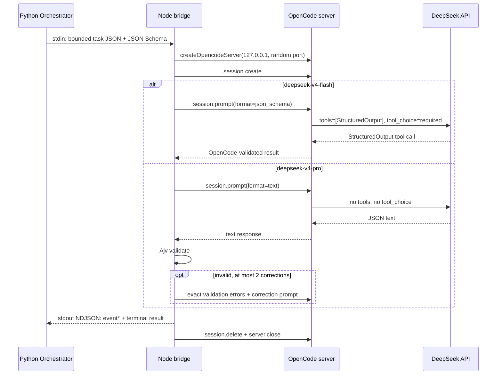

# OpenCode + DeepSeek 接入设计

## 调研结论

OpenCode 官方提供的是 JS/TS SDK。SDK 通过 `createOpencodeServer` 启动本地 server，再用
`createOpencodeClient` 创建类型化客户端；会话主路径是 `session.create` 和
`session.prompt`。它支持给 prompt 传 JSON Schema，并通过内部 `StructuredOutput` 工具
收集结构化结果。官方资料：

- [OpenCode SDK](https://opencode.ai/docs/sdk/)
- [OpenCode Providers / DeepSeek](https://opencode.ai/docs/providers)
- [DeepSeek Thinking Mode](https://api-docs.deepseek.com/guides/thinking_mode/)
- [DeepSeek Tool Calls](https://api-docs.deepseek.com/guides/tool_calls)
- [DeepSeek Agent Integration Compatibility](https://api-docs.deepseek.com/quick_start/agent_integrations/oh_my_pi)
- [DeepSeek JSON Output](https://api-docs.deepseek.com/guides/json_mode/)
- [DeepSeek API 更新记录](https://api-docs.deepseek.com/updates/)

截至 2026-07-23，项目锁定 `@opencode-ai/sdk==1.18.4` 与 `opencode-ai==1.18.4`。DeepSeek
当前正式模型使用 `deepseek-v4-pro` 和 `deepseek-v4-flash`；旧的 `deepseek-chat` /
`deepseek-reasoner` 将于 2026-07-24 停用，因此没有把旧别名作为默认值。

这里存在一个必须显式处理的协议差异：

- OpenCode 1.18.4 的 `format: json_schema` 会注册内部 `StructuredOutput` 工具，并固定
  向 provider 下发 `tool_choice: required`；
- DeepSeek V4 Pro 默认使用思考模式。它可以返回 JSON 文本，但思考模式拒绝
  `tool_choice` 参数，因此不能直接使用 OpenCode 这条工具型 StructuredOutput 通道；
- V4 Flash 继续使用 OpenCode 原生 `json_schema` 通道。

因此平台按模型选择输出适配器，而不是在 Pro 失败后静默换成 Flash：

| 模型 | OpenCode format | 发给模型的工具 / `tool_choice` | 结果校验 |
| --- | --- | --- | --- |
| `deepseek-v4-pro`（及其版本后缀） | `text` | 无工具；不发送 `tool_choice` | prompt 携带精确 Schema 和最小示例；Ajv 8.20.0 本地校验，最多 2 次同 session 纠正 |
| `deepseek-v4-flash` | `json_schema` | 仅 `StructuredOutput`；`required` | OpenCode 内部校验，最多 2 次重试 |

Pro 通道不会把思考模式关掉，也不会绕过 OpenCode session/provider。它只避开
OpenCode 当前由工具实现的 StructuredOutput，再由本地确定性校验器把 JSON 文本收敛为
同一份 `AgentInvestigationResult`。

本地克隆的 OpenCode `dev` 源码与 npm 发布包均为 1.18.4。调研同时发现官网示例、生成
类型和发布包运行时可能短暂不同步，所以不能只依赖文档片段：本项目固定 SDK/CLI 同版，
并使用真实发布包的无计费 capability probe 与本地协议测试守住升级边界。

## 为什么使用 Node bridge

主控制面是 Python，而官方 OpenCode SDK 是 JavaScript。直接从 Python 重写 HTTP 调用会
绕过 SDK 的 provider、session、消息转换和结构化输出语义。因此增加一个很薄的一次性
Node worker：



bridge 不参与任务规划、证据判定或设备操作。Python 仍然负责：

1. 静态工具覆盖面和入口枚举；
2. 生成每个入口的任务与证据摘要；
3. 在每个自适应轮次校验 Agent 提出的受限测试（默认每轮最多接受 4 个）；
4. 在云真机上执行允许的 Probe/ADB/Frida 操作；
5. 验证 Evidence ID，并把不满足条件的结论降级。

## 安全边界

OpenCode 本身是 coding agent，默认会暴露读文件、Shell、编辑、Web、MCP 和 task 工具。
在 APK 扫描场景里，这些能力不应直接交给模型。本接入采用以下约束：

- OpenCode 的全局和专用 Agent permission 先 `* = deny`。Flash 通道只额外允许内部
  `StructuredOutput`；Pro 通道不允许任何工具。
- 不给 OpenCode 挂载 APK、反编译 workspace、认证流或 ADB socket；prompt 只包含平台
  生成的 JSON。
- 设置 `OPENCODE_PURE=1`，禁用外部插件；禁用 project config、Claude 配置、模型目录
  自动刷新和自动升级。
- 每次调用使用新 session、新 OpenCode server 和临时 HOME/XDG 数据目录。
- worker 在发送 prompt 前订阅 `event.subscribe()` SSE，并把会话状态、步骤、响应、
  重试、校验和错误归一化为 NDJSON 事件；Python 按 `task_id` 写入实时扫描时间线。
- loopback server 使用随机端口与随机 Basic Auth；进程超时后终止整个进程组。
- Docker 模式使用只读 rootfs、无 capabilities、`no-new-privileges`、PID/CPU/内存限制
  和临时 HOME。
- API Key 不进入 payload、命令参数、日志或数据库；只通过 `DEEPSEEK_API_KEY` 环境变量
  传给 worker。
- 自定义 base URL 不接受凭据、查询参数或 fragment；远程网关必须使用 HTTPS，明文 HTTP
  只允许指向 loopback。

这能收窄主机侧权限，但模型仍会收到任务上下文和证据摘要。启用前必须确认公司对
DeepSeek 或企业代理的区域、保留、训练使用、日志和敏感数据策略；生产部署还应把容器
出口限制到获批端点。

## 配置和选择

服务默认后端由以下变量决定：

```bash
export APKSCANNER_INVESTIGATOR_BACKEND=opencode
export APKSCANNER_OPENCODE_ENABLED=true
export APKSCANNER_OPENCODE_MODEL=deepseek-v4-pro
export DEEPSEEK_API_KEY=...
```

Web 上传框和 CLI 的 `--investigator` 可以为单个扫描选择：

- `configured`：创建时解析并固化服务默认值；
- `codex`：使用 Codex；
- `opencode`：使用 OpenCode + DeepSeek；
- `none`：只执行静态规则与确定性动态测试。

不会在一次任务失败后静默切换模型。静默 fallback 会导致同一报告混合不同供应商的
行为、费用和数据边界，也会让结果不可复现。需要切换时应创建新扫描，或明确修改扫描
选择后重跑。

每次调用的审计记录会写明 `output_mode`。Pro 的 `output_transport.model_calls` 还会保存
每一轮实际 prompt、原始文本响应、解析错误、Schema 校验错误、是否被接受和单轮 usage；
即使 3 次都失败，这些内容也进入 `agent.error` 的不可变 Evidence。API Key 和隐藏思考
内容不进入审计。规范化 SDK 关键事件另存为 `agent.events` Evidence。

## 验证与升级

```bash
npm ci --prefix opencode-worker
npm run check --prefix opencode-worker
npm test --prefix opencode-worker

DEEPSEEK_API_KEY=... \
APKSCANNER_OPENCODE_ENABLED=true \
APKSCANNER_OPENCODE_ISOLATION=host \
scanctl capabilities --deep
```

`npm test` 启动本地假的 DeepSeek OpenAI-compatible SSE 服务，不访问外网、不产生模型
费用。协议测试分别确认：

1. Flash 请求只暴露 `StructuredOutput` 且使用 `tool_choice: required`；
2. Pro 的所有请求都没有 `tools` 和 `tool_choice`；
3. Pro 首次返回不合格 JSON 时，Ajv 拒绝结果并通过同一 session 下发可审计纠正提示；
4. worker 在两种模式下都输出可增量消费的事件 envelope 和唯一 terminal result；
5. 通过本地 Schema 校验后，两个通道归一化为相同的 worker 响应。

升级时必须：

1. SDK 与 CLI 使用同一精确版本；
2. 更新 `opencode-worker/package.json`、lockfile、Python 版本常量和 Docker labels；
3. 跑本地 bridge 协议测试；
4. 跑无计费 `capabilities --deep`，确认目标模型存在；
5. 用非生产测试账号执行一个真实 DeepSeek smoke scan，核对 usage、超时和错误脱敏；
6. 重新评审 OpenCode permission、provider 转换和结构化输出源码。
