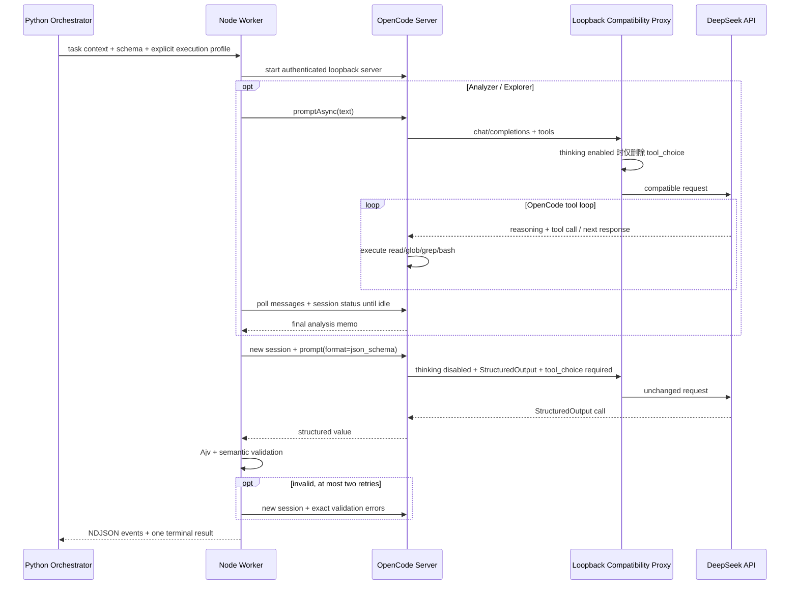

# OpenCode + DeepSeek 接入设计

## 结论

项目不再把“是否思考、是否开放工具、怎样结构化输出”绑定到模型名称，而是由扫描阶段
显式选择执行协议。这样 `deepseek-v4-flash` 和 `deepseek-v4-pro` 可以共用同一套编排，
也不会因为供应商调整模型默认行为而悄悄切换调用语义。

当前稳定基线是 `deepseek-v4-flash`。真实 API 已验证三条路径：

1. 非思考分析器使用 workspace 工具，再由独立定稿器输出结构化结果；
2. 思考型 Explorer 连续调用工具并完整回放 `reasoning_content`，再由独立定稿器收敛；
3. 最终裁决只运行非思考定稿器。

`deepseek-v4-pro` 保留为显式兼容测试项，不会在 Flash 失败后自动启用，也不会被平台
静默替换为 Flash。

参考资料：

- [OpenCode SDK](https://opencode.ai/docs/sdk/)
- [OpenCode Providers / DeepSeek](https://opencode.ai/docs/providers)
- [DeepSeek Thinking Mode](https://api-docs.deepseek.com/guides/thinking_mode/)
- [DeepSeek Tool Calls](https://api-docs.deepseek.com/guides/tool_calls/)
- [DeepSeek Agent Integration Compatibility](https://api-docs.deepseek.com/quick_start/agent_integrations/oh_my_pi/)
- [DeepSeek API](https://api-docs.deepseek.com/api/create-chat-completion)

项目固定 `@opencode-ai/sdk==1.18.4`、`opencode-ai==1.18.4` 和 `ajv==8.20.0`。已退役的
`deepseek-chat`、`deepseek-reasoner` 会在启动检查时直接拒绝。

## 为什么之前容易失败

问题不是“Agent 必须关闭思考才能调用工具”。DeepSeek 思考模式可以调用普通工具，真正
冲突的是 `tool_choice`：

- DeepSeek thinking 请求不接受 `tool_choice`；
- OpenCode 1.18.4 的普通工具路径会注入 `tool_choice: auto`；
- OpenCode `StructuredOutput` 又会强制 `tool_choice: required`；
- 思考型工具循环的下一轮还必须原样带回上一轮 `reasoning_content`；
- `promptAsync` 只表示异步下发。如果 Worker 看到第一条 `finish=tool-calls` 消息就返回，
  得到的是空文本，而不是完整 Agent 结果；
- 禁用工具后让模型“修 JSON”并不能消除前一轮工具上下文，模型可能继续输出 DSML
  tool-call 标记；
- 单纯通过模型目录探测只能证明配置存在，不能证明认证、余额、参数和真实结构化调用可用。

旧实现把上述问题混在一个会话内处理，因而会交替出现：

- `Thinking mode does not support this tool_choice`；
- `Unexpected end of JSON input`；
- DSML/XML 工具标记无法被 JSON parser 解析；
- `fetch failed` 或长响应链路断开；
- Schema 合法，但“证据不足 + 高危/高置信度”在业务语义上自相矛盾。

## 三种执行配置

| 扫描阶段 | 执行配置 | 思考与工具 | 输出 |
| --- | --- | --- | --- |
| `static_only` 及未识别阶段 | `stable_analyzer` | Analyzer 关闭思考，允许 `read/glob/grep/bash`，普通 `auto` 工具循环 | 全新 Finalizer 关闭思考，以 `StructuredOutput` 定稿 |
| `test_planning`、`adversarial_review`、`exploration_round` | `thinking_explorer_then_finalizer` | Explorer 开启思考，允许 workspace 工具；线上不发送 `tool_choice` | 全新 Finalizer 关闭思考，以 `StructuredOutput` 定稿 |
| `final_evaluation`、`recovery_evaluation` | `structured_finalizer` | 不开放 workspace 工具 | 直接用非思考 `StructuredOutput` 定稿 |

思考强度通过 `APKSCANNER_OPENCODE_REASONING_EFFORT=high|max` 配置，默认 `high`。模型 ID
只选择供应商模型，不决定执行配置。

## 调用链



兼容代理只监听 `127.0.0.1`，只做协议修正和审计：

- 只接受带随机一次性凭据的 `POST /chat/completions`，其他路径、无认证请求和超过单
  Worker 上限的请求会被拒绝；
- 仅当 `thinking.type=enabled` 时删除 OpenCode 注入的 `tool_choice`；
- 非思考请求原样转发，所以 StructuredOutput 仍使用 `required`；
- 不修改消息数组，因此 OpenCode 能完整回放 `reasoning_content` 和工具结果；
- 不记录 Authorization/API Key；
- 记录实际思考模式、收到/转发的 `tool_choice`、是否修正、模型与 HTTP 状态码。

## 工具循环与长任务

Analyzer/Explorer 使用 `promptAsync` 下发，再以短连接轮询 `session.messages` 和
`session.status`。Worker 只有同时看到会话 idle 和已完成 assistant 消息才会读取结果；
`finish=tool-calls` 只表示中间步骤，不再被误当成最终输出。

本地读取遇到短暂 `fetch failed`、`ECONNRESET`、Undici socket/header timeout 时会有限
退避重试；整个 Worker 仍失败时，Python 只会在原任务剩余预算内重建一次，不延长总预算、
不切换模型。单任务的 OpenCode 最大步骤数保持为 100，平台的 AI 总超时和手动续跑机制
仍是外层硬边界；每个一次性 Worker 最多向 provider 转发 120 个经过认证的
`chat/completions` 请求，为默认 1000 个 Agent 步骤、定稿和少量传输重试留出空间。

## 结构化结果与危害约束

Explorer 只生成证据备忘录，不负责最终 JSON。Finalizer 位于全新 session，关闭思考且只
允许内部 `StructuredOutput`，避免工具标记、隐藏推理和旧会话状态污染定稿。

OpenCode 返回后还要经过本地 Ajv 8.20.0 和业务语义校验：

- `inconclusive` 必须使用 `severity_proposal=info`、`confidence=low`；
- `supported_static`、`reproduced_blackbox`、`observed_instrumented`、
  `not_reproduced` 必须至少引用一个平台 Evidence ID；
- `final_evaluation`、`recovery_evaluation` 不允许再产生 `requested_tests`；
- 数组数量和文本长度均有上限；
- 纠正最多两次，每次使用全新 session，并把精确校验错误交给定稿器。

这解决“信息不全但给低危/高危”的概念混乱：`info` 表示尚无风险等级，不能把未知风险
伪装成已经确认的 Low。

最终仍由 Python 控制面验证 Evidence ID、普通 App UID 攻击者模型、到达性、缺失防护和
具体未授权影响。模型文字本身不能把候选项升级为已复现漏洞。

## 权限和审计

- OpenCode Agent 默认 `* = deny`，只给 Analyzer/Explorer 开放
  `read/glob/grep/bash`；Finalizer 只允许 `StructuredOutput`。
- 平台按 `task_id + attempt` 物化独立 workspace；提示词要求 Bash 只在该目录和 `/tmp`
  创建分析产物。
- 原生 write/edit/patch、Web、MCP、task/subagent 禁用。
- ADB 同时由 OpenCode permission 和 PATH shim 阻断；Agent 只能通过 `requested_tests`
  向 Python 申请设备动作。
- 每次调用使用临时 HOME/XDG、全新 OpenCode server 和随机 Basic Auth。
- `OPENCODE_PURE=1`，并关闭项目配置、Claude 配置、模型目录刷新和自动升级。
- API Key 只通过 Worker 启动环境传递；Worker 立即把它转移到兼容代理的内存中并从
  子进程环境删除，OpenCode provider 配置只拿到无权限的 loopback 占位 Key。因此即使
  Bash 输出完整 `env` 也看不到真实凭据。专用 Bash wrapper 同时删除
  `OPENCODE_CONFIG_CONTENT`、loopback Server 认证信息和代理环境变量。密钥不进入
  payload、数据库、事件或错误消息。

每次 AI 调用审计以下内容：

- 精确 prompt、执行阶段、profile、思考模式和 reasoning effort；
- OpenCode thread/turn ID、工具名称与受限参数摘要、步骤状态；
- 兼容代理看到的实际 wire 语义和 HTTP 状态；
- Explorer 备忘录、Finalizer 结构化值、Ajv/语义错误及各次是否接受；
- provider/model、token、cache、reasoning、cost 和调用次数；
- 401、402、422、429、5xx、工具选择冲突、reasoning 回放错误等归一化类别。

隐藏思考内容和 API Key 不进入业务审计。

## 配置

```bash
npm ci --prefix opencode-worker

export DEEPSEEK_API_KEY=...
export APKSCANNER_INVESTIGATOR_BACKEND=opencode
export APKSCANNER_OPENCODE_ENABLED=true
export APKSCANNER_OPENCODE_ISOLATION=host
export APKSCANNER_OPENCODE_MODEL=deepseek-v4-flash
export APKSCANNER_OPENCODE_REASONING_EFFORT=high

scanctl capabilities --deep
```

`capabilities --deep` 会发起一笔很小但真实、会计费的非思考 StructuredOutput 请求，用于
同时验证 API Key、模型、参数、结构化输出和网络。成功结果会在当前进程内缓存；失败结果
不会缓存。

企业网关通过 `APKSCANNER_DEEPSEEK_BASE_URL` 配置。远程地址必须为 HTTPS，HTTP 只允许
loopback；URL 不能包含凭据、查询参数或 fragment。官方地址必须写
`https://api.deepseek.com`，不能附加 `/v1`。

## 验证和升级

```bash
npm run check --prefix opencode-worker
npm test --prefix opencode-worker
ruff check backend
pytest -q backend/tests
```

Worker 协议测试覆盖：

1. ADB shim 固定拒绝；
2. `read` 与 `bash` 均不能读取 workspace 和 `/tmp` 之外的哨兵文件；
3. Bash 环境读取不到 API Key，但 provider 上游认证仍然成功；
4. 非思考 Finalizer 使用 `required` StructuredOutput；
5. 稳定 Analyzer 完成真实工具循环后进入隔离 Finalizer；
6. Thinking Explorer 删除 wire `tool_choice`，并回放 reasoning/tool result；
7. deep capability 发起真实 provider 请求；
8. 401 等 provider 错误被分类且不泄露密钥；
9. Schema 合法但语义矛盾的结果被拒绝，并用新 session 纠正。

升级 OpenCode 时必须同步更新 SDK、CLI、lockfile、Python 常量、Docker protocol label，
再执行协议测试和非生产 DeepSeek smoke test。重点复核 provider 的 thinking 参数映射、
`tool_choice` 注入、reasoning 回放、StructuredOutput 实现及 session message/status API。
