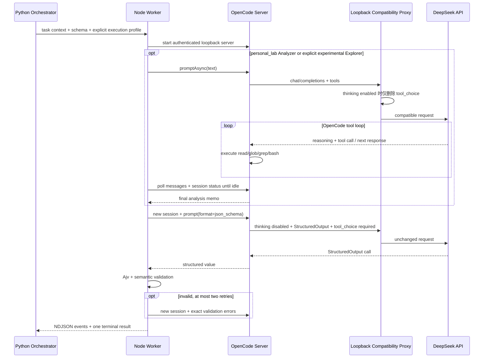

# OpenCode + DeepSeek 接入设计

## 结论

默认 `personal_lab` 路径运行关闭思考的工具分析器，再由隔离的 StructuredOutput 定稿器
输出结果。工具分析器可以读取完整 JADX、apktool 和 archive 目录，并在每个任务自己的
可写工作区内搜索、写脚本、构建源码型或预编译 APK。它不再依赖 thinking 模式，因而避免
模型长期停在 `finish=tool-calls`；最终定稿仍关闭工具并由 Ajv 校验。

设置 `APKSCANNER_AGENT_PERMISSION_PROFILE=strict` 可回到单次、无 workspace 工具的
StructuredOutput 路径。`personal_lab` 的 host 模式还可开放原始 ADB 做探索，但
adb-shell 输出不能冒充普通 App UID 证据，最终复现仍通过平台 Probe/PoC 和 Evidence ID。

当前稳定基线是 `deepseek-v4-flash`。思考型 Explorer 仅作为显式实验选项保留，通过
`APKSCANNER_OPENCODE_THINKING_EXPLORER=true` 开启，而且不会影响最终或恢复裁决。
文本输出型 `deepseek-v4-pro` 无法满足扫描器强制 StructuredOutput 契约，会在能力检查时
直接拒绝；系统不会静默切换模型。

参考资料：

- [OpenCode SDK](https://opencode.ai/docs/sdk/)
- [OpenCode Providers / DeepSeek](https://opencode.ai/docs/providers)
- [DeepSeek Thinking Mode](https://api-docs.deepseek.com/guides/thinking_mode/)
- [DeepSeek Tool Calls](https://api-docs.deepseek.com/guides/tool_calls/)
- [DeepSeek Agent Integration Compatibility](https://api-docs.deepseek.com/quick_start/agent_integrations/oh_my_pi/)
- [DeepSeek API](https://api-docs.deepseek.com/api/create-chat-completion)

项目固定 `@opencode-ai/sdk==1.18.4`、`opencode-ai==1.18.4` 和 `ajv==8.20.0`。已退役的
`deepseek-chat`、`deepseek-reasoner` 会在启动检查时直接拒绝。

## 为什么之前容易失败

问题不是“Agent 必须关闭思考才能调用工具”。DeepSeek 思考模式可以调用普通工具，真正
冲突的是 `tool_choice`：

- DeepSeek thinking 请求不接受 `tool_choice`；
- OpenCode 1.18.4 的普通工具路径会注入 `tool_choice: auto`；
- OpenCode `StructuredOutput` 又会强制 `tool_choice: required`；
- 思考型工具循环的下一轮还必须原样带回上一轮 `reasoning_content`；
- `promptAsync` 只表示异步下发。如果 Worker 看到第一条 `finish=tool-calls` 消息就返回，
  得到的是空文本，而不是完整 Agent 结果；
- 禁用工具后让模型“修 JSON”并不能消除前一轮工具上下文，模型可能继续输出 DSML
  tool-call 标记；
- 单纯通过模型目录探测只能证明配置存在，不能证明认证、余额、参数和真实结构化调用可用。

旧实现把上述问题混在一个会话内处理，因而会交替出现：

- `Thinking mode does not support this tool_choice`；
- `Unexpected end of JSON input`；
- DSML/XML 工具标记无法被 JSON parser 解析；
- `fetch failed` 或长响应链路断开；
- Schema 合法，但“证据不足 + 高危/高置信度”在业务语义上自相矛盾。

## 执行配置

| 扫描阶段 | 执行配置 | 思考与工具 | 输出 |
| --- | --- | --- | --- |
| 所有阶段（`personal_lab` 默认） | `stable_analyzer` | 关闭思考，开放任务 workspace 工具 | 文本 memo 后接隔离的 `StructuredOutput` |
| 所有阶段（`strict`） | `structured_finalizer` | 关闭思考，不开放 workspace 工具 | 单次 `StructuredOutput` |
| `test_planning`、`adversarial_review`、`exploration_round`（显式实验） | `thinking_explorer_then_finalizer` | Explorer 开启思考并允许受限 workspace 工具；定稿器关闭思考 | 文本 memo 后接隔离的 `StructuredOutput` |
| `final_evaluation`、`recovery_evaluation` | `structured_finalizer` | 始终关闭思考且不开放 workspace 工具 | 单次 `StructuredOutput` |

实验性 Explorer 的思考强度通过
`APKSCANNER_OPENCODE_REASONING_EFFORT=high|max` 配置，默认 `high`。

## 调用链



兼容代理只监听 `127.0.0.1`，只做协议修正和审计：

- 只接受带随机一次性凭据的 `POST /chat/completions`，其他路径、无认证请求和超过单
  Worker 上限的请求会被拒绝；
- 仅当 `thinking.type=enabled` 时删除 OpenCode 注入的 `tool_choice`；
- 非思考请求原样转发，所以 StructuredOutput 仍使用 `required`；
- 不修改消息数组，因此 OpenCode 能完整回放 `reasoning_content` 和工具结果；
- 不记录 Authorization/API Key；
- 记录实际思考模式、收到/转发的 `tool_choice`、是否修正、模型与 HTTP 状态码。

## 工具循环与长任务

默认路径不调用 `promptAsync`，也不读取 Explorer 文本。显式实验性 Explorer 才会异步
下发并轮询 `session.messages` 和 `session.status`；`finish=tool-calls` 只表示中间步骤，
不会被误当成最终输出。实验性 memo 为空时可调用独立 memo-writer，但该兜底不参与正常
扫描。

本地读取遇到短暂 `fetch failed`、`ECONNRESET`、Undici socket/header timeout 时会有限
退避重试；整个 Worker 仍失败时，Python 只会在原任务剩余预算内重建一次，不延长总预算、
不切换模型。会话事件流和会话删除都有 1 秒清理上限；终态 NDJSON 写入后 Worker 显式
退出，Python 无论成功、超时还是取消都会终止并回收整个 Worker 进程组，避免遗留
`opencode serve` 子进程。平台按阶段预留最终裁决预算，Critic 和额外探索预算不足时会
跳过而不是发起注定超时的调用。

## 结构化结果与危害约束

稳定 Finalizer 位于全新 session，关闭思考且只允许内部 `StructuredOutput`，避免工具
标记、隐藏推理和旧会话状态污染定稿。实验性 Explorer 只生成证据备忘录，不负责最终
JSON。

OpenCode 返回后还要经过本地 Ajv 8.20.0 和业务语义校验：

- `supported_static`、`refuted_static`、`reproduced_blackbox`、
  `not_reproduced` 必须至少引用一个平台 Evidence ID；
- `final_evaluation`、`recovery_evaluation` 不允许再产生 `requested_tests`；
- 实时 Proof Replay 可用时，`requested_tests` 只作为兼容字段且不得重复提交同一测试；
- 兼容路径的 `requested_tests[].hypothesis_id` 必填，且 Hypothesis/EntryPoint ID 必须属于当前任务；
- 数组数量和文本长度均有上限；
- 纠正最多两次，每次使用全新 session，并把精确校验错误交给定稿器。

Agent 不再允许返回通用的 `inconclusive`。JADX、动态插桩或登录回放等可选能力缺失不能
替代安全判断；Agent 必须基于 Manifest、Apktool/Smali、归档和已有动态证据给出明确的
静态支持或静态反驳结论，证据较弱时通过置信度和具体 follow-up 表达。

最终仍由 Python 控制面验证 Evidence ID、普通 App UID 攻击者模型、到达性、缺失防护和
具体未授权影响。模型文字本身不能把候选项升级为已复现漏洞。

## 权限和审计

- `personal_lab` Analyzer 开放 `read/glob/grep/bash`、独立任务工作区写入、网络和
  host 模式 ADB；稳定 Finalizer 仍只允许 `StructuredOutput`。
- 平台按 `task_id + attempt` 物化独立 workspace；提示词要求 Bash 只在该目录和 `/tmp`
  创建分析产物。
- MCP、task/subagent 禁用；Agent 可用 shell 创建脚本、Android 工程和预编译 PoC APK。
- `strict` 或 Docker 无设备模式仍阻断 ADB；`personal_lab + host + ADB_SERIAL` 允许原始
  ADB 探索。Agent 完成 PoC 后运行 `apkscanner-proof <回放 JSON>`，由任务内实时通道
  调用平台的构建、串行设备执行、Oracle 和 Evidence 关联；只有实时通道不可用时才回退
  `requested_tests`。
- 每次调用使用临时 HOME/XDG、全新 OpenCode server 和随机 Basic Auth。
- `OPENCODE_PURE=1`，并关闭项目配置、Claude 配置、模型目录刷新和自动升级。
- API Key 通过 Worker 的一次性 stdin 请求传递，不进入 Worker 初始环境。Worker 在
  校验业务 payload 前提取并删除内部凭据字段，再把 Key 留在兼容代理内存中；OpenCode
  provider 配置只拿到无权限的 loopback 占位 Key。因此 Bash 读取自身或 Docker 内祖先
  进程的 `/proc/*/environ` 也看不到真实凭据。专用 Bash wrapper 同时删除
  `OPENCODE_CONFIG_CONTENT`、loopback Server 认证信息和代理环境变量。密钥不进入
  业务 payload、数据库、事件或错误消息。
- Host 降级模式没有 PID/同 UID 进程隔离，Agent 可能观察同机控制面进程；它不是凭据
  隔离边界，只用于个人受控调试。生产和不受信任 APK 必须使用默认 Docker 模式。

每次 AI 调用审计以下内容：

- 精确 prompt、执行阶段、profile、思考模式和 reasoning effort；
- OpenCode thread/turn ID、工具名称与受限参数摘要、步骤状态；
- 兼容代理看到的实际 wire 语义和 HTTP 状态；
- 实验性 Explorer 备忘录、Finalizer 结构化值、Ajv/语义/平台 ID 错误及各次是否接受；
- provider/model、token、cache、reasoning、cost 和调用次数；
- 401、402、422、429、5xx、工具选择冲突、reasoning 回放错误等归一化类别。

隐藏思考内容和 API Key 不进入业务审计。

## 配置

```bash
npm ci --prefix opencode-worker

export DEEPSEEK_API_KEY=...
export APKSCANNER_INVESTIGATOR_BACKEND=opencode
export APKSCANNER_OPENCODE_ENABLED=true
export APKSCANNER_OPENCODE_ISOLATION=host
export APKSCANNER_OPENCODE_MODEL=deepseek-v4-flash

scanctl capabilities --deep
```

`capabilities --deep` 会发起一笔很小但真实、会计费的非思考 StructuredOutput 请求，用于
同时验证 API Key、模型、参数、结构化输出和网络。成功结果会在当前进程内缓存；失败结果
不会缓存。

企业网关通过 `APKSCANNER_DEEPSEEK_BASE_URL` 配置。远程地址必须为 HTTPS，HTTP 只允许
loopback；URL 不能包含凭据、查询参数或 fragment。官方地址必须写
`https://api.deepseek.com`，不能附加 `/v1`。

## 验证和升级

```bash
npm run check --prefix opencode-worker
npm test --prefix opencode-worker
ruff check backend
pytest -q backend/tests
```

Worker 协议测试覆盖：

1. ADB shim 固定拒绝；
2. `read` 与 `bash` 均不能读取 workspace 和 `/tmp` 之外的哨兵文件；
3. Bash 环境读取不到 API Key，但 provider 上游认证仍然成功；
4. 非思考 Finalizer 使用 `required` StructuredOutput；
5. 稳定路径所有阶段只调用一次禁用思考/工具的 StructuredOutput；
6. 显式 Thinking Explorer 删除 wire `tool_choice`，并回放 reasoning/tool result；
7. 当前任务之外的 Hypothesis/EntryPoint ID 被本地拒绝并纠正；
8. deep capability 发起真实 provider 请求；
9. 401 等 provider 错误被分类且不泄露密钥；
10. Schema 合法但语义矛盾的结果被拒绝，并用新 session 纠正；
11. Worker 成功、超时和服务关闭均不遗留 OpenCode 子进程。

升级 OpenCode 时必须同步更新 SDK、CLI、lockfile、Python 常量、Docker protocol label，
再执行协议测试和非生产 DeepSeek smoke test。重点复核 provider 的 thinking 参数映射、
`tool_choice` 注入、reasoning 回放、StructuredOutput 实现及 session message/status API。
