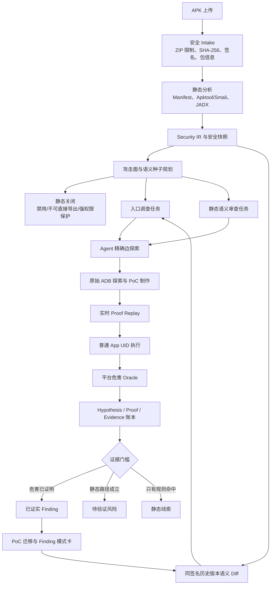

# APK Scanner 项目总结与汇报材料

> **迁移前历史快照**：本文记录 2026-07-31 `main` 分支在 Codex 重构前的汇报口径，
> 其中 OpenCode 路由、Worker、测试数量和代码路径不再代表
> `feature/codex-docker-migration`。当前实现状态以
> [Codex + DeepSeek Docker 执行架构与迁移规范](codex-docker-architecture.zh-CN.md)
> 和仓库 README 为准；后续应在迁移完成、真实 Provider/设备评测后重新生成本汇报。

> 文档基线：2026-07-31，基于当前 `main` 分支实现整理。
>
> 使用场景：项目总结、方案评审、阶段汇报和现场演示。
>
> 口径说明：本文区分“已证实 Finding”“待验证风险”和“静态线索”，不使用模拟数据冒充真实扫描结果。

## 1. 一句话介绍

APK Scanner 是一套面向 Android APK 的证据驱动安全审计平台：它先用确定性静态分析保证攻击面不漏枚举，再让 AI Agent 从有限入口出发自由追踪漏洞链、构建 PoC 并使用独占 ADB 设备验证，最后只把经过平台 Evidence 和危害 Oracle 证明的结果计入 Finding。

它不是“让大模型看一遍代码并输出报告”，而是把传统扫描、Agent 探索、真机验证、证据审计和历史漏洞复用组合成一条可复核的工程流水线。

## 2. 项目要解决的问题

传统 Android 静态扫描通常有三个问题：

1. **规则命中不等于漏洞。** 导出组件、Deep Link、危险 API、WebView 或命令执行调用只能说明存在攻击面，不能证明普通第三方应用能够造成实际危害。
2. **纯 AI 审计容易漏入口或产生幻觉。** 一次把整个 APK 交给模型，容易遗漏组件，也可能编造不存在的代码路径。
3. **动态验证与最终报告脱节。** 即使人工或 Agent 使用 ADB 验证成功，如果执行记录、调用身份和危害结果没有结构化关联，最后仍难以形成可信 Finding。

APK Scanner 的核心回答是：

- 用确定性枚举解决“是否漏入口”；
- 用入口种子和精确边扩展解决“如何让 Agent 自由发现漏洞链”；
- 用普通应用 UID PoC、平台 Oracle 和 Evidence ID 解决“结论是否真的成立”；
- 用安全快照、语义 Diff 和模式卡解决“历史经验如何复用”。

## 3. 产品定位与边界

### 3.1 当前定位

- 输入是一份待审计 APK，不依赖源码工程。
- 控制面是单用户、localhost 部署的 Web/CLI 应用。
- 静态分析可独立完成；连接授权测试设备后启用动态验证。
- 主要攻击者模型是普通第三方 Android 应用，即 `ordinary_app_uid`。
- 输出面向安全人员复核，不自动替代最终发布审批。

### 3.2 当前不作为核心依赖的能力

- 不依赖 Frida。
- 不要求统一的 Auth Flow 配置；登录态、设备认证等只作为具体漏洞链的应用级前置条件。
- Probe APK 只保留为可选兼容快速路径，不是主验证机制。
- `requested_tests` 只保留为 Docker 或实时回放不可用时的兼容后备。
- 当前没有全局 Campaign Brain，也没有让模型自由创建子 Agent。
- 调试端口、开发 WebServer 和纯 debug surface 不属于默认审计目标。

## 4. 核心设计原则

### 4.1 覆盖与探索分离

平台负责确定性地枚举全部入口，Agent 不负责“记住所有组件”。每个可疑入口都会形成任务、静态关闭记录或静态语义审查种子，因此不会因为模型注意力不足而悄悄消失。

入口只是探索起点，不是代码阅读的终点。Agent 可以沿着真实代码边继续追踪：

- 非导出 Activity；
- Binder/AIDL；
- ContentProvider；
- PendingIntent 和嵌套 Intent；
- WebView、JavaScript Bridge；
- 反射、回调、文件、数据库；
- native 边界和其他辅助类。

### 4.2 模型负责策略，平台负责事实

Agent 可以提出假设、阅读反编译内容、使用 ADB、构建 PoC、修正失败方案，但不能靠自己的文字证明漏洞。平台独立控制：

- 当前任务与设备租约；
- APK/PoC 构建和安装；
- Evidence 落库；
- Proof Attempt 状态；
- 危害 Oracle；
- Finding 准入。

### 4.3 可达性与危害分离

以下事实都不足以单独成为 Finding：

- 组件 `exported=true`；
- ADB shell 能启动组件；
- PoC 能绑定 Service；
- 出现了危险 API；
- 模型认为“可能高危”；
- PoC 自己打印“成功”。

最终 Finding 需要同时回答：

1. 普通第三方应用身份能否到达路径；
2. 缺少了什么安全控制；
3. 产生了什么未经授权的机密性、完整性、权限或可用性影响；
4. 平台能否独立观察并关联这次危害。

### 4.4 历史结果只能加速，不能复制

旧版本漏洞、旧 PoC 和同类漏洞模式可以提高新任务优先级并驱动验证，但不能直接复制成新版本 Finding。每个版本仍需产生本版本 Evidence。

## 5. 总体架构



系统可以理解为四层：

| 层次 | 主要职责 |
| --- | --- |
| 确定性分析层 | 制品校验、Manifest/代码分析、攻击面枚举、规则和覆盖矩阵 |
| Agent 调查层 | 从种子入口追踪真实调用链，生成假设、PoC 和中文结论 |
| 动态证明层 | 独占 ADB、普通 App UID 回放、日志/状态采集、危害 Oracle |
| 审计与知识层 | Finding 分层、Evidence、AI 审计、版本 Diff、PoC 迁移、模式卡和评测 |

## 6. 一次扫描的完整流程

### 6.1 APK Intake

平台首先执行：

- 上传大小限制；
- ZIP 条目数、解压体积和压缩比检查；
- 路径穿越与重复条目识别；
- APK SHA-256 内容寻址；
- 包名、版本、minSdk/targetSdk 提取；
- APK 签名和签名方案检查。

APK、反编译内容、资源字符串、日志和网页内容都被视为不可信输入，不能反向改变 Agent 指令或平台策略。

### 6.2 静态分析与 Security IR

平台组合以下信息：

- Manifest 生效语义；
- Activity、Activity Alias、Service、Receiver、Provider；
- Intent Filter 与 Deep Link；
- 自定义权限及保护等级；
- Apktool、Smali、资源和 archive；
- 可选 JADX；

JADX 只是便利视图。JADX 局部失败是正常情况，平台会继续使用 Manifest、Smali、资源和 archive，不会因为“JADX 不完整”自动给出信息不足。

当前内置规则覆盖 24 类规则 ID：

- 4 类 Manifest 配置；
- 5 类导出组件；
- 2 类 Deep Link；
- 4 类 APK/签名/归档；
- 9 类代码敏感模式。

代码模式还会聚合成三类静态语义审查种子：

- WebView 内容与 JavaScript Bridge 边界；
- shell 执行与命令风险策略边界；
- 发布环境、非生产端点与嵌入凭据边界。

静态规则只产生候选和审查线索，不直接等价于漏洞。

### 6.3 入口任务规划

任务规划遵循“全量覆盖、减少无效探索”的平衡：

- 外部可触达组件形成调查种子；
- 同一 handler 的 Deep Link 合并到所属组件任务；
- 静态敏感代码形成有边界的 `static_review` 任务；
- disabled、不可直接导出、明确受 signature/privileged 级权限保护的入口可静态关闭；
- Provider 如果存在 URI Grant、path-permission 缺口或保护不完整，仍保留调查。

静态关闭只表示“普通应用不能直接调用该入口”，不表示该组件永远安全。非导出组件和强权限组件仍可作为已分派种子链路中的间接目标，例如：

- 导出 Activity 重定向到内部 Activity；
- 外部 Binder 委托调用受保护 Binder；
- PendingIntent 代替攻击者执行；
- URI Grant 临时放大 Provider 权限；
- 反射或嵌套 Intent 到达内部组件。

### 6.4 Agent 自由探索

`personal_lab` 模式给每个任务提供：

- 独立可写的 `task_id + attempt` 工作区；
- 完整只读 Apktool/JADX/archive 根；
- Bash、读取、搜索和辅助脚本能力；
- 当前租约设备的 ADB；
- `poc/` 下创建 Android PoC 工程的能力；
- 实时 `apkscanner-proof` 回放通道。

自由度不是无目标地遍历整个 APK。Agent 必须：

1. 从分配的种子和 `context.json` 开始；
2. 只有当前代码或运行输出出现精确类名、方法、URI、Binder 接口等真实边时，才扩展到下一文件；
3. 零结果引用搜索结束该分支；
4. 一个 ADB 命令证明可达后，不重复做等价变体；
5. 需要普通应用身份时，尽快转为最小专用 PoC；
6. 一个危害回放成功后，停止对同一漏洞链重复证明。

这种设计既避免“只看入口类导致漏链”，也避免模型在简单代码上无限扩大分析范围。

### 6.5 ADB 策略

Agent 在任务独占设备期间可以直接使用 ADB，但需要遵守稳定性边界：

- 明确绑定平台分配的 serial；
- 不切换或管理 ADB/debug 监听端口；
- 不执行 `adb root`、`remount` 或用更强身份读取应用私有数据；
- 不创建 `forward/reverse` 调试映射；
- 不启用隐藏调试开关、开发模式或功能开关；
- 复现前清理 logcat，并使用唯一 marker；
- 清理当前任务创建的临时文件和 PoC APK。

原始 ADB 是发现和排障通道，不是最终证明通道。最终结果进入 `apkscanner-proof`，由平台重新执行并取证。

### 6.6 PoC 构建与实时 Proof Replay

Agent 在工作区创建最小源码型 PoC：

```text
poc/<name>/
  AndroidManifest.xml
  src/.../*.java
```

平台负责：

- 校验 PoC 路径、大小、包名和入口组件；
- 选择可用 Android compile API；
- 规范化 minSdk、targetSdk 和 package visibility；
- 使用受控 `aapt2 + javac + d8/dx + apksigner` 工具链；
- 对资源表兼容错误尝试其他可用 aapt2；
- 安装、启动、采集、判定并卸载；
- 对源码和 APK 记录 SHA-256。

Agent 不需要自己猜 SDK 路径或运行不受控 Gradle 构建脚本。预编译 PoC APK仍可作为兼容输入，但同样要经过平台验证。

实时回放的关键价值是：Agent 不必等到整轮输出结束。它可以在当前会话中提交 PoC，立即拿到平台回执，根据构建失败、权限拒绝或 Oracle 不成立继续修正。

### 6.7 Hypothesis、Proof 和 Evidence

每个任务在模型运行前就由平台创建安全假设。每条假设包含：

- 攻击者身份；
- 入口和前置条件；
- 预期影响；
- reachability 与 security impact 两类 proof obligation；
- 支持和反证 Evidence；
- Proof Attempt 历史；
- 最终状态。

一次动态证明至少关联：

```text
任务 → 假设 → 入口 → PoC/请求 → 普通 App UID 执行
    → 平台观察 → Oracle → Evidence IDs → Finding
```

Critic、Hunter 或 Finalizer 都不能修改已经由平台证明为 `proven` 的假设。模型如果试图把已证明漏洞改成 `refuted_static`，平台会覆盖模型结论并保留审计记录。

### 6.8 多轮探索、Critic 与救援

多轮机制不是无条件重复调用模型，而是针对两类风险：

#### 正向过快：Adversarial Review

当初步结果给出非 INFO 的 `supported_static`/`reproduced_blackbox`，且没有等待执行的测试、也没有平台危害证明时，可以触发 Critic。

- Critic 使用独立上下文寻找具体反例；
- Critic 只看候选真正引用的证据，并可只读复核候选指向的有界源码锚点；
- 最多提出 4 个可能改变结论的实质异议；
- 没有异议就立即停止；
- 有异议只进入一次最终裁决；
- Critic 无权覆盖平台 Proof。

#### 负向过快：Blind Rescue

当模型准备给出 `refuted_static` 或 `not_reproduced` 时，平台进行一次独立救援审查，避免模型因为能力不足而过早放弃。

- Rescue Review 不接收原结论的说服性文本；
- 寻找替代入口到 sink 的真实链路；
- 找到具体 lead 后只允许一次工具型 Rescue Exploration；
- 没有真实边则关闭；
- Critic 和 Rescue 不再互斥：Critic 或最终裁决形成负面结论后，仍必须通过独立盲审关闭，避免一个模型链路同时漏掉候选和替代攻击面。

当前辩论策略是严格单向、单次：

| 阶段 | 每任务最大次数 |
| --- | ---: |
| Critic | 1 |
| Rescue Review | 1 |
| Rescue Exploration | 1 |
| Final Evaluation | 1 |

这样保留“纠正幻觉和过早放弃”的价值，同时防止简单代码被无限辩论。

### 6.9 多设备并发

`APKSCANNER_ADB_SERIALS` 接受任意数量的逗号分隔设备：

```bash
export APKSCANNER_ADB_SERIALS="device-a,device-b,device-c"
```

调度策略是：

- 调查并发数等于配置设备数；
- 运行中新增或恢复设备会自动扩大 dispatcher 容量，无需重启服务；
- 一个任务在完整生命周期内独占一台设备；
- Agent 的 `ANDROID_SERIAL` 和 ADB wrapper 固定到租约设备；
- 不同任务拥有不同可写工作区；
- 第 N+1 个任务等待设备释放；
- 不同扫描也共享同一个全局设备池上限。

因此三台在线设备可以同时运行三个完整任务，而不是让三个 Agent 混用同一台手机。

### 6.10 Finding 分层

前端和 API 将结果分为三层：

| 层级 | 典型状态 | 含义 |
| --- | --- | --- |
| 已证实 Finding | `reproduced_blackbox`、人工 `accepted` | 平台观察到具体危害，Evidence 完整 |
| 待验证风险 | `supported_static` 或 proof backlog | 静态攻击路径成立，但缺少危害 Oracle |
| 静态线索 | `candidate` 等 | 规则或敏感 API 命中，尚未形成完整漏洞路径 |

`/findings` 只返回：

- 状态为 `reproduced_blackbox` 或人工 `accepted`；
- `harm_demonstrated=true`；
- 至少一个 Evidence ID；
- 所有 Evidence 都属于当前扫描。

这解决了“静态高危很多，但最终 Finding 不可信”的问题。静态结果不会丢失，而是进入“待验证风险”或“静态线索”页面。

### 6.11 版本安全演进

每次扫描都会形成内容寻址的安全快照，记录：

- 包名、签名和版本身份；
- 外部入口和 Manifest 保护；
- 规范化代码摘要；
- 安全相关调用、caller guard 和敏感 sink。

同包名、同签名的上一版本自动成为语义 Diff 基线。Diff 识别：

- 新增或删除入口；
- exported 变化；
- permission 新增、删除或保护等级变化；
- caller guard 增减；
- 实现变化；
- 可确定映射的组件重命名。

#### 旧 PoC 自动迁移

只有动态证明或人工接受的 Finding 才能产生回放候选。平台会：

1. 校验历史 PoC 源码归档；
2. 映射当前版本入口；
3. 替换可确定的组件名或 authority；
4. 用当前工具链重建；
5. 在当前版本重新执行并产生新的 Proof Attempt。

旧 Finding 永远不会直接复制到新版本。

#### Finding 模式卡

动态证明或人工接受的 Finding 可以沉淀为包无关模式卡，包括：

- 漏洞类别；
- 入口形态；
- 关键安全 API；
- 缺失 guard；
- 排除条件；
- 最小 proof recipe。

新 APK 命中模式卡后只生成 `candidate_match` 并提高相关任务优先级，不直接生成 Finding。

### 6.12 AI 审计与中文结果

AI 审计保存：

- 模型精确输入；
- provider/model/SDK 和执行 profile；
- runtime 关键事件；
- 原始结构化输出；
- test validation；
- Evidence/结果平台校验；
- thread/turn ID；
- token usage；
- error/cancellation。

面向人的 summary、假设解释、coverage gap 和测试说明统一要求简体中文；枚举、Evidence ID、类名、路径和命令保持原文，便于检索。

OpenCode + DeepSeek 的正常主路径是：

1. V4 Flash 非思考工具分析器；
2. 隔离的 V4 Flash StructuredOutput Finalizer；
3. 需要 Critic/Rescue 时，V4 Pro 负责无工具文本分析，再由 V4 Flash 结构化。

正常分析器和终局 Adaptive Verifier 均不设置模型 step/provider-request、工具调用、PoC 重建、
Proof Replay、探索轮次、单轮测试数或候选数上限。平台只保留任务生命周期、扫描截止时间、
取消、设备租约和安全边界等运行保障。Critic/Rescue/Final 每个阶段仍最多启动一次，避免辩论
链路反复扇出，但不限制已启动 Turn 内的审查深度。

## 7. 核心数据模型

| 对象 | 作用 |
| --- | --- |
| `Scan` | APK、包/版本/签名、工具版本、状态和统计 |
| `EntryPoint` | 组件、Deep Link、权限、导出原因和代码锚点 |
| `InvestigationTask` | 种子范围、假设、优先级、设备和 Agent 状态 |
| `SecurityHypothesis` | 可被支持、挑战、证明或反驳的安全主张 |
| `HypothesisArgument` | Hunter/Critic/平台的正反论证 |
| `ProofAttempt` | PoC 计划、执行、Oracle、Evidence 和危害状态 |
| `Evidence` | 内容摘要、命令、退出码、身份和不可变制品 |
| `Finding` | 漏洞描述、严重性、证据和人工复核 |
| `CoverageItem` | MASVS/入口在各阶段的覆盖与缺口 |
| `SecuritySnapshot` | 单版本规范化安全事实 |
| `VersionDiff` | 两版本间的语义安全变化 |
| `VulnerabilityPattern` | 从已证明漏洞提炼的复用模式 |
| `PatternMatch` | 模式命中的待验证候选 |
| `BenchmarkEvaluation` | 与私有 ground truth 的可审计评测 |

## 8. 当前已实现能力

| 能力 | 状态 | 说明 |
| --- | --- | --- |
| APK Intake 与内容寻址 | 已实现 | ZIP 安全、SHA-256、签名、版本 |
| Android 攻击面枚举 | 已实现 | 组件、Alias、Provider、Deep Link |
| Apktool/Smali + 可选 JADX | 已实现 | JADX 部分失败不阻断 |
| 内置规则与静态语义种子 | 已实现 | 24 类规则 ID，3 类语义审查家族 |
| Security IR / MASVS 覆盖 | 已实现 | 记录覆盖和具体 gap |
| Codex Agent | 已实现 | 严格结构化输出和审计 |
| OpenCode + DeepSeek Agent | 已实现 | 工具分析、中文定稿、Critic/Rescue |
| Agent 独立工作区 | 已实现 | `task_id + attempt` 隔离 |
| 原始 ADB 自由探索 | 已实现 | 绑定任务租约和安全边界 |
| 平台源码型 PoC 构建 | 已实现 | 多 API/工具兼容和签名 |
| 实时 Proof Replay | 已实现 | 同轮反馈、Evidence、Oracle |
| 多轮纠错 | 已实现 | 根据真实测试反馈继续 |
| 单轮 Critic/Blind Rescue | 已实现 | 防幻觉、防过早关闭、防无限辩论 |
| 多 ADB 设备并发 | 已实现 | N 台设备对应 N 个完整任务 |
| Finding/待验证/线索分层 | 已实现 | 最终 Finding 只认危害证据 |
| 版本快照与语义 Diff | 已实现 | 同包名、同签名自动比较 |
| 历史 PoC 迁移 | 已实现 | 当前版本重新构建和证明 |
| Finding 模式卡 | 已实现 | 候选搜索和任务提权 |
| Ground-truth 模型比较 | 已实现 | 只对证实 Finding 计分 |
| 汇报仿真 | 已实现 | 明确水印，不创建假 Finding/Evidence |
| Web/JSON/HTML/SARIF | 已实现 | 审查与报告出口 |
| Campaign Brain / 子 Agent 调度 | 未实现 | 暂不纳入当前范围 |

## 9. 与普通扫描器相比的关键差异

### 9.1 不靠模型保证覆盖

所有入口先由平台枚举，Agent 只负责深挖，因此模型遗漏一个组件不会让该入口从账本中消失。

### 9.2 不把规则严重性当漏洞严重性

静态规则的 high 表示验证优先级，不表示漏洞已证实。只有危害证明成功后才进入最终 Finding。

### 9.3 Agent 有足够自由，但探索可收敛

Agent 可以完整阅读反编译内容、写脚本、构建 APK 和使用 ADB；同时必须从种子出发、沿精确边扩展、避免重复证明。

### 9.4 动态证据不可被模型推翻

Critic 是咨询角色，平台 Proof 是事实角色。模型辩论不会覆盖已经观察到的物理证据。

### 9.5 一次审计可以积累为后续能力

历史 Finding 不只是报告条目，还可以形成 PoC 回放和模式卡，让后续版本与同类 APK 更快进入高价值验证。

## 10. 当前工程状态与验证

本次文档整理时完成了以下校验：

- 后端 `pytest`：249 项测试通过；
- OpenCode Worker：17 项集成测试通过；
- 前端 ESLint：通过；
- 前端 production build：通过；
- 三设备调度器验证：三个任务分别获得三个不同 serial。

测试覆盖重点包括：

- Manifest、静态规则和攻击面；
- Evidence 与 Finding 准入；
- Hypothesis/Proof 流程；
- PoC 构建、签名和回放；
- Critic 不得推翻平台证明；
- Blind Rescue；
- DeepSeek StructuredOutput 和空文本收尾；
- ADB serial 隔离；
- 版本 Diff、PoC 迁移和模式卡；
- API、报告和 benchmark。

## 11. 当前已知边界与风险

这些边界不否定当前方案，但应在汇报中主动说明：

1. **真实样本基线仍需扩大。** 合成 APK 能验证工程闭环，但召回率、误报率和耗时必须以真实 APK 集测量。
2. **Oracle 类型仍有限。** UI、目标 UID 日志、Provider 数据、进程崩溃等可以自动判断；复杂业务状态可能仍需新增领域 Oracle 或人工复核。
3. **静态能力不能完全覆盖 native 和服务端。** APK-only 无法独立证明后端权限、风控和服务端数据状态。
4. **Host personal-lab 不是强隔离。** 它适合个人受控环境；团队生产化应优先 Docker 和受控网络出口。
5. **多设备暂不热扩容。** 设备列表在服务启动时确定，掉线设备不会自动把当前任务迁移到另一台设备。
6. **SQLite 适合单机控制面。** 多用户、多节点调度需要数据库和租约架构升级。
7. **仍有兼容设计债务。** Probe 与 `requested_tests` 尚未完全移除，但已不属于主路径。
8. **仍存在生命周期配置。** Worker 工具探索没有 step/request 或其他计数上限，但任务和整单仍有可配置截止时间；上线前需要根据真实样本确定合理策略。

## 12. 下一阶段建议

建议优先级如下：

### P0：真机和真实 APK 基线

- 建立分层样本集：大小、混淆、组件数量、系统应用/普通应用；
- 统计 recall、precision、F0.5、动态证明率、耗时与模型成本；
- 在 Android 16/17 真机上完成 PoC 工具链兼容验收；
- 把已知真实漏洞整理为 ground truth。

### P1：动态证明能力

- 增加可插拔业务 Oracle；
- 改进 UI 状态、文件变化和 Binder 返回值观察；
- 为设备离线增加健康路由与安全重试；
- 支持运行中识别新增设备，但不迁移已持有设备的任务。

### P2：知识复用

- 扩大 Finding 模式卡类别；
- 增强组件重命名和跨版本数据流映射；
- 建立 PoC 迁移成功率和失败原因统计；
- 支持人工维护漏洞模式和排除条件。

### P3：平台化

- PostgreSQL/任务队列；
- 多用户、RBAC 和审计归属；
- Worker 与 provider 网络出口治理；
- 再评估 Campaign Brain 和受控子 Agent 调度。

## 13. 建议汇报结构

### 13.1 十分钟版本

1. **1 分钟：问题**

   传统扫描误报多，纯 AI 容易漏入口和产生幻觉，真机结果难沉淀。

2. **2 分钟：总体方案**

   确定性覆盖 + 入口种子 + Agent 自由追链 + PoC + 平台 Oracle。

3. **2 分钟：核心差异**

   Finding 只认危害证据；待验证风险与静态线索分层。

4. **2 分钟：Agent 与设备**

   每任务独立工作区、完整反编译访问、独占 ADB、三设备三任务并行。

5. **1 分钟：稳定性设计**

   单轮 Critic、Blind Rescue、平台 Proof 不可被模型推翻。

6. **1 分钟：知识复用**

   安全快照、语义 Diff、旧 PoC 回放、模式卡。

7. **1 分钟：现状与计划**

   自动化测试已通过，下一步重点是真实 APK 和 Android 16/17 基线。

### 13.2 推荐现场演示

1. 上传 `vulntest.apk` 或另一份授权测试 APK；
2. 展示攻击面不是由模型生成，而是平台完整枚举；
3. 打开一个探索任务，展示 Agent 沿内部类继续追踪；
4. 展示 PoC 源码、实时 Proof Replay 和 Oracle 回执；
5. 对比“待验证风险”和“已证实 Finding”；
6. 展示 AI 审计中的 prompt、事件、结构化输出与平台校验；
7. 展示版本演进中的 Diff、PoC 回放候选和模式卡；
8. 如果连接三台设备，展示三个不同 serial 同时占有三个任务。

## 14. 建议汇报指标

不要使用单个 APK 推导总体效果。建议至少按 APK 类型分层统计：

| 指标 | 口径 |
| --- | --- |
| 攻击面枚举完整率 | 平台枚举入口 / 人工基准入口 |
| 已知漏洞召回率 | 动态证实 Finding 命中 / ground truth |
| Precision | ground truth 命中 / 全部已证实 Finding |
| F0.5 | 更重视 Precision 的模型比较指标 |
| 待验证转化率 | 最终获得动态证明 / supported_static |
| 动态证明成功率 | proven Proof Attempt / 执行 Proof Attempt |
| PoC 首次构建成功率 | 首次构建成功 / PoC 构建任务 |
| PoC 修正后成功率 | 多轮后成功 / 首次失败 PoC |
| 单 APK 耗时 | P50/P95，拆分静态、Agent、ADB |
| 单 APK 模型成本 | token/费用 P50/P95 |
| 设备利用率 | 持有设备时间 / 可用设备时间 |
| 版本回放成功率 | 新版本成功证明 / replay candidate |
| 幻觉纠正率 | 后续轮次纠正的事实错误 / 已识别事实错误 |

仓库提供显式 ground-truth 评测和带水印的汇报仿真。仿真只用于界面演练，不创建 Finding、Evidence 或真机结论。

## 15. 常见问题回答

### 为什么不能把静态高危直接放进 Finding？

因为规则严重性表示“值得优先验证”，不是“已经造成危害”。如果直接合并，会重新回到传统扫描器误报堆积的问题。平台把它放入待验证区，不会丢失。

### 每个入口一个任务会不会限制 Agent 发现跨组件漏洞？

不会。入口是覆盖种子，Agent 可以沿真实代码边进入非导出组件、Binder、WebView、Provider 和反射路径。限制的是无边界全局漫游，不是漏洞链深度。

### signature 权限入口静态关闭后会不会漏掉间接利用？

静态关闭只关闭“普通应用直接调用”的边。已分派任务如果发现重定向、委托、PendingIntent、URI Grant 等真实链路，仍可以分析和验证该内部组件。

### 为什么还需要 Critic？

Critic 用来检查模型是否过快把静态迹象当成漏洞。它只有一次机会、最多四个可能改变结论的异议，而且不能推翻平台 Proof，因此不会形成无止境辩论。

### 为什么还需要 Rescue？

能力较弱的模型可能看见一点困难就给出安全结论。Blind Rescue 从独立视角再找一次替代攻击链，避免“模型没想到”被错误等同于“漏洞不存在”。

### Agent 已经能用 ADB，为什么还要 Proof Replay？

原始 ADB 适合探索，但调用身份、日志和影响容易混乱。Proof Replay 把最终 PoC 重新放入平台控制的普通 App UID 执行、Evidence 和 Oracle 流程，才能进入 Finding。

### 三台设备能否真正并行？

可以。配置或运行中接入三个 serial 后，并发数动态变为 3；每个任务独占一台设备直至清理结束。
排空设备会停止新任务分配但不打断当前 lease，移除设备不需要重启服务。

## 16. 代码导航

| 模块 | 路径 |
| --- | --- |
| 配置与设备池 | `backend/apkscanner/config.py`、`device.py` |
| 静态分析与规则 | `static_analysis.py`、`manifest.py`、`rules.py` |
| 入口规划 | `planner.py` |
| 主编排 | `orchestrator.py` |
| Agent 提示词 | `agent_prompt.py` |
| OpenCode/DeepSeek | `opencode_runner.py`、`opencode-worker/worker.mjs` |
| PoC 构建 | `poc.py` |
| Proof 客户端 | `proof_client.py` |
| 假设与证明账本 | `security_pipeline.py` |
| Finding 准入 | `finding_policy.py` |
| 版本快照与模式卡 | `versioning.py` |
| Ground truth 评测 | `benchmark.py` |
| API 与报告 | `api.py`、`reports.py` |
| Web 控制台 | `frontend/src/App.tsx` |
| 合成测试 APK | `testapk/` |

## 17. 汇报结束语

APK Scanner 当前最重要的成果，不是“接入了一个大模型”，而是建立了一套让模型能够安全、自由、可纠错地参与 Android 漏洞验证的工程协议：

> 确定性系统保证覆盖，Agent 负责发现链路，真机负责产生事实，平台负责证据和最终口径，历史结果负责加速下一次审计。

这套设计已经跑通从 APK 上传、攻击面、Agent 探索、PoC、ADB、Oracle、Finding 到版本演进的完整闭环。下一阶段的重点应从继续堆叠机制，转向真实 APK、Android 16/17 真机和已知漏洞集上的可量化验证。
